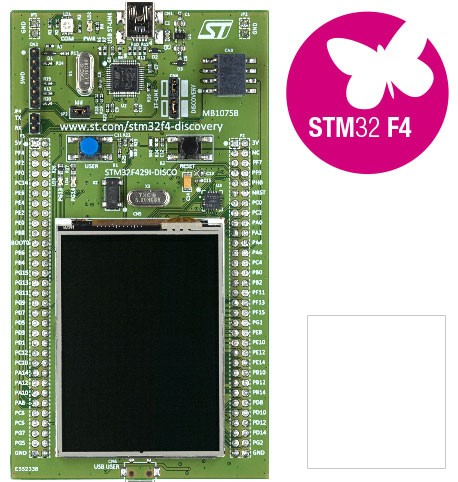

# STMicroelectronics 32F429IDISCOVERY

## [Product page](http://www.st.com/en/evaluation-tools/32f429idiscovery.html)

## Features

- STM32F429ZIT6 mcu
- 2 Mbytes of internal Flash memory
- 256 Kbytes of internal RAM
- 64-Mbit SDRAM (provided as 8 Mbytes of managed heap)
- 2.4" QVGA TFT LCD
- Two user LEDs: LD3 (green), LD4 (red)
- Two push-buttons (user and reset)
- USB OTG with micro-AB connector
- Simple extension header exposing most of the mcu pins
- On-board ST-LINK/V2

## Firmware images (ready to deploy)

The ready to use firmware images provided include support for the class libraries and features marked bellow.

| Gpio | Spi | I2c | Pwm | Adc | Serial | Events | SWO | Networking | Large Heap |
|:-:|:-:|:-:|:-:|:-:|:-:|:-:|:-:|:-:|:-:|
| :heavy_check_mark: | :heavy_check_mark: | :heavy_check_mark: | :heavy_check_mark: | | :heavy_check_mark: | :heavy_check_mark: | :heavy_check_mark: | | :heavy_check_mark: |

| Stable | Preview |
|---|---|
|  |  |
