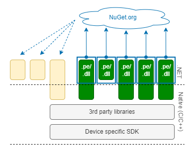

# Packaging, versioning and deployment

## About this document
This document describes how your application and the .NET **nanoFramework** components required for your application are packaged and deployed to a hardware device. It also describes the versioning system used to relate the packages.

## Components
For the purpose of this description, the general [architecture](index) of a .NET **nanoFramework** application is presented in a different way.

The .NET **nanoFramework** makes it possible to write your application and class libraries in .NET and hides the device dependent implementation details as much as possible. Your application typically consists of a .NET application and perhaps one or more class libraries. If you have special requirements that are not covered by the .NET **nanoFramework** and make use of native/device specific libraries, your application can include a library component that has an implementation that is partly .NET and partly native.

The .NET **nanoFramework** itself is split into multiple components that can be selected for use in an application. Many components have an implementation that is partly .NET and partly native. The native implementation uses third party libraries for some of the functionality. Some part of the native implementation is device specific as it has to use the appropriate SDK to interact with the microcontroller.

Ultimately your application has to be deployed to the device, by writing the software to the flash memory of the microcontroller. The content of the flash memory can be divided into four sections: a booter that is used to start up the device and that is independent of the application, a section that is reserved for the .NET **nanoFramework** runtime (CLR), a section where the application will be deployed and some space to store extra files. The latter is only available for devices where the flash memory is sufficiently large.

## Packaging and distribution of the nanoFramework components

Each of the .NET **nanoFramework** components has a class library as .NET implementation. The library is compiled to a .dll file for use in development environments and a [.pe file](pe-file) that can be run on the device. Each library is distributed as a [NuGet package](class-libraries).

You select the NuGet packages required for your application and class libraries. The packages will ultimately be deployed to the device as part of your application. Framework class libraries that are not necessary for your application are not deployed to the device and do not take up space in flash memory.

The native implementation of the .NET **nanoFramework** components are not packaged individually. Instead a selection of components is combined with the third party and device specific libraries into a single package. That package is deployed to the device as nanoFramework CLR. It is in other documentation also referred to as *target*, as it determines what functionality your application can use.

For each device there are one or more of such packages. The selection of the components depends on the capabilities of a device. E.g., the native component of the nanoFramework.Device.Can component is omitted if the device does not have hardware support for a Can bus. The nanoFramework.Device.Bluetooth is only included for devices that have a sufficient amount of flash memory.

If your application does not have a native component, you'll use one of the pre-packaged runtimes/targets. There are both [reference](../reference-targets) and [community](../community-targets) targets. The targets are made available from an [online repository](https://cloudsmith.io/~net-nanoframework/repos/nanoframework-images/packages/) and should be deployed to the device using the [nanoff](https://github.com/nanoframework/nanoFirmwareFlasher) tool. The *nanoff* tool also makes sure that an appropriate booter is present.

Apart from the *.bin* file that is deployed to the device, the package containing the runtime may also contains additional (device dependent) information that is used in the deployment process. Such as the partition of the flash memory in sections for the runtime, managed code and additional files.

## Native application component or custom runtime

In the .NET **nanoFramework** architecture all native components have to be part of a runtime/target, and a device can only have one runtime installed. If your application has a native component, or if you don't want to use a pre-packaged runtime but want to make your own selection of components to include, you'll have to create an application-specific runtime. It should be deployed to the device using the [nanoff](https://github.com/nanoframework/nanoFirmwareFlasher) tool.

Once a native component of your application is part of the runtime, it is treated in the same way as the native .NET **nanoFramework** components. The framework does not make a distinction between framework and non-framework native components.

## Packaging and distribution of the .NET application and libraries

The .NET components of your application and the .NET **nanoFramework** framework components included via NuGet packages can be deployed to the device in three phases of the development cycle.

The first stage is during the development of the class libraries. The .NET **nanoFramework** framework supports (unit) testing of class libraries (not applications). The [test platform](../unit-test) deploys the [.pe files](pe-file) of the class libraries and a unit test launcher to the device and executes the tests.

The second stage is during the development of the integrated application. The .NET **nanoFramework** framework supports debugging of an application. The debugger that is part of the Visual Studio extension deploys the [.pe files](pe-file) of the application and all referenced class libraries to the device and runs the application. 

The last stage is the deployment of the final application. As part of the build process the application and referenced class libraries are packaged in an application.bin package. That package should be deployed to the device with the [nanoff](https://github.com/nanoframework/nanoFirmwareFlasher) tool. The tool also allows for the deployment of additional files, if the device supports that.

The *nanoff* tool supports the deployment of the runtime/target and application in one go or in separate operations. Separate operations are required for testing and debugging: the test platform and debugger only deploy an application, the runtime and additional files should already be present on the device.

None of the .NET **nanoFramework** tools try to "reuse" what might be already deployed on the device. All the PE/.bin files are always deployed. This has the advantage of not requiring the extra steps of reading back what's in the device, checking the exact versions and deciding if a certain PE file will fit on a flash block. The downside is that sometimes this causes unnecessary flash erase and write cycles. Considering that a typical modern SoC flash endurance limit is in the range of 100k to 1M cycles this is negligible and acceptable for a device used for development purposes.

## Component versioning and consistency checks

A deployed application consists of many elements: the managed application components, referenced .NET **nanoFramework** class libraries, and a runtime with native application and framework components. The elements cannot be independently selected. The managed application depends on specific versions of the managed framework components. For each component the managed implementation is based on a specific version of the native component. A runtime contains a specific version of each native component. As native components share libraries and SDKs, a runtime cannot be composed of components of arbitrary versions.

The various elements are selected and incorporated at different moments in the build and deployment process, so the is no automatic guarantee that the element versions match in the deployed application and runtime. The framework uses a versioning system to enable the verification of the consistency of the components in the application and runtime.

Each native implementation of a component has a [version and checksum](guide-version-checksums). .NET **nanoFramework** tools can obtain a list of native components and their version and checksum from the runtime once it is deployed on a device.

Each managed implementation of a component has a version as is common for .NET assemblies. If the component also has a native implementation, the .NET assembly also has a reference (via the *AssemblyNativeVersion* attribute) to the version of the native component. .NET **nanoFramework** tools can read the attribute.

The consistency of references from one .NET assembly to another is done by the regular .NET tooling like Visual Studio, MS Build and the (NuGet) package manager. Version conflicts are detected in the build process and have to be resolved before an *application.bin* or *.pe*-file can be created for deployment to a device.

The consistency of references from managed assemblies to the native components is done by .NET **nanoFramework** tools and components:

- Before an application starts to run on a device, the presence and version consistency of the native components is checked by reading the *AssemblyNativeVersion* attribute values. The application will not be run if a native component is missing or the *AssemblyNativeVersion* value is different from the version of the native component present in the runtime.

- The same consistency check is done by the Visual Studio extension before the *.pe*-files of an application are deployed for debugging.

## Interdependency of tools and runtimes

The description so far may give the impression that the .NET **nanoFramework** tools that support the packaging and deployment are independent of the packages the tools work with. That is not the case, there are a few interdependencies.

All tools except *nanoff* (and *nanoff* for additional files) do not write directly to the flash memory of a device. Instead they use a limited part of the [wire protocol](wire-protocol) to send the *.pe*-files to the device, and the (already deployed) runtime writes to flash memory. The tool and the deployed runtime have to have the same perception that part of the wire protocol; (breaking) changes in the protocol may lead to incompatibility of tools and runtimes. Fortunately the wire protocol is very stable and changes are few and far between.

The *nanoff* tool has some hard-coded logic to select the most suitable pre-packaged runtime/target for a particular device. The runtime package does not contain sufficient information to link the (device manufacturer's specific) description that a device provides to the *nanoff* tool to the suitability of the runtime. E.g., a runtime may target a particular model of microcontroller, but if the microcontroller is part of a development kit, *nanoff* may receive an identification of the kit when querying the device instead of an identification of the microcontroller. If new pre-packaged runtimes/targets become available, the *nanoff* tool may require an update. The selection mechanism can always be bypassed by explicitly specifying the runtime/target to deploy.
