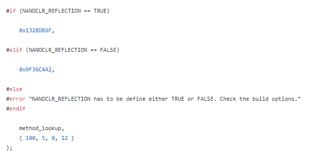
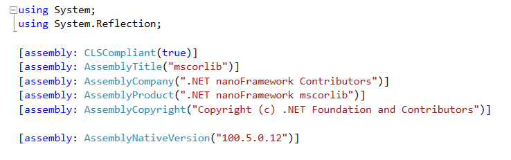
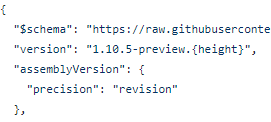
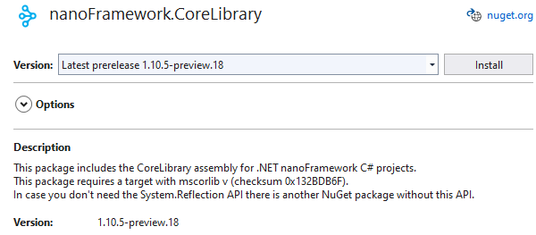
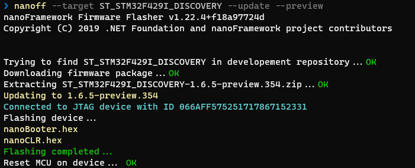
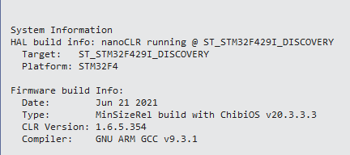
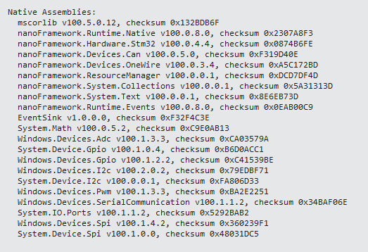

# Package and assembly versions and checksums

Much of the .NET **nanoFramework** is made up of C# classes that invoke code that is in native C++ assemblies.  Some assemblies are just generic C++, others are specific to a hardware platform.

There is an interop framework that assists in handling the interface between C# and C++. That framework includes the generation of a checksum for a given interface contract, and a version checking mechanism to make sure that versions are updated when the contract (and checksum) change.

## How the checksum is generated

As with all of dotnet the nfproj file is actually a MSBuild XML configuration file. Part of the nanoFramework is the `meta-data-processor` (MDP) which is invoked as a post-build task in the MSBuild of the nfproj.

During the post-build the MDP creates stub C++ files for any interfaces that are declared as `InternalCall`.  The stub files are located at bin\debug\stubs\\[assembly-name].  The calculated checksum is found in the corlib_native.cpp file. The MDP also emits the checksum as an environmental variable and later that is used to embed the checksum in the Portable Executable (PE) file that the nanoFramework actually runs. Below is a screen print taken from a stub of mscorlib with a checksum of 0x132BDB6F, and required native assembly version of 100.5.0.12:
>

## How the required native version is defined

The required native version is set manually by a developer in the AssemblyInfo.cs file for the assembly.  The MDP will copy that information and also place it in the stub file corlib_native.cpp.  Here is a screen print of the CoreLibrary AssemblyInfo.cs file:
>

## Manual process to update native assembly checksum and version

Each native assembly has a corlib_native.cpp (and .h) file.  A developer manually copies any interface changes generated by the MDP stub generation process into the CPP files actually used by the native assembly.  They are very careful to copy the new checksum and to accept a new version number if the checksum has changed due to an interface/contract change.

## How the NuGet package version is generated

The assemblies in the nanoFramework use the nerdBank GitVersion NuGet component to manage NuGet versions.  There is a version.json file in the GIT repository root - here is a screen print for CoreLibrary:
>

The {height} placeholder is filled out by the nerdBank component.  It is the number of commits since the last time the version.json file was changed to a new version number.  Note that the number will always increment, but it is not like a build number in that you may not start at 1, and it may not increment by 1.  But the version number will always be numeric and greater than the previous version.  Changing the version info in the file will cause the counter to start back around 1 - this depends on how many commits are in the first build after updating the version info.

The developer manually updates the NuGet package version prefix when there are breaking changes to the interface and a new checksum is needed.  In the preceding example the developer changed the prefix from 1.10.4 to 1.10.5.  Code changes that do not change the contract (and the checksum) will just get a new "height" as changes are committed and built.

The checksum and required native version are included in the description for the NuGet package.  Here is what that looks like for CoreLibrary:
>
>Note: In this example a bug in the build process caused the required native assembly version number to not be copied to the description correctly.

## Firmware versions and native assembly versions

Firmware is built automatically for a standard set of device targets.  The firmware version is independent from the assembly versions, but the latest firmware always uses the latest native assembly versions and will work with the latest NuGet package versions of a component. Here is a screen shot of `nanoff` installing the latest preview version of the firmware from the Cloudsmith.io repository:

>

Here are two screen shots from using the **Device Capabilities** of the **Device Explorer** in Visual Studio to see what version of the firmware is installed, and then what native assembly versions (and checksums) were included in that firmware version:

>
>
