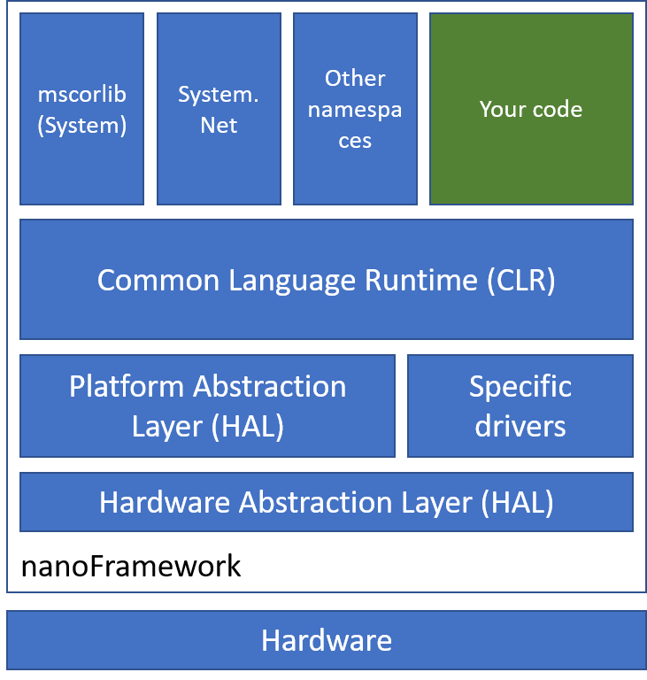

# .NET **nanoFramework** Architecture

[Simplifications and trade-offs](simplifications-and-trade-offs.md) is an important read to start with. As in micro controller unit the resources are limited, we had to make trade off to still get the best of the .NET and C# experience but with few constraints.

Native development:

- [Generating stubs for a native project, NANOCLR macros, Arguments and return types](nanoclr-stub-args.md)
- [Class Libraries](class-libraries.md)
- [Date and Time](date-and-time.md)
- [Native interrupt handlers](native-interrupt-handlers.md)
- [Wire Protocol](wire-protocol.md)
- [PE File format](pe-file.md) and more details [here](pe-file/index.md)
- [Package and assembly versions and checksums](guide-version-checksums.md)
- [String.Format for numerics examples](string-format-examples.md)

As a summary, we can represent the nanoFramework architecture like this:

nanoFramework is build on an Hardware Abstraction Layer (HAL). The HAL allow to access the hardware in a consistent and standard way. This allow to have a set of functions that are exposed the same way to the Platform Abstraction Layer (PAL) and specific drivers.

The CLR is built on the PAL and offers multiple libraries. The one which is always used is mscorlib (System and few other namespaces). The modularity of nanoFramework allows to add as many namespaces, classes as you want. They'll all be linked to the CLR.

Other architecture elements:

- [Unit Test for nanoFramework architecture](unit-test.md)
- [Floating point calculations](floating-point-calculations.md)
- [Application deployment](deployment.md)
- [Thread execution](thread-execution.md)
- [HAL](HAL.md)
