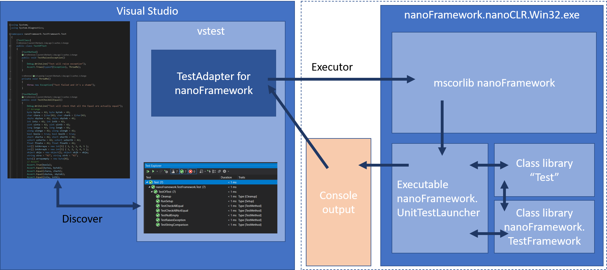

# Unit Test for nanoFramework architecture

This document gives explanation on how the nanoFramework Unit Test platform is build and how everything is working together. The all up architecture can be described like that:



nanoFramework test platform is relaying on Visual Studio test platform (vstest) and uses the concept of Adapter. You'll fine more details information [here](https://github.com/Microsoft/vstest-docs/blob/master/RFCs/0004-Adapter-Extensibility.md).

In short, vstest offers extensibility for an integration into Visual Studio but as well as in command line for capacity to run on pipelines. We've been building a specific component, `nanoFramework.TestAdapter` for this purpose. It does implement the 2 interfaces described into the detailed information and a third one to use specific parameters like time out, if the tests has to run on real hardware or in the Win32 nanoCLR. The architecture is the exact same if the tests are on the Win32 nanoCLR or done on real hardware. The only difference is the output console which in the case of a real hardware is pulled from the serial debug port.

One of the interface is called `ITestDiscoverer` which is used by the Visual Studio to gather the possible tests. vstest will call the adapter for any build that is triggered and pass the dll or exe generated matching specific build condition (as so far we don't have TFM, we're using a hack and target Framework40). Our nanoFramework TestAdapter is then parsing the directories to find the nfproj, parsing the cs files looking at the specific Test attributes defined for nanoFramework. A list is built out of this and passed back.

This hack is done thru a file called with the extension `.runsettings` and the minium elements you need are (not: IsRealHardware to false to run on Win32 nanoCLR, true for a real hardware):

```xml
<?xml version="1.0" encoding="utf-8"?>
<RunSettings>
   <!-- Configurations that affect the Test Framework -->
   <RunConfiguration>
       <MaxCpuCount>1</MaxCpuCount>
       <ResultsDirectory>.\TestResults</ResultsDirectory><!-- Path relative to solution directory -->
       <TestSessionTimeout>120000</TestSessionTimeout><!-- Milliseconds -->
       <TargetFrameworkVersion>Framework40</TargetFrameworkVersion>
   </RunConfiguration>
   <nanoFrameworkAdapter>
    <Logging>None</Logging>
    <IsRealHardware>True</IsRealHardware>
   </nanoFrameworkAdapter>
</RunSettings>
```

Visual Studio will then display them. In this case, they are still not run once discovered except if you've selected this option.

When you start building them, another interface is triggered `ITestExecutor`. In the case you're running in the context of Visual Studio, the list of test (individual or full list) is passed and this is where the `nanoFramework.nanoCLR.Win32.exe` is launched as a process passing the `nanoFramework.UnitTestLauncher.pe`, `mscorlib.pe`, `nanoFramework.TestFramework.pe` and of course you own testlibrary to the executable. The nanoFramework Unit Test launcher will then use reflection to load the test assembly and execute the tests with first the `Setup` ones, then the `TestMethod` and finally the `Cleanup` ones.

The output of this process is redirected to the TestAdapter which then parse it. Important note: the `UnitTestLauncher` **must** be build and deploy in debug! If not, it will never be able to output anything in the console. To run the test on a real hardware, it's just about adding an entry line into the runsettings file like above.

Once the tests finishes to run, the status is returned. Simple string output with the status of the test, the name of the method and the time it run or the exception. `Test passed: MethodName, 1234` or `Test failed: MethodName, Detailed exception`.

This is passed back to vstest and then displayed into Visual Studio.

If the vstest.console.exe is used, the executor will be just a list of dll and exe, the discovery phase is called internally and a list of tests and their status is then returned using the same principal.

## Distributing everything in a transparent way

NuGet is our best friend! We've package all what you need in there! The Win32 nanoCLR executable, the mscorelib and of course the Unit Test launcher and the test Framework. If you add it to your project, you'll just need to add a `.runsettings` file into your project directory with the elements described in the previous section.

We've been building a Unit Test nanoFramewok project as well in Visual Studio, that's the easiest way! It will add automatically the NuGet and the .runsettings to the project.

## Where to look next

The current status and information about usage is available under [Unit Test](./index.md) main menu entry.
