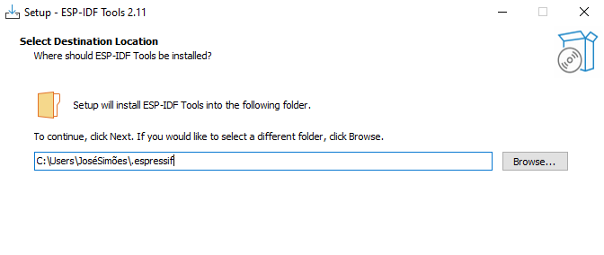
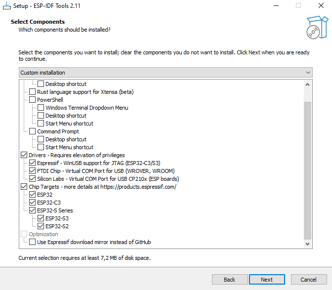

# How to Build, Flash and Debug the ESP32 nanoCLR on Windows using Visual Code

⚠️ NOTE about the need to build .NET **nanoFramework** firmware ⚠️

You only need to build it if you plan to debug the CLR, interpreter, execution engine, drivers, add new targets or add new features at native level.
If your goal is to code in C# you just have to flash your MCU with the appropriate firmware image using [nanoff](https://github.com/nanoframework/nanoFirmwareFlasher).
There are available ready to flash firmware images for several targets, please check the [Home](https://github.com/nanoframework/Home#firmware-for-reference-boards) repository.

## About this document

This document describes how to build the required images for .NET **nanoFramework** firmware for ESP32 targets.
The build system is based on CMake tool to ease the development in all major platforms.

## Using Dev Container

If you want a simple, efficient way, we can recommend you to use [Dev Container](using-dev-container.md) to build your image. This has few requirements as well like Docker Desktop and Remote Container extension in VS Code but it is already all setup and ready to run!

If you prefer to install all the tools needed on your Windows machine, you should continue this tutorial.

## Prerequisites

You'll need:

- [Visual Studio Code](https://code.visualstudio.com/). Additional extensions and setup steps follow below.
- Visual Studio Code Extensions
  . [C/C++](https://marketplace.visualstudio.com/items?itemName=ms-vscode.cpptools) - C/C++ IntelliSense, debugging, and code browsing (by Microsoft)
  . [CMake Tools](https://marketplace.visualstudio.com/items?itemName=ms-vscode.cmake-tools) - Extended CMake support in Visual Studio Code (by Microsoft)
- [CMake](https://cmake.org/download/) (Minimum required version is 3.21)
- [Python 3.6.8](https://www.python.org/downloads/release/python-368) Required for uploading the nanoCLR to the ESP32.
  - Ensure the Windows default app to open `.py` files is Python.
- A build system for CMake to generate the build files to. We recommend [Ninja](https://github.com/ninja-build/ninja/releases).
- [ESP-IDF Tools](https://docs.espressif.com/projects/esp-idf/en/stable/esp32/get-started/windows-setup.html).
- Driver for the USB to UART Bridge. This depends on the ESP32 hardware. After installing it, use Windows Device Manager to determine the COM port as this is needed to complete the setup. Follows the most common drivers (all these are available along with ESP-IDF tools installer):
  - [CP210x USB to UART Bridge VCP Drivers](https://www.silabs.com/developers/usb-to-uart-bridge-vcp-drivers?tab=downloads).
  - [FTDI Virtual COM Port Drivers](https://www.ftdichip.com/Drivers/VCP.htm).
  - [WHC CH34x](https://www.wch.cn/download/CH341SER_ZIP.html).

## Overview

-**Step 1**: Create a directory structure such as the following:

      `C:\nanoFramework`

-**Step 2**: Download and install [Visual Studio Code](http://code.visualstudio.com).

-**Step 3**: Clone [`nf-interpreter`](https://github.com/nanoframework/nf-interpreter) repository into `C:\nanoFramework\nf-interpreter`. See next section for more info.

-**Step 4**: Install ESP-IDF Tools by using the installer provided by Espressif.

-**Step 5**: Review and adjust several JSON files to match your environment (as documented below)

-**Step 6**: Restart Visual Studio Code (due to json changes)

## .NET **nanoFramework** GitHub repo

If you intend to change the nanoCLR and create Pull Requests then you will need to fork the [nanoFramework/nf-interpreter](https://github.com/nanoFramework/nf-interpreter) to your own GitHub repo and clone the forked GitHub repo to your Windows system using an Git client such as [Fork](https://fork.dev) or the [GitHub Desktop application](https://desktop.github.com).

The _main_ branch is the default working branch. When working on a fix or experimenting a new feature you should do it on its own branch. See the [Contributing guide](../contributing/contributing-workflow.md#suggested-workflow) for specific instructions on the suggested contributing workflow.

If you don't intend to make changes to the nanoBooter and nanoCLR, you can just clone [nanoFramework/nf-interpreter](https://github.com/nanoFramework/nf-interpreter) directly from GitHub.

Make sure to put this folder high enough on your drive, that you won't trigger long filename issues. CMake does not support filenames in excess of 250 characters.

## Setting up the build environment

After cloning the repo, you need to setup the build environment. You can use the power shell script or follow the step-by-step instructions.

### Manual install of the build environment

(If you already have installed ESP-IDF Tools you can skip this step.)

-**Step 1**: Install ESP-IDF Tools by using the installer provided by Espressif [here](https://docs.espressif.com/projects/esp-idf/en/stable/esp32/get-started/windows-setup.html#esp-idf-tools-installer). The installer includes all the pre-requisites.

-**Step 2**: After launching the installer you have to follow the wizard and follow the instruction there. Follows some aspects worth mentioning.

-**Step 3**: Location of the IDF repository. You can set this to a location of your choosing. After the installer completes, you'll find a git clone of the ESP-IDF at this location.


-**Step 4**: Location of the IDF toolchain and other tools. The default it's at the user folder. Feel free to change this to another location of your choosing.



-**Step 5**: At the options screen, know that you don't have to install all the tools there. Follow the recommended option to be able to build .NET nanoFramework. Also note that you may want to install the toolchains only for the chip serie(s) that you're planning to build for.



-**Step 6**: The install step may prompt you for permission on installing drivers and launch secondary installers. And be aware that it can take a while to complete...

-**Step 7**: After the installer completes, open a command prompt at the IDF repository location with elevated permission and execute the script `install`. This will _hopefully_ install all the requirements and prerequisites.

-**Step 8**: Now execute the script `export`. This will _hopefully_ update the path environment variable of your machine. You can check the success of the operation by opening another cmd prompt and print the content of the path variable.

:warning: At the time of this writing, the CMake version distributed with IDF it's outdated. You have to edit the path environment variable after this step and remove the entry pointing to CMake so the current CMake it's used. This should be something like `(...).espressif\tools\cmake\3.20.3`. :warning:

-**Step 9**: Calling the above scripts it's not 100% guaranteed to effectively install everything and updates the path. This can be because of permission issues, updating the path variable and others. Here's the image of the path on a machine where the update was successful so you can compare it.


-**Step 10**: Also worth checking if the following environment variables have also been setup:

- `IDF_PATH`: must point to the location where the ESP-IDF repo was cloned (see step 3. above).
- `IDF_PYTHON_ENV_PATH`: must point to Python install location.
- `IDF_TOOLS_PATH`: must point to the location where the ESP-IDF tools where installed (see step 3. above).

:warning: **Having the path properly setup it's absolutely mandatory in order to be able to build.** :warning:

## Set up Visual Studio Code

-**Step 1**: Install the extensions:

    - [C/C++](https://marketplace.visualstudio.com/items?itemName=ms-vscode.cpptools)
    - [CMake Tools](https://marketplace.visualstudio.com/items?itemName=ms-vscode.cmake-tools)

-**Step 2**: Run the PowerShell script `Initialize-VSCode.ps1` that's on the `install-scripts` folder. This will adjust the required settings, build launch configuration for debugging and setup the tasks to ease your developer work.

    ```ps
    .\Initialize-VSCode.ps1
    ```

    - You can force the environment variables to be updated by adding `-Force` to the command line.
    - The PowerShell relies on the environment variables described above to properly setup the various VS Code working files. In case you have not used the automated install and the variable are not available you'll have to manually edit `tasks.json`, `launch.json` and `settings.json` to replace the relevant paths. **!!mind to always use forward slashes in the paths!!**
    - More info available on the [Tweaking CMakeUserPresets.TEMPLATE.json](cmake-presets.md) documentation page.

- **Step 3:** Copy the template file (in `nf-interpreter\config` folder) `user-tools-repos.TEMPLATE.json` to a (new) file called `user-tools-repos.json`. Rename the json section `user-tools-repos-local` to `user-tools-repos` and adjust paths for the tools and repositories in the `user-tools-repos` configuration preset. If you don't have the intention to build for a particular platform you can simply remove the related options from there. If you don't want to use local clones of the various repositories you can simply set those to `null`. **!!mind to always use forward slashes in the paths!!**

- **Step 4**: Save any open files and **RESTART** VS Code. Have you **RESTARTED** VS Code? You really have to do it otherwise this won't work.

## Build nanoCLR

-**Step 1**: Launch Visual Studio from the repository folder, or load it from the **File** menu, select **Open Folder** and browse to the repo folder. VS Code could prompt you asking "Would you like to configure this project?". Ignore the prompt as you need to select the build variant first.
Next time VS Code open it should load the workspace automatically.

- **Step 2:** Reopen VS Code. It should load the workspace automatically. In the status bar at the bottom left, click on the `No Configure Preset Selected` and select the target you want to build from the drop-down list that will open at the top, e.g. `ESP32_PSRAM_REV0`. The respective build preset will be automatically selected by VS Code. More details on this on the documentation about the available targets [here](../reference-targets/esp32.md).


-**Step 3**: In the status bar click `Build` or hit F7.

-**Step 4**: Wait for the build to finish with `Build finished with exit code 0` output message.

-**Step 5**: In the `build` folder you'll find several files:
    - `nanoCLR.bin`
    - `nanoCLR.elf`
    - `partitions_4mb.elf`
    - ...

>> Note: If there are errors during the build process it is possible to end up with a partial build in the `build` folder, and the `CMake/Ninja` build process declaring a successful build despite the `.bin` targets not being created, and a `CMake clean` not helping.
In this case deleting the contents of the `build` folder should allow the build to complete once you resolve the issues that cause the original failure.

### Common Build Issues

The above may have some errors if:

- CMake is not installed properly, not in the PATH or cannot be found for some reason.
- Ninja is not recognized: check settings.json or your PATH environment variable and restart Visual Studio Code.
- COMPILATION object file not found: check that your paths don't exceed 140 chars. Put the solution folder high enough on drive.
- Reopen VS Code if you have made changes on the `CMakePresets.json` or `CMakeUserPresets.json`.

A good remedy for most of the build issues is to manually clean the build folder by deleting it's contents and restarting VS Code.

## Flash nanoCLR into ESP32

-**Step 1**: The third file that gets flashed into the ESP32 is the `bootloader.bin` which will be located here `build/bootloader/bootloader.bin` after a successful build.

-**Step 2**: Connect your development board.

-**Step 3**: Some ESP32 boards require to be put into "download mode". Most don't even need this. Check the documentation for your variant. One of the most common options are: hold down the GPIO0 pin to GND or holding down the respective button during power up.

-**Step 4**: Download the image to device.
    - In Visual Studio Code go to menu "Terminal" -> "Run Task" and select "Flash nanoCLR to ESP32 from the list.

    - As an alternative enter the command in command palette:

       ```cmd
       Tasks: Run task
       ```

       and if you flash the board for the first time

       ```cmd
       Erase ESP32
       ```

       and then

       ```cmd
       Flash nanoCLR to ESP32
       ```

       It will ask you for the COM port where it's connected.

    - An other alternative is using [nanoff](../getting-started-guides/getting-started-managed.md#uploading-the-firmware-to-the-board-using-nanofirmwareflasher) tool:

       ```console
       nanoff --target ESP32_PSRAM_REV0 --serialport <YourCOMPort> --image nanoCLR.bin --address 0x00010000
       ```
  
    - And another alternative would be to use Espressif's own [esptool.py](https://github.com/espressif/esptool) tool:

        ```console
        esptool.py --chip auto --port <YourCOMPort> --baud 1500000 --before "default_reset" --after "hard_reset" write_flash -z --flash_mode "dio" --flash_freq "40m" --flash_size detect 0x1000 <YourPathTo>/nf-interpreter/build/bootloader/bootloader.bin 0x10000 <YourPathTo>/nf-interpreter/build/nanoCLR.bin 0x8000 <YourPathTo>/nf-interpreter/build/<PartitionFilePassingToYourBoard>.bin
        ```

## Start with a 'Hello World' C# application

Watch the video tutorial [here](https://youtu.be/iZdN2GmefXI) and follow the step that should be done in Visual Studio 2017 Community Edition. Skip the steps that describing uploading the nanoCLR into the STM32 Nucleo board.

## Debugging nanoCLR

If you want to debug the nanoCLR code on the ESP32 chip you'll need an JTAG debugging adapter. ESP32 WROVER KIT already includes one. For other boards you can use the Olimex ARM-USB-OCD-H JTAG debugging adapter or a Segger JLink. There are preset configurations for these adapters.

You can now debug nanoCLR on the ESP32 by pressing F5 in Visual Studio Code.

### Notes on JTAG debugging on ESP32

The JTAG connections on ESP32 DEVKITC are:

- TDI -> GPIO12
- TCK -> GPIO13
- TMS -> GPIO14
- TDO -> GPIO15
- TRST -> EN / RST (Reset)
- GND -> GND

See Gojimmypi for description of JTAG connections [here](https://gojimmypi.blogspot.com/2017/03/jtag-debugging-for-esp32.html).

If flashing nanoCLR via a COM port (default), then be aware that you need to disconnect the JTAG to avoid it preventing the bootloader from running, and therefore being unable to reprogram the ESP23. e.g. if you see the following pattern repeating, unplug the USB-OCD-H, and then the programming will proceed.

      ```txt
         esptool.py v2.1
         Connecting........_____....._____...
      ```

You may have to add the `IRAM_ATTR` attribute to a function that you want to debug, so it can be loaded in RAM. When launched the debugger will normally stop at the main task. Its not possible to set a break point on code that is not yet loaded so either step down to a point that it is loaded or temporarily set the method with the IRAM_ATTR attribute.

For more information on JTAG debugging see [Espressif documentation](http://esp-idf.readthedocs.io/en/latest/api-guides/jtag-debugging/).

### Debugging nanoCLR without special hardware

If you do not have access to any special hardware required for debug methods mentioned above you still may use some old-school technique: just place some temporary code at interesting places to get the required information. Using steps below you will get that information in Visual Studio's standard debug output window.
Certainly Visual Studio must be debugging something to have that window in working state. So this hack will work only in cases when
you want to debug a nanoCLR code which can be executed via managed code.

- **Step 1**: Write some managed code which results in a nanoCLR call executing the code you are interested in.
- **Step 2**: Choose one or more places in nanoCLR code where you want to know something.
   e.g.: What is the value of a variable? Which part of an if-else statement gets executed?
- **Step 3**: Put the following temporary code there:

      ```cpp
      {
            char temporaryStringBuffer[64];
            int realStringSize=snprintf(temporaryStringBuffer, sizeof(temporaryStringBuffer), "interestingValue: %d\r\n", interestingValue);
            CLR_EE_DBG_EVENT_BROADCAST( CLR_DBG_Commands_c_Monitor_Message, realStringSize, temporaryStringBuffer, WP_Flags_c_NonCritical | WP_Flags_c_NoCaching );
      }
      ```

   Or simply:

      ```cpp
         CLR_EE_DBG_EVENT_BROADCAST( CLR_DBG_Commands_c_Monitor_Message, 12, "Hello World!", WP_Flags_c_NonCritical | WP_Flags_c_NoCaching );
      ```

- **Step 4**: The boring part: rebuild and re-flash firmware and your program.
- **Step 5**: Start debugging in Visual Studio and keep eye on it's debug output window.
   You will get your messages there when the related temporary code gets executed!
- **Step 6**: Iterate steps 2-5 till you find out what you were interested in.
- **Step 7**: Do not forget to remove all those temporary code blocks before you accidentally commit it!
