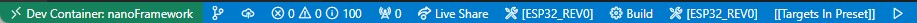

# Using Dev Container to build targets

[Dev Container](https://marketplace.visualstudio.com/items?itemName=ms-vscode-remote.remote-containers) is a way to use VS Code with a separated container. This allows to work on a separated environment than your normal Windows/Linux/Mac. This has the advantage of being isolated from the application installed, so you don't have to "pollute" your own environment with tools you may not need for other purpose. The other advantage is the ability to be pre setup, build at first request, pulling all the needed tools, repository, documents and settings that you'll need in your development.

We offer the possibility to use such a Dev Container to build any of the supported target in a very simple and straight forward way.

## Requirements

- **Step 0**: Install WSL - We strongly recommended for performance reasons: activate [Windows Subsystem for Linux 2](https://learn.microsoft.com/windows/wsl/install) on your Windows host machine.

> note: that may require a reboot

- **Step 1**: We **DO NOT** recommend to have any application like Docker Desktop installed but rather use directly a clean installation of Docker or Podman directly on a WSL Ubuntu Linux instance.
The measure performances between native WSL Docker or Podman and using Docker Desktop are about **50 times faster without** and **with the git project also directly cloned in the WSL instance**. 
  1. you can install a new version of WSL like the Ubuntu 22.04: `wsl --install Ubuntu-22.04`
  1. Create your user and password.
  1. Install directly a container engine, let's say the Docker engine, follow the [instructions here](https://docs.docker.com/engine/install/ubuntu/). For an Ubuntu based image:

      ```shell
      # Add Docker's official GPG key:
      sudo apt-get update
      sudo apt-get install ca-certificates curl
      sudo install -m 0755 -d /etc/apt/keyrings
      sudo curl -fsSL https://download.docker.com/linux/ubuntu/gpg -o /etc/apt/keyrings/docker.asc
      sudo chmod a+r /etc/apt/keyrings/docker.asc

      # Add the repository to Apt sources:
      echo \
        "deb [arch=$(dpkg --print-architecture) signed-by=/etc/apt/keyrings/docker.asc] https://download.docker.com/linux/ubuntu \
        $(. /etc/os-release && echo "$VERSION_CODENAME") stable" | \
        sudo tee /etc/apt/sources.list.d/docker.list > /dev/null
      sudo apt-get update
      ```

      Then make the install and confirm you want to install:

      ```shell
      sudo apt-get install docker-ce docker-ce-cli containerd.io docker-buildx-plugin docker-compose-plugin
      ```

      Add your user to the group who can run docker without elevated priviledges:

      ```shell
      sudo usermod -aG docker $USER
      ```

      Exit WSL with `exit`

- **Step 2**: Make sure you have [VS Code](https://code.visualstudio.com/Download) installed.
- **Step 3**: Make sure you have the `DevContainer` extention installed in VS Code: select the extension icon (or File -> Preferences -> Extensions) and search for `DevContainer`. Install the Microsoft one:

    

  1. Create a profile in VS Code (File -> Preferences -> Profile -> Create profile), call it for example nanoFramework:

    

  1. Adjust DevContainer options: Go to the settings (File -> Preferences -> Settings) and search for container, set the WSL distribution you just prepared (in our example Ubuntu-22.04):

    

    Adjust as well the commands to be luanch in WSL and not from Windows:

    

- **Step 4**: From the command line, reconnect to WSL (just type `wsl`), go to your home (just do `cd ~`).
- **Step 5**: Make sure your have cloned [nf-interpreter](https://github.com/nanoframework/nf-interpreter) nanoFramework directory. The working branch is `main`.

  ```shell
  git clone https://github.com/nanoframework/nf-interpreter.git
  ```
- **Step 6**: Open the full `nf-interpreter`directory with VS Code. Form your home, in WSL, you can just type `code ./nf-interpreter`
- **Step 7**: Copy the two template files (in `nf-interpreter\config` folder) `user-tools-repos.TEMPLATE.json` and `user-prefs.TEMPLATE.json` to (new) files named `user-tools-repos.json` and `user-prefs.json`.
  Change the content of your "new" `user-tools-repos.json` file as follows:
  - Rename the json section `user-tools-repos-container` to `user-tools-repos`.
  - You will have to close VS Code
  - Reopen VS Code from your home `code ./nf-interpreter`

- **Step 8**: Choose your container.

- **Step 9**: Once prompted, open the dev container.

  This is illustrating how to do this:

  

  > note: in our case, we have multiple DevContainers all starting with `nanoFramework`. Select the one you need!

  

  If VS Code does not show the prompt, you can press F1 to show all commands. In this list, you can select the item "Remote-Containers: Open Folder in Container..." to open the dev container manually. This option will require you to select the folder through the folder selection dialog.

- **Step 10**: At that point, like in the previous illustration, when clicking on the logs, you should see activities. Be patient. Yes, super patient.
- **Step 11**: The prebuild container will be downloaded, depending on your internet bandwith, this may take a little bit of time.
- **Step 12**: More patience, yes, all the needed tools and directory are cloned, all the needed settings are cloned as well.
- **Step 13**: It will be over when your VS Code will give you access to the files and will look like this:


- **Step 14**: Select the target you want to build, if all the previous steps has been done properly, the list will show up:


If you select for example the ESP_REV0, you will see it in the taskbar:



To select a new image, just click on the name of the target, the menu will pop up again and you can select a new target. Make sure that you clean your build folder first.

- **Step 15**: This will actually prepare all what is needed in the `build`folder.

> **Important**: If you did not follow the path of cloning the repository in the WSL instance but rather use a clone in Windows,
this may take up to 1h or more depending on the target and the performance of your machine. So be patient! While the project will be in preparation, you'll get the small window on the right:


- **Step 16**: If you are using the recommended configuration and followed the steps, everything should be done in couple of seconds.
- **Step 17**: Hit `F7` this will trigger the build. The build will take some time as well. If all goes right, it will finish with a code 0 with something like: `[build] Build finished with exit code 0`
- **Step 18**: When the build succeed, your build file is located on `~/nf-interpreter/build/nanoCLR.bin`. You can copy it into a Windows folder
(for example `cp ~/nf-interpreter/build/nanoCLR.bin /mnt/c/tmp`). From there, you can use `nanoff` to flash it, see [flashing image section](#flashing-image).

## Tips and tricks

### Some build may fail for size reasons

Build may fail if your image is too big. This is the case sometime when you select `debug`on some devices like the ST Nucleo one. You'll then get a build fail which looks like this:

```text
[build] Memory region         Used Size  Region Size  %age Used
[build]           flash0:       18984 B        18 KB    102.99%
[build]           flash1:          0 GB         0 GB
[build]           flash2:          0 GB         0 GB
[build]           flash3:          0 GB         0 GB
[build]           flash4:          0 GB         0 GB
[build]           flash5:          0 GB         0 GB
[build]           flash6:          0 GB         0 GB
[build]           flash7:          0 GB         0 GB
[build]           config:          0 GB         0 GB
[build]       deployment:          0 GB         0 GB
[build]            ramvt:          0 GB         0 GB
[build]             ram0:        8528 B      32720 B     26.06%
[build]             ram1:          0 GB         0 GB
[build]             ram2:          0 GB         0 GB
[build]             ram3:          0 GB         0 GB
[build]             ram4:          0 GB         0 GB
[build]             ram5:          0 GB         0 GB
[build]             ram6:          0 GB         0 GB
[build]             ram7:          0 GB         0 GB
[build]       bootclpbrd:          48 B         48 B    100.00%
[build] collect2: error: ld returned 1 exit status
```

### Making changes in your CMakePresets.json or CMakeUserPresets.json file

Every time you make a change in the `CMakePresets.json` or `CMakeUserPresets.json` files, you may have to leave the container bit clicking on the bottom left and then select `Reopen locally` and again select `Reopen in dev container`.

You usually do this operation to adjust what you want to add in your target.

More generally, any change in any of the file from the `.vscode` folder will require to exit and restart the dev container.

## Advance scenarios

A Dev Container consist of a Dockerfile and a `devcontainer.json` file. You can of course customize both and personalize your environnement. This section will give you couple of hints for this.

### Customize your devcontainer.json file

There are quite some elements you can customize, one of them is the mounting folders you want to be able to access in your container. For example, we've couple of usual folders where you can for example store your bash history or mount more folders:

```json
"mounts": [
    "source=/var/run/docker.sock,target=/var/run/docker.sock,type=bind",
    // Mount .azure folder for seamless az cli auth
    "source=${env:HOME}${env:USERPROFILE}/.azure,target=/home/vscode/.azure,type=bind",
    // Keep command history
    "source=nano-bashhistory,target=/home/vscode/commandhistory,type=volume",
]
```

You have quite a large number of elements you can customize including the extension that will be installed:

```json
// Add the IDs of extensions you want installed when the container is created.
"extensions": [
    "ms-vsliveshare.vsliveshare-pack",
    "streetsidesoftware.code-spell-checker",
    "twxs.cmake",
    "ms-vscode.cmake-tools"
]
```

### Restricting the platforms you want to download

The `Dockerfile` contains all the elements needed to build any of the target. If you have a limited bandwidth or you are only interested in a limited number of targets, you can restrict what is cloned and installed.

Everything is commented, so if for example, you are sure you'll never target any TI boards, you can comment what is related to TI. In this example, you'll comment all this:

```dockerfile
#RUN git clone --branch 4.10.00.07 https://github.com/nanoframework/SimpleLink_CC32xx_SDK.git ./sources/SimpleLinkCC32 \
    # && git clone --branch 3.61.00.16 https://github.com/nanoframework/TI_XDCTools.git ./sources/TI_XDCTools \
#    && git clone --branch 4.20.01.04 https://github.com/nanoframework/SimpleLink_CC13x2_26x2_SDK.git ./sources/SimpleLinkCC13 \
#    && git clone --branch 1.5.0 https://github.com/nanoframework/TI_SysConfig.git ./sources/TI_SysConfig
```

You will note as well that you have 2 images, one for downloading and expending the tools, the other ones where the core tools are installed and the elements downloaded from the download image are copied. You could of course optimize both images to reduce to the strict minimum you require.

This is recommended for advance users only having a minimum of understanding of the required components.

### Non root user

The default Dev Container is running with root privileges. While this is ok in a context of a simple usage where you are just using it for this task once time to time, if you start using more regularly, you may want to lower the privileges and run thru a standard user.

For this, you'll have to uncomment the last line:

```json
// Uncomment to connect as a non-root user. See https: //aka.ms/vscode-remote/containers/non-root.
,"remoteUser": "vscode"
```

in the main Dockerfile, uncomment the files and add the script `non-root-user.sh`:

```dockerfile
ARG USERNAME=vscode
ARG USER_UID=1000
ARG USER_GID=$USER_UID
```

### Flashing image

Using Docker Desktop from Windows 10 you cannot flash compiled image to your device directly
because of the limitations of serial port exposal to container.
The instructions about "Terminal" -> "Run Task" -> "Flash nanoCRL ..."  available on other
document pages here wont work.

You can flash the compiled nanoCLR.bin file with [nanoff](../getting-started-guides/getting-started-managed.md#uploading-the-firmware-to-the-board-using-nanofirmwareflasher) tool.

Example:

```console
nanoff --update --platform esp32 --serialport COM3 --clrfile nanoCLR.bin
```

### Using podman as a container engine

If you are using podman as a container engine, you need to adjust couple of more settings:


In the `devcontainre.json` files, add the following entries:

```json
    "runArgs": ["--userns=keep-id"],
    "containerUser": "vscode",   
```

This is needed for the DevContainer to work as a standard user.
Podman works as a standard user per default compare to Docker which runs as root per default.

### Using Docker Desktop

We **DO NOT** recommand to use Docker Destop as the performances are not good with it. It does create an overlayer that makes all the commands and traffic to go through Windows.

If you still want to use it and are happy to pay a performance price, you need to make sure you uncheck the option "Execute in WSL".
