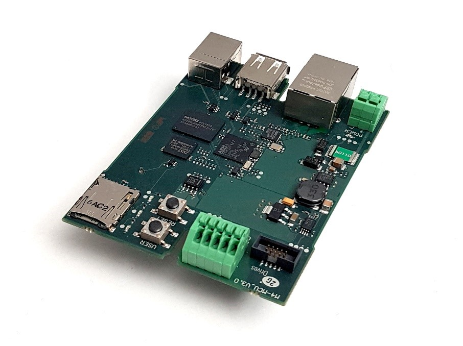
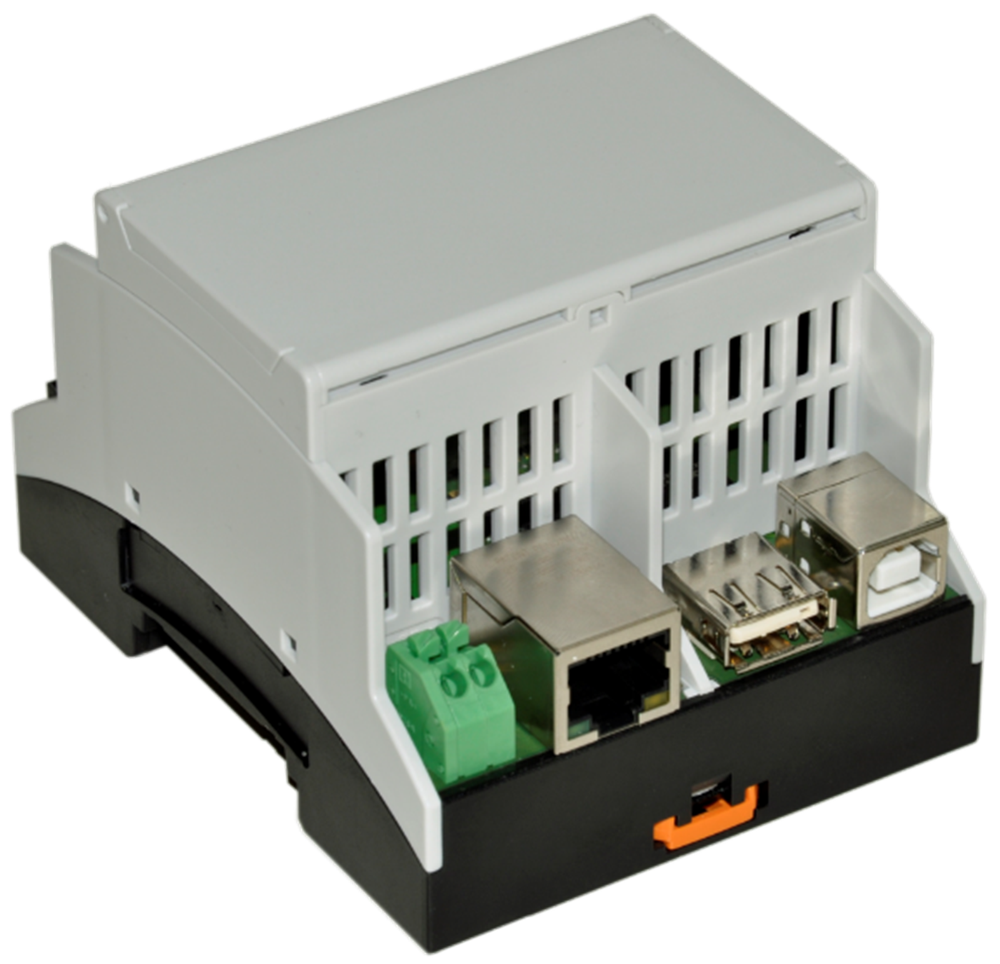
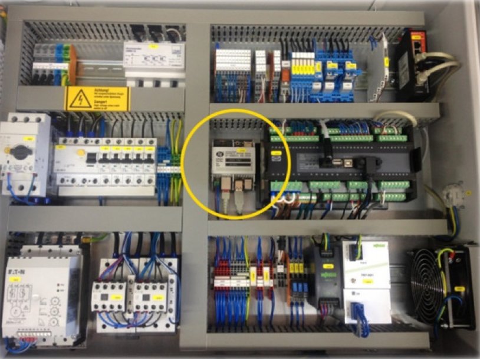
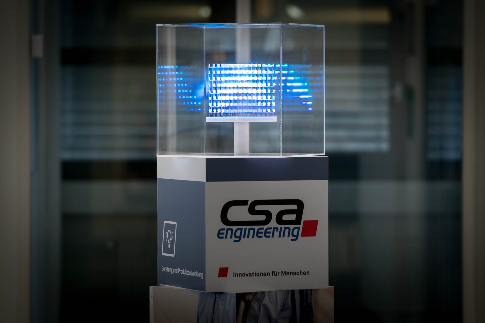
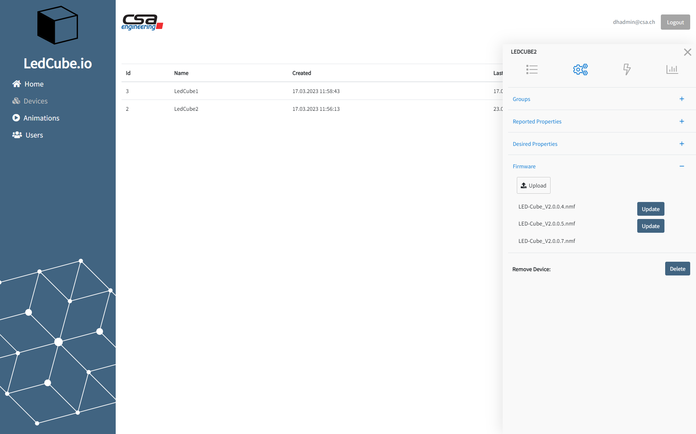

# .NET nanoFramework usage at CSA Engineering AG

**Company**: [CSA Engineering AG](https://www.csa.ch/)

As an engineering service provider, CSA Engineering AG develops customer-specific hardware and software solutions for the medical technology, passenger transportation and industry sector.
Recently, CSA developed together with one of its customers a universal embedded platform with a STM32F4 microcontroller as main hardware component and the .NET nanoFramework as software basis. The result is the so-called M4MCU-Board.

## M4MCU-Board

For both applications these key requirements were important:

- Extensive communication capabilities, especially TCP/IP for the remote access and CAN as well as ModBus for connecting to a PLC and industrial sensors
- Available filesystem and capabilities to handle larger data files and enable an easy on-site configuration, especially required are USB host and SD card functionalities
- Usage of C# code with all the publicly available .NET class libraries, as already a large code basis is existent at the customer and CSA. Additionally, to facilitate an efficient development environment as the same tools for programming the embedded part (M4MCU) and the computer application can be used
- The possibility of safe and secured remote software updates in the field

The developed M4MCU-Board fulfils these key requirements with the following components:

- Cortex-M4 STM32F427 microcontroller with 256kB SRAM and 1MB flash
- 8MB SDRAM and 8MB flash external storage
- SD card slot to store configuration data and large files
- LEDs, buttons and some GPIOs for general interactions
- Communication interfaces:
  - 1x USB device
  - 1x USB host
  - 1x Ethernet RJ45
  - 1x CAN
  - 1x RS485

In addition, several software realized features are available as e.g., development, deploying and debugging directly with Visual Studio, data encryption with NaCl algorithm, remote software update, several communication protocols as SSL/TLS, CAN, ModBus, software supervision with a watchdog.

The porting of the .NET nanoFramework to our own hardware platform took some time and required in-depth knowledge in embedded software development. But finally, the .NET nanoFramework could be successfully introduced and provided a comfortable way of development combined with a comprehensive set of features for the product application.

The M4MCU-Board and .Net nanoFramework has been used in the following applications.

## Application 1: Smart gateway for combined heat and power plant units

These generators produce in parallel heat and electrical power. For optimization purposes several control parameters need to be set up e.g., ignition timing or the air fuel ratio. The parameters must be accessible to maintenance engineers, both locally at the generator itself as well as over the internet since some of the generators are installed in very remote locations. In addition, characteristic data and error messages are logged and sent to the company to analyze the plant efficiency continuously. One important characteristic data is the nitrogen oxide concentration in the exhaust gases. To continuously monitor this value as well in previous models, a stand-alone unit as retrofit kit is available too. All the tasks described are realized with the M4MCU-Board, .NET nanoFramework as basis and the C# product application.

*M4MCU built into DIN rail compatible case*

*Application 1: Smart gateway (marked with yellow circle) installed in the combined heat and power plant control cabinet*

## Application 2: Control and communication electronic for an exhibition eye-catcher product

This product is an 8x8x8 LED-Cube to display text and animations and thus catch the attention of exhibition visitors. The LED-Cubes can be configured, animations chosen, and the status supervised by the operator on a frontend. In the background our IoT-Backend based on Azure products is running. The communication with this IoT-Backend via MQTT, the conversion and storage of the animations / playlists and the activation of the LEDs via SPI is realized with the M4MCU-Board, .NET nanoFramework as basis and the C# product application.

*Application 2: LED-Cube controlled by the M4MCU-Board*

*Application 2: LED-Cube configuration frontend*
