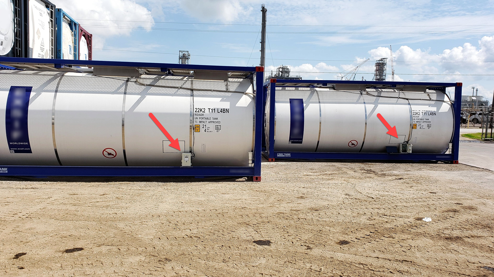
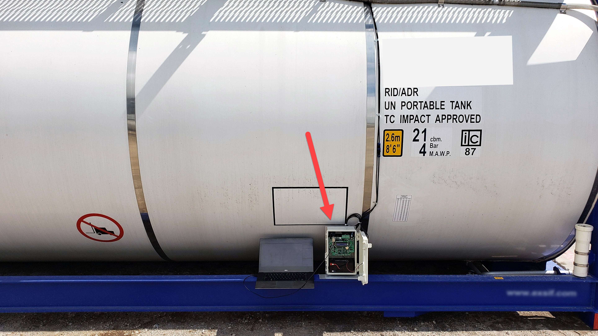
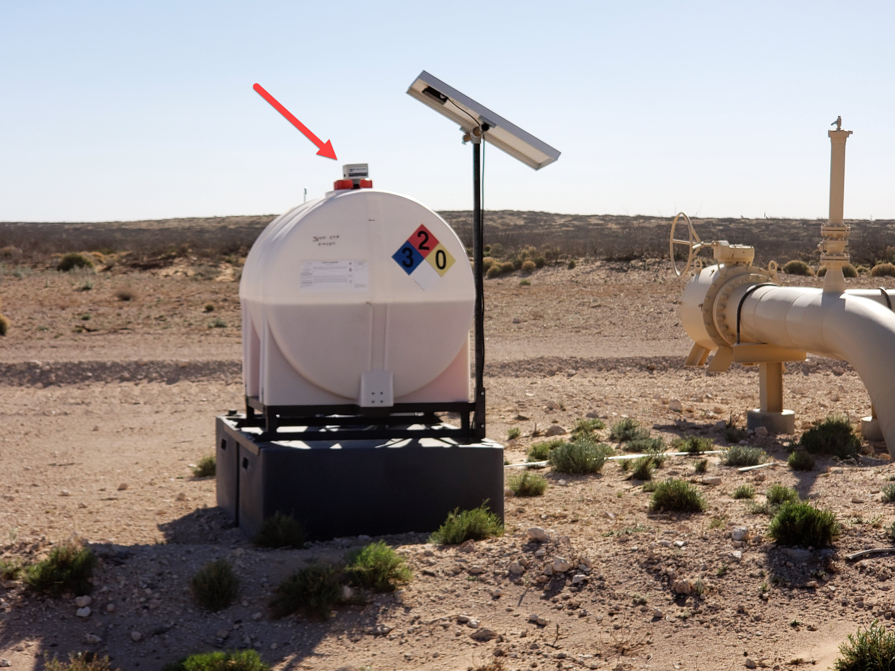
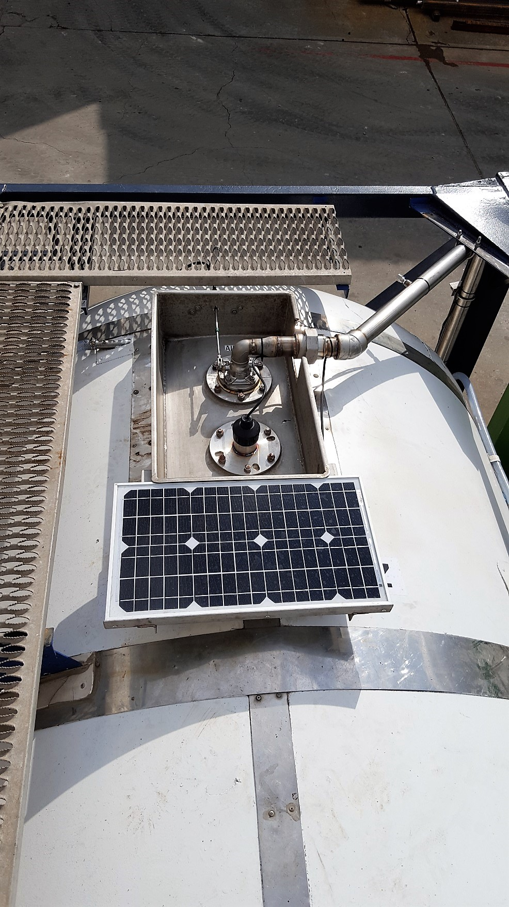
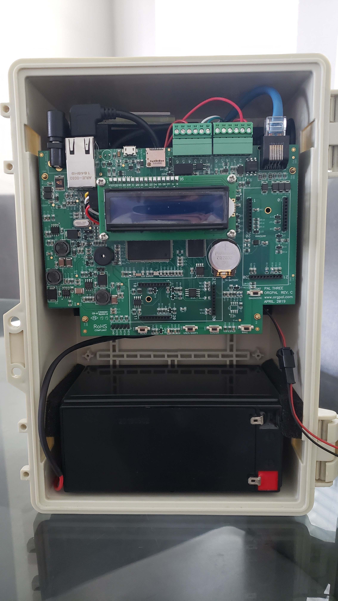

# Oil Fields Monitoring

**Company**: [OrgPal Telemetry](https://www.orgpal.com/)

**Application Industry**: Oil Field

**[Product website](https://www.orgpal.com/solutions-tank-level-monitoring)**

Energy field services and operations requires compliance, accurate and frequent monitoring. For oil and gas companies the challenge is finding a cost-effective, reliable system and not all telemetry systems are created equal.

[Zan Gligorov](https://www.linkedin.com/in/zan-gligorov-bb03a752), CEO of [OrgPal Telemetry](https://www.orgpal.com/), explains  the reasoning behind their choice.

Our objective was to create a modern, simple, easy-to-install and use device that could easily integrate with the hundreds of sensors from the most modern to already existing across oil fields in North America. Our hardware met those goals, but we needed a great firmware to match it, and nanoFramework made that possible.

Many solutions use different components from many manufacturers to integrate a solution, leading to a costly solution and even more costly maintenance option. The technology is not compatible by design, only function and given that they are deployed in distant hostile environments with limited or no access to terrestrial communications - and no electrical power supply - maintenance becomes very costly over time.

Because nanoFramework is so feature rich yet easy to use, has small footprint (it fits on tiny MCU's), our solution is efficient with the lowest power consumption in the industry. We were able to use a very high power STM32 MCU, integrate a complete satellite with antenna, on board flash/file system, USB, cellular support, RTC and more for a very powerful remote measurement system, with low energy footprint.

The resulting PalThree based solution is a game-changer for the industry.

Checkout these photos bellow.

*Tanks in staging area*

*Close up on tank with PalThree*

*Tank fitted with PalThree deployed in the desert*

*Solar panel that is powering PalThree*

*PalThree in product enclosure*
