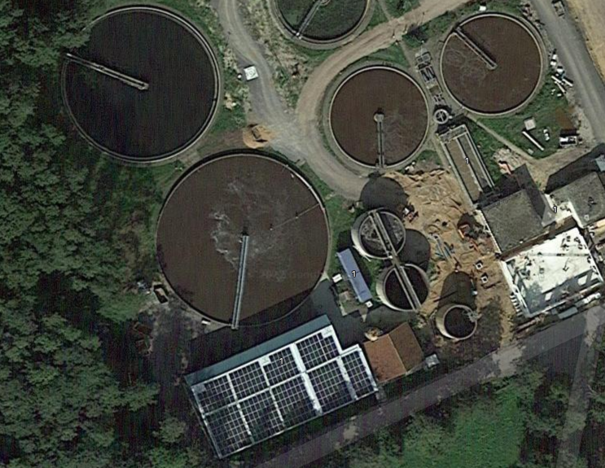
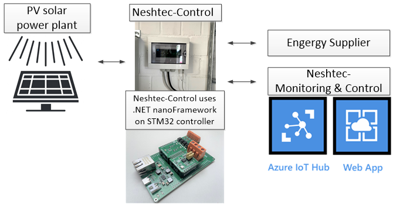

# Solar power plant remote monitoring & control

**Company**: [Neshtec](https://neshtec.eu/)

**Application Industry**: Solar power plant

Neshtec used its own newly developed hardware platform called Neshtec-Control in a project for the first time. The HW platform is based on a STM32F7 microcontroller and runs on .NET nanoFramework. In the project, Neshtec-Control is used to implement the interface between a <100kWp PV solar system installed at a sewage treatment plant and the energy supplier.

With the help of Neshtec-Control, the energy supplier can monitor the system remotely and also control it, for example set performance specifications or carry out an emergency shutdown. This is connected to Azure which enables Neshtec to perform its own plant monitoring and remote SW updates.

The interface conversion by Neshtec-Control takes place between the two communication protocols Modbus and IEC 60870-5-104. The Neshtec-Control has a modular structure and thus enables the project-specific use of different I/O modules, which are available abstractly on the application level through the .NET nanoFramework. In combination with the high reliability of the framework and information security functions, this enables an increase in efficiency in terms of costs and implementation time for Nesstec projects.

Checkout these photos bellow.

*Aerial view of the plant*

*System diagram*
