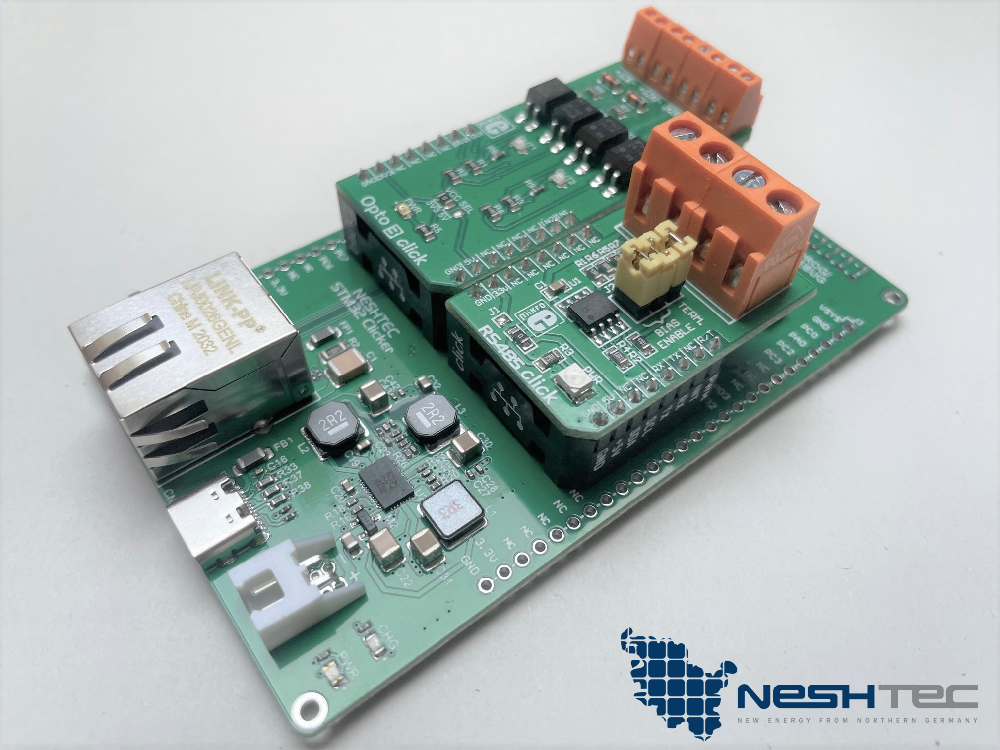
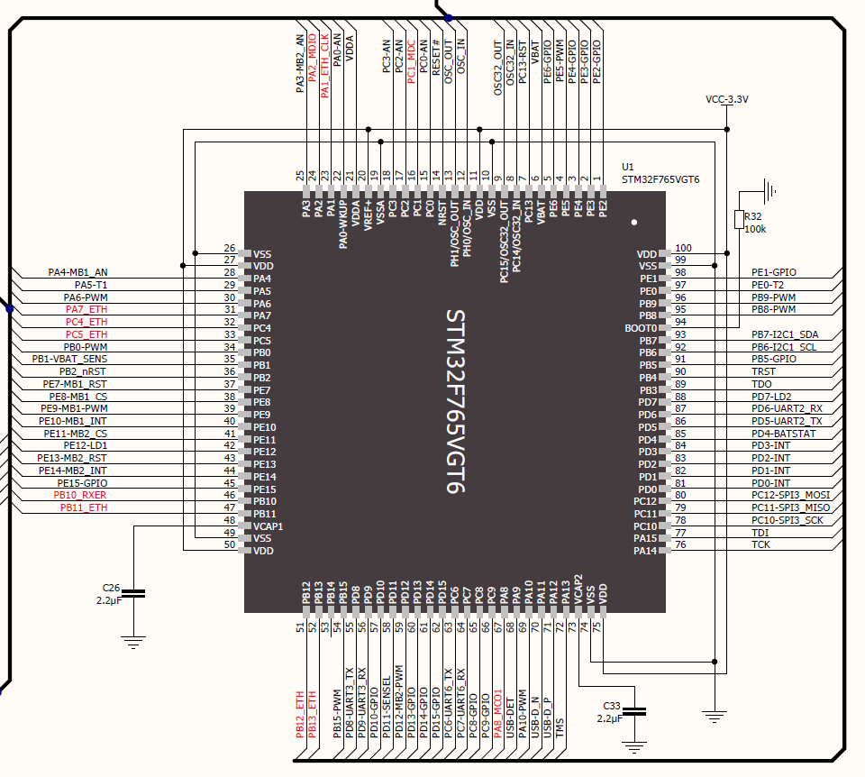
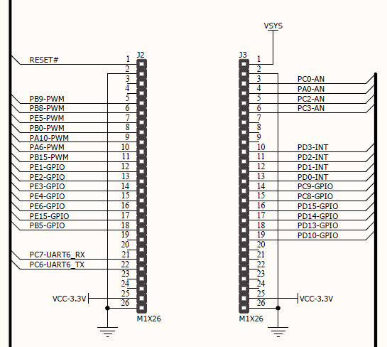
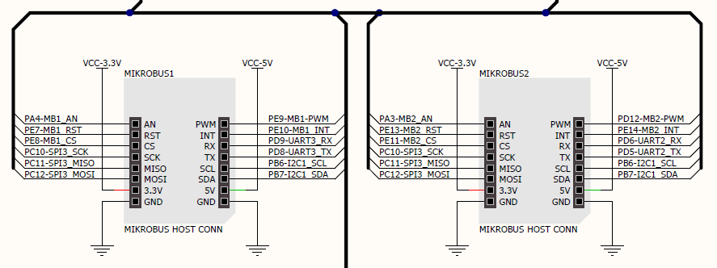
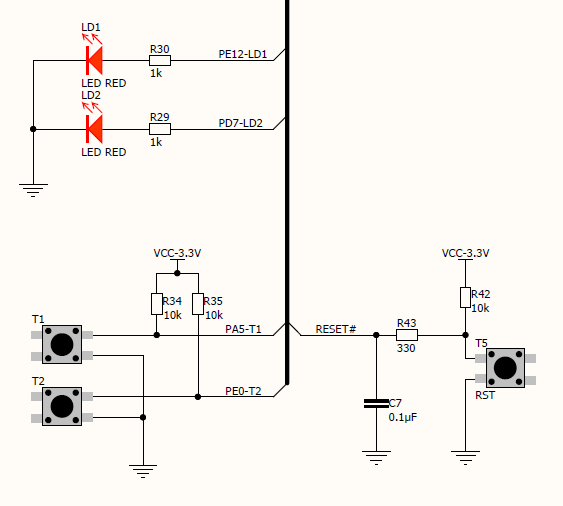

# NESHTEC NeshNode

NeshNode is a flexible, high performance board featuring a powerful STM32F7 dual core microcontroller, on-board ethernet, LiPo battery charger, lots of I/Os and another powerful feature: two MikroE Click™ sockets.

This board has also been tested by [TÜV Nord](https://www.tuev-nord.de/), which means that it is fully compliant with EU regulations (CE).

## How to get one?
Just check out or shop, we'll ship the board from Germany:
https://neshtec.eu/products/neshnode-controllerplatine

(We are working on a English translation, sorry about that)

## Hardware

NeshNode was designed to be used as flexible as possible in professional projects, without having to develop a new board every time. The board is powerful enough for extensive cryptographic tasks and offers a lot of interfaces.

### STM32F765VGT6 microcontroller

The board currently uses an ARM Cortex-M7 RISC core based STM32F765VGT6 MCU in a 100 pin package which operates at up to 216 MHz, 2 MB of persistent flash, 512KB SRAM, features a dedicated double precision FPU and also implements a full set of DSP instructions. To increase application security, it also features a MPU (memory protection unit).

See here for more details: https://www.st.com/en/microcontrollers-microprocessors/stm32f765vg.html

### Ethernet

Ethernet is supplied by a Microchip LAN8720A, which is a high performance 10BASE-T/100BASE-TX transceiver delivering up to 100 MBit/s, working on a large temperature range: https://www.microchip.com/en-us/product/lan8720a

### MikroE Click / MikroBus 

MikroE has designed a compact interface for which, as of today, there are over 1,000 different so-called "click boards" of very high quality - giving you the flexibility to easily add whatever kind of additional functionality you might need. 

See above (pinout) for a sample of MikroEs MikroBus layout.

Check out MikroE's click store for some awesome addon boards: https://www.mikroe.com/click

More information about the click standard can be found on the MikroE website: https://www.mikroe.com

### LTC3586 power management

We use a LTC3586 from Linear Technology, which is a highly efficient USB power manager and battery charger for LiIon and LiPo battery charging IC.

### Physical power switch

The board features a physical power switch, thus it can be completely turned off (or on).

### Pinout

#### MCU

#### GPIO / side headers 

#### MikroE MikroBus 

#### LEDs & buttons

## Legal
### General disclaimer

All information and technical data have been provided to the best of our knowledge. Mistakes can happen and will be corrected as we are aware of them.

Should you find an error, we would be pleased to hear from you! Just drop us an e-mail: kontakt@neshtec.eu.

### Trademark disclaimer

All product and company names are trademarks™ or registered® trademarks of their respective holders. Use of them does not imply any affiliation with or endorsement by them. 

MikroE® is a registered trademark and MikroBus™ a trademark of MikroElektronika d.o.o.
