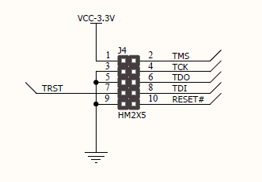
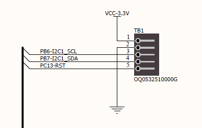

# NESHTEC NeshNode

NeshNode is a flexible, high performance board featuring a powerful STM32F7 dual core RISC based microcontroller, on-board ethernet, battery charger, lots of I/Os, two MikroE® Click™ sockets and a lot of tiny details, like a robust USB-C connector.

Furthermore, our board has been extensively tested by the independent testing institute [TÜV Nord](https://www.tuev-nord.de/) for EMC/EMI (electromagnetic compatibility / interference), which means that it is fully compliant with EU regulations (CE).

## How to get one?
Just check out our shop, we'll ship the board from Germany:
https://neshtec.eu/products/neshnode-controllerplatine

(We are working on a English translation, sorry about that)

## Hardware

NeshNode was designed to be used as flexible as possible in professional projects, without having to develop a new board every time. The board is powerful enough for extensive cryptographic tasks, cloud connectivity (like Microsoft Azure IoT Hub) and offers a lot of interfaces.

### STM32F765VGT6 microcontroller

The board currently uses an ARM Cortex-M7 RISC core based STM32F765VGT6 MCU in a 100 pin package which operates at up to 216 MHz, 2 MB of persistent flash, 512KB SRAM, features a dedicated double precision FPU and also implements a full set of DSP instructions. To increase application security, it also features a MPU (memory protection unit).

See here for more details: https://www.st.com/en/microcontrollers-microprocessors/stm32f765vg.html

### Ethernet

Ethernet is supplied by a Microchip LAN8720A, which is a high performance 10BASE-T/100BASE-TX transceiver delivering up to 100 MBit/s, working on a large temperature range: https://www.microchip.com/en-us/product/lan8720a

### MikroE® Click™ / MikroBus™

MikroE® has designed a compact interface for which, as of today, there are over 1,000 different so-called Click™ boards of very high quality - giving you the flexibility to easily add whatever kind of additional functionality you might need.

See above ([Pinout](#pinout)) for a sample of MikroE®s MikroBus™ layout.

Check out MikroE®'s Click™ board store for some awesome addon boards: https://www.mikroe.com/click

More information about the Click™ standard can be found on the MikroE®s website: https://www.mikroe.com

### USB-C connector
This can be used for powering the board, charging the battery (if installed) at the same time. Or you may use the USB-C connector to upload and debug nanoFramework programs from within Visual Studio (or any other IDE supported by nanoFramework) once you flashed the nanoFramework bootloader.

### Programming and debug interface
A fully connected programming and debug interface, which comes without headers by default, can be used by native STMicroelectronics tools for the STM32 line of MCUs. For example, you may use STLink for flashing the nanoFramework bootloader, to set fuses and so on.

### External I2C connector
There's a dedicated connector sporting 3V3, GND, SCL, SDA and RST on the rear side of the board. This is supposed to be used for I2C, but you may also reconfigure the pins to act as GPIO.

### Battery support
The power management controller ([see below, LTC3586](#ltc3586-power-management)) supports LiIon- and LiPo-Batteries. You may use one, but you don't have to. The board automatically detects any installed battery and starts using and charging it, if a sufficent external power supply is available.

### LTC3586 power management
We use a LTC®3586 (LTC3586) from Linear Technology, which is a highly efficient USB power management and battery charger IC for LiIon and LiPo batteries.

### Buttons, LEDs, power switch
There are three LEDs of which one is used by the power management IC and two can be used at your own discretion. Also, there are 3 buttons of which two can be used for your own needs and one is used for resetting the MCU.

Finally, the board features a physical power switch, thus it can be completely turned off (or on).

## Pinout

### MCU

### GPIO / side headers 

### Programming and debug interface

### MikroE® Click™ sockets / MikroBus™ 

### External I2C connector

### LEDs & buttons

## Legal
### General disclaimer

All information and technical data have been provided to the best of our knowledge. Mistakes can happen and will be corrected as soon as we are aware of them.

Should you find an error, we would be pleased to hear from you! Just drop us an e-mail: kontakt@neshtec.eu.

### Trademark disclaimer

All product and company names are trademarks™ or registered® trademarks of their respective holders. Use of them does not imply any affiliation with or endorsement by them.

* STM32 is a registered trademark of STMicroelectronics International N.V.
* MikroE is a registered trademark and MikroBus a trademark of MikroElektronika d.o.o.
* Microsoft, Azure and IoT Hub are trademarks or registered trademarks of the Microsoft group of companies.
* Microchip is a trademark belonging to Microchip Technology Inc. or one of Microchip’s subsidiaries.
* LT, LTC and LTM are registered trademarks of Linear Technology Corporation.

All other trademarks are the property of their respective owners