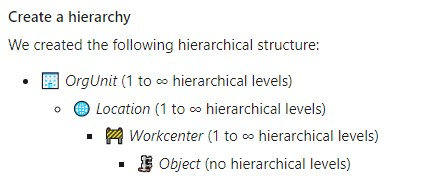

# Rules for creating Markdown in the repository

This document explains a couple of rules to create a proper Markdown file in the documentation repository.

Markdown is a lightweight markup language that you can use to add formatting elements to plaintext text documents. Created by John Gruber in 2004, Markdown is now one of the world’s most popular markup languages.

Markdown files are text based. If you want to learn about possibilities (headers, lists, tables, code and such) this cheat sheet is always helpful: [Markdown Cheatsheet · adam-p/markdown-here Wiki · GitHub](https://github.com/adam-p/markdown-here/wiki/Markdown-Cheatsheet). There are a number of them.

Using Markdown is different than using a WYSIWYG editor. In an application like Microsoft Word, you click buttons to format words and phrases, and the changes are visible immediately. Markdown isn’t like that. When you create a Markdown-formatted file, you add Markdown syntax to the text to indicate which words and phrases should look different. That said, as explained in the [section below](#preview-in-vs-code), you can have a nice preview when you open the repository with VS Code.

You can find more information, a full documentation [here](https://www.markdownguide.org/).

## Images and attachments

**All** images should be stored in `/images` and its sub directories.

Reason: we are using [DocFX](https://dotnet.github.io/docfx/) to generate a static website. We only move attachments and pictures from `/images`. The rest is ignored.

## Naming conventions

Please to follow those simple rules:

- Try to only use lowercase in your file names
- Don't use spaces, use `-` or `_`
- Use only ASCII 7 characters from the alphabet and numerical

## Links

It's ok to use external links.

For internal links on documentation, please use relative link to the file. For example if you are in `/content/esp32` and want to reference the document `build-esp32.md` which is located in `/content/building`, the link will be `../building/build-esp32.md`.

## Practical Tips & Tricks

### Preview in VS Code

When editing markdown in [VS Code](https://code.visualstudio.com), there is a preview button on the top right that will open a live preview window on the left. So you can type and see the result at the same time. This is usually a great way to avoid basic mistakes, making sure your images are showing up properly for example.


### Typora as an alternative tool

[Typora](https://typora.io/) is an online editor to help you generate proper Markdown. It can help you creating your first Markdown, get use to it. It also has great features like the ability to create table from a copy/paste of a web page. Be sensitive of the fact this is an online tool and of the confidentiality of the information you may put into this tool.

### Run markdownlint before pushing

To make sure before you push, run the markdownlint tool on your md-file and solve all messages. This tool will be run in the pipeline to validate your Markdown files. Check more details [below](#markdownlint).

If you're using VS Code you can install an extension with a markdown linter such as [markdownlint](https://marketplace.visualstudio.com/items?itemName=DavidAnson.vscode-markdownlint). With it, you'll immediately get visual feedback on any formatting issues.

> **Important**: There won't be any merge possible if the Markdown file is **not** properly formed. So it is very important to run the linter before you do a PR and fix all the issues.

### Use a spell checker

You have plenty of Spell checker extensions, they will reduce the numbers of mistakes. We can recommend you in VS Code, `Spell Right` or `Code Spell Checker` extensions.

### Patterns for enumerations

It can be a bit frustrating when working on markdown and when you try to work with enumerations. One of the key point to keep in mind is that enumerations in markdown and in generals are made to be grouped. Once you need a lot of text or code blocks in between, enumerations are not really the best. So here are couple of patterns.

```markdown
# This is the one and only main title

## You can have as many title 2 as you want

1. My enumeration starts with 1
  - I have sub bullets which can be enums as well
  - And another one
1. This one will have number 2
1. And you can guess, this one is 3

1. Now, this one is 1 again as there is a career return between both enums
1. And 2 again

```

If you are trying to get a large block of text with paragraphs and block of code, use the `Step #` pattern like this:

```markdown

- Step 1: do something

Here you may have a lot of blabla, some text code block, images, etc.

- Step 2: do the next step

Same here, a lot of things here.

- Step 3: you can continue this pattern

```

### Adding an Emoji into markdown file

It can be a great way to bring essential content to the point if you add some Emojis into markdown content. To add them use the next shortcuts depends on your operational system:

- on Mac: CTRL + CMD + Space
- on Windows: Win + ; (semi-colon) or Win + . (period)



## Moving files

In general, try **not** to move the files. There are a lot of links in files pointing to each others.

In case you want to change files, here is a process to catch broken link:

- Once you'll do a PR, the the [DockLinkChecker](https://github.com/nanoframework/nanoframework.github.io/blob/538b9fee8631ec30a11805da24c3bc23ef030e4f/azure-pipelines.yml#L236) will run part of the build pipeline.
- Open the DocFX task result and check the logs, it will contain broken links
- Correct the broken files
- Push back the changes
- If you still have some, they'll still show up!

## No need to add any TOC

The documentation is built automatically using DocFX. DocFX companion tools will take care of creating the TOC for you. So please do not add it. [TheToDocFxCreation](https://github.com/nanoframework/nanoframework.github.io/blob/538b9fee8631ec30a11805da24c3bc23ef030e4f/azure-pipelines.yml#L228) tool will create it for you.

### Tables

Please make sure you respect as well the rules for tables. You need to have a `|` at the beginning and end of each column. The second line should contains at least 3 dashes, so `---` per column. You can have more and you can use the `:` pattern to align the column as you'd like. The [DockLinkChecker](https://github.com/nanoframework/nanoframework.github.io/blob/538b9fee8631ec30a11805da24c3bc23ef030e4f/azure-pipelines.yml#L236) will check that your tables are properly formed as well during a PR.

## Markdownlint

To help developers and anyone who needs to create Markdown, we propose to use [Markedownlint](https://github.com/DavidAnson/markdownlint) which is easy and the most used linter for Markdown documents. [Markdownlint-cli](https://github.com/igorshubovych/markdownlint-cli) is an easy to use cli based out of Markdownlint.

### Rules

A comprehensive list of rules are available [here](https://github.com/DavidAnson/markdownlint/blob/main/doc/Rules.md). We will use a quite strict approach except for the line length rule MD013 which we won't apply and html tags.

Please avoid using html tags at all. As we do integrate few external images sources which are hard to align properly, we are not applying this rule. But we will be vigilant in PR to make sure there is none checked in which is not critical.

A configuration file is present in the root directory of the project for your convenience. The file is `.markdownlint.json` and contain:

```json
{
    "MD013": false,
    "MD033": false
}
```

Then simply run the following command from the root folder:

```bash
markdownlint -f path_to_your_file.md
```

Note that the -f parameter will fix all basics errors and save you some time.

### Using VS Code extensions

There are couple of VS Code extensions to help you in this task as well. We can recommend [Prettier](https://marketplace.visualstudio.com/items?itemName=esbenp.prettier-vscode) which will catch some of them as well.

## Azure DevOps pipeline

Markdownlinter is also part of the Azure DevOps code quality pipeline which will automatically run upon PRs. If there is any issue, it will fail and gives you all the issues. You will have to fix them for a merge. See the tips and tricks as well!
