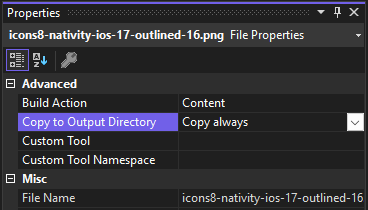

# Updating File System during Visual Studio code deployment

> [!NOTE]
>
> This document is based on this [Discord Announce](https://discord.com/channels/478725473862549535/481780524864503828/1317131756369088574)

This method is complementary from deploying files during the [flash process using nanoff](https://github.com/nanoframework/nanoFirmwareFlasher?tab=readme-ov-file#deploy-file-to-device-storage). It is intended to faciliate development. While deploying at scale, we recommend to use the nanoff method.

## Can I update the internal filesystem of an ESP32 (or any other board that supports it) during deployment?

Yes, you can!

To do that you should set the property `Build action` to `Content` and `Copy to output directory` to `Copy always`



## Folder structure are supported?

Yes, by default the deploy will maintain the structure of the folder startig from the root of project.

For example you can place a file named "favicon.ico" to the root of the project, sets the two props as described and your internal storage will be:

```txt
I:\favicon.ico
```

If you put that file under in your project's "webapp" folder, the internal storage structure will follow the same tree and look like this:

```txt
I:\webapp\favicon.ico
```

If you want to change the storage path of a file you need to set `NF_StoragePath` metadata to the file definition inside the project file.
To do that click with right button on the project entry and select `Unload project`, Visual Studio will open the project file for you.
Inside this file search for the `Content` entry of your file and add the TAG `NF_StoragePath` like this example:

```xml
<Content Include="webapp\index.html">
  <CopyToOutputDirectory>Always</CopyToOutputDirectory>
  <NF_StoragePath>I:\newindex.html</NF_StoragePath><!-- now this file will be copied under the root of I:\ and rename the file to newindex.html -->
</Content>
```

## Can I erase all files before deploy?

The response for this question is no but yes...

In other words you can not erase the internal storage every time you press `F5` or deploy your code but you can do that re-flashing the firmware with `--masserase` option of `nanoff` cli, for example:

```sh
nanoff --platform esp32 --serialport COM3 --update --masserase --target ESP32_S3_BLE
```
