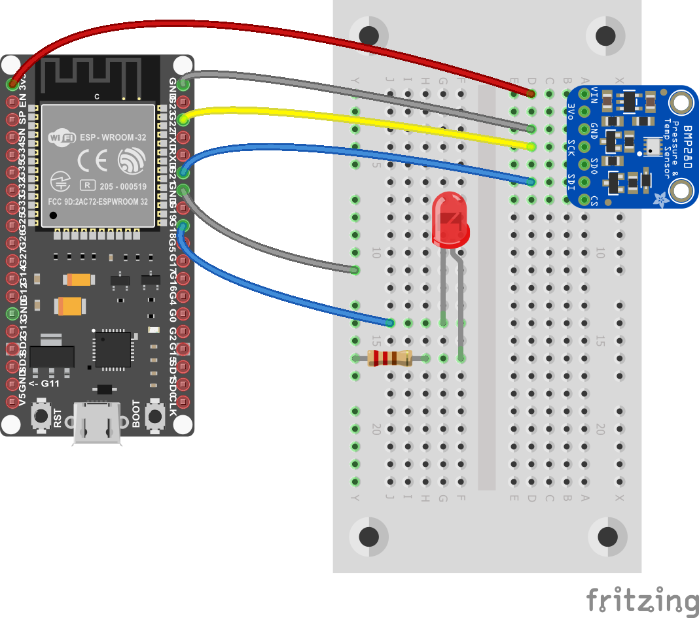

# Comparison between .NET **nanoFramework** and .NET IoT

This document compares .NET **nanoFramework** and .NET IoT platforms. For this documentation a same sample application with an identical scenario is created on both platforms.

The sample application includes a scenario on both platforms: Every 3 seconds the application reads temperature value from BMP280 sensor and turns on LED after reading the value. Then this temperature value is pushed to IoT Hub with device name and after every successful push LED will blink and turn off. Data will be handled by IoT Hub message routing and will be pushed to blob storage to store.

| .NET IoT               | .NET **nanoFramework** |
| :----------------------------------------------------------: | :----------------------------------------------------------: |
|  |  |
| [Raspberry Pi with .Net IoT sample project](https://github.com/dotnet/iot/tree/main/samples) | [M5Stack with .NET nanoFramework sample project](https://github.com/nanoframework/Samples/tree/main/samples/AzureSDK/AzureSDKSensorCertificate) |

## Certificate

Device certificates are used in these samples. Certificates provide handshake between your device and Azure IoT Hub, and samples explain how to use certificates on both .NET IoT and .NET **nanoFramework** platforms.

If you don't have any certificate, you can learn how to create certificates following [Create test certificate using OpenSSL and Azure IoT Hub](https://github.com/nanoframework/Samples/blob/main/samples/AzureSDK/AzureSDKSensorCertificate/create-certificate.md) documentation.

You can check differences of using these certificates below.

## Quick Tips & Differences

| .NET IoT                                                | .NET **nanoFramework**                                           |
| ------------------------------------------------------------ | ------------------------------------------------------------ |
| Works on powerful boards with memory and CPU                 | Works on low-level microcontroller devices with low memory   |
| Due to device specs it can benefit from all .NET core libraries | Uses specific .NET libraries for **nanoFramework** due to performance on low-level devices |
| You can add your packages via NuGet manager                  | You can add your packages via NuGet manager                  |
| You only need to add `Iot.Device.Bindings` and `System.Device.Gpio` packages for new sensors | You need to add **nanoFramework** specific packages separately for each sensor |
| You need to setup your deployment and remote debugging manually | Built-in deployment and rich remote debugging experience as Default |
| Deploy the code via SSH connection                           | Deploy the code directly via wired connection                |
| It can use WiFi of Raspberry Pi OS                           | You need to connect your device to WiFi through your code                   |
| You can use `pfx` certificates in your code                  | You can use `PEM`, `crt` and `der` certificates in your code |

## Code Comparison

With this comparison we use exactly the same scenario for .NET IoT and .NET **nanoFramework** platforms. We're controlling BMP280 temperature & pressure sensor and LED via GPIO pins, connecting to Wi-Fi and accessing Azure IoT Hub via client specific Azure SDKs. We're using certificates to identify devices on Azure IoT Hub and grant access based on certificates.

Code may change due to access some platform specific resources and SDKs, but majority of the code lines are identically same in these samples. Let's compare what are the differences on these platforms.

## Conclusion

Both .NET IoT and .NET **nanoFramework** are very powerful platforms and enable the writing of managed code applications using C# on different boards. Both platforms provide maximum code reusability, there are only small nuances which are due to platform/board specific differences.

Both of them provide access to GPIO pins, pin numbers may change based on device manufacturer.
