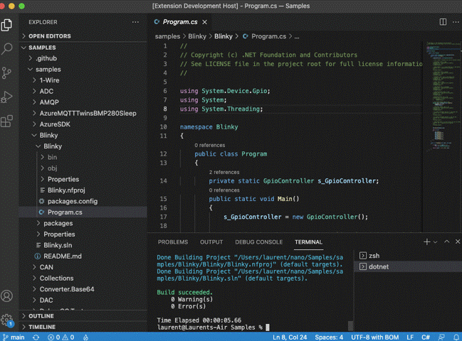
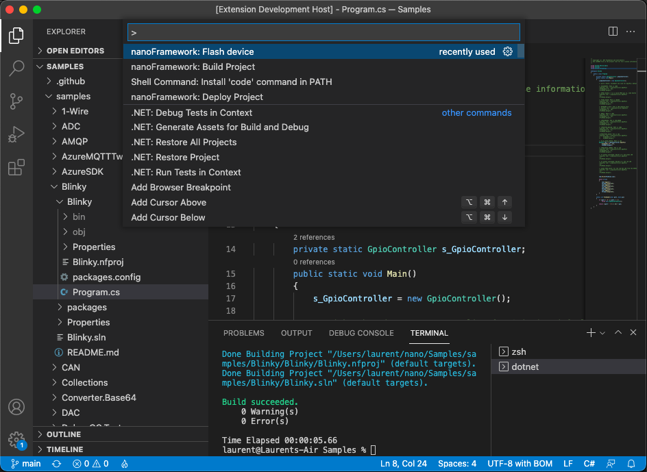
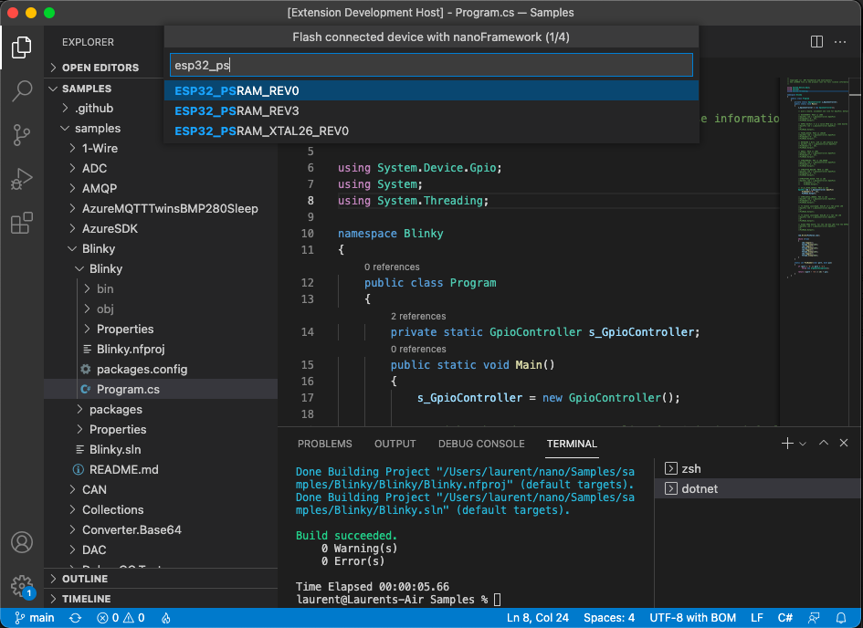
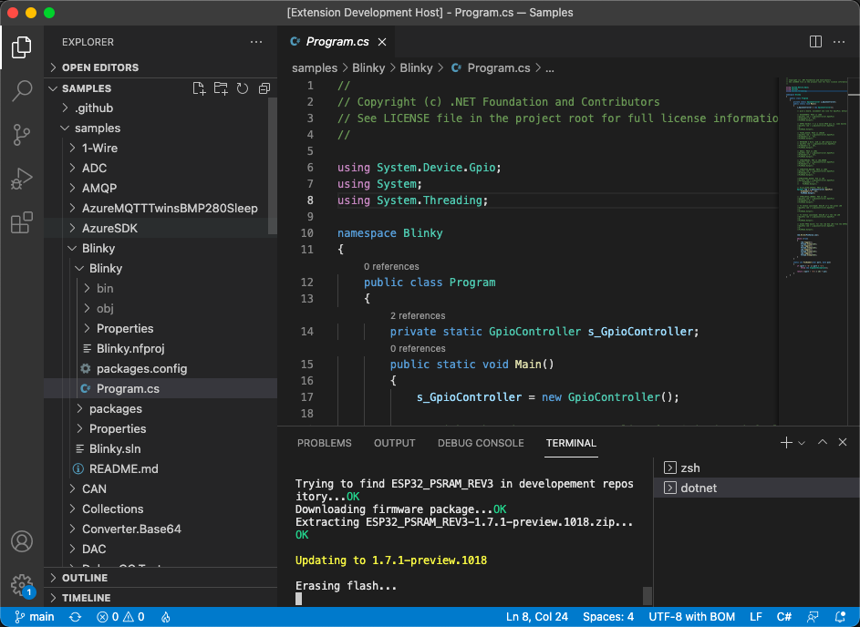
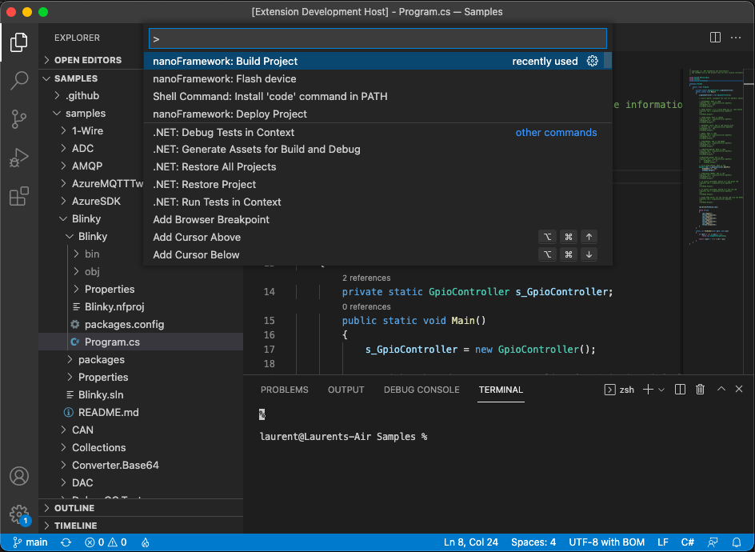
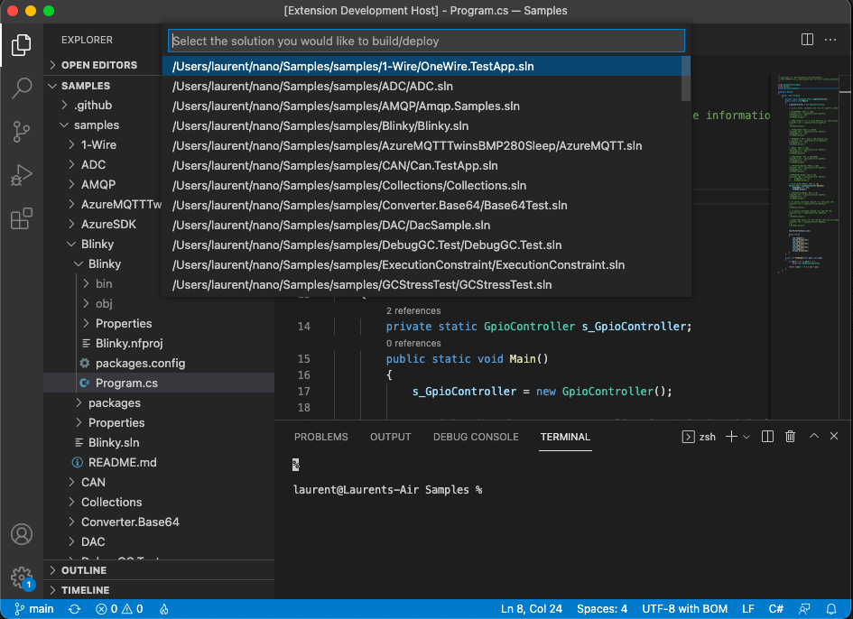
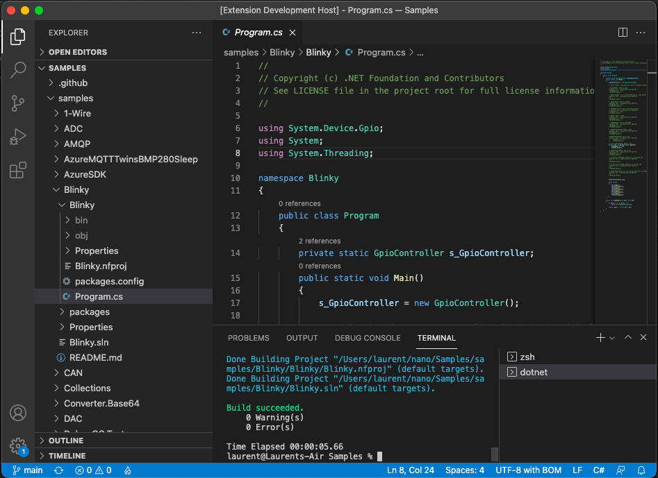
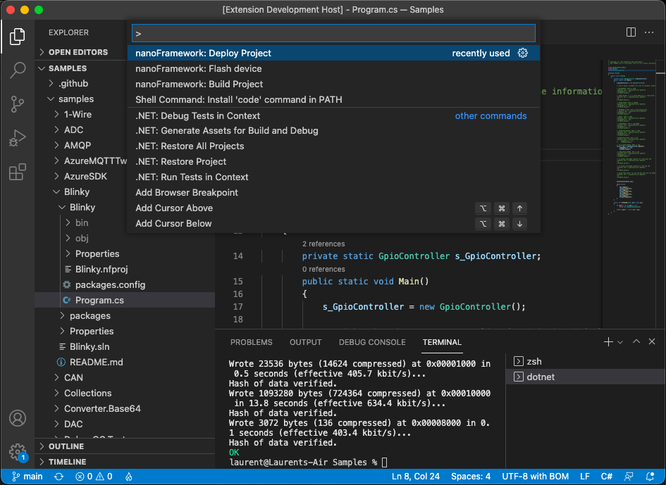
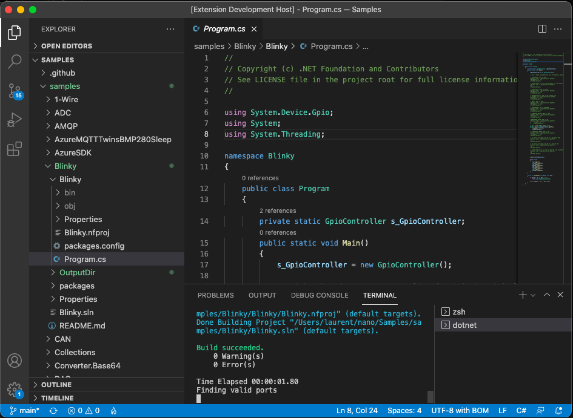

# Getting Started Guide for managed code (C#) with VS Code

.NET **nanoFramework** enables the writing of managed code applications for embedded devices. Doesn't matter if you are a seasoned .NET developer or if you've just arrived here and want to give it a try.

This getting started guide will walk you through the setup of your development machine using Visual Studio Code (VS Code), and get you coding a nice "Hello World" in no time.

If you are looking for the Visual Studio guide instead, check [this page](getting-started-managed.md).

Not sure where to buy a device? Check [this page](where-to-buy-devices.md) out!

## Installing and configuring VS Code

The first part is to get VS Code and the .NET **nanoFramework** extension installed.



1. **Install [.NET 10.0 SDK or Runtime](https://dotnet.microsoft.com/download/dotnet/10.0) (or later)**

1. **Install [Visual Studio Code](https://code.visualstudio.com/)**

1. **Install the _nanoFramework_ extension for VS Code**
   1. Open VS Code.
   1. Go to the **Extensions** view (`Ctrl`+`Shift`+`X`).
   1. Search for **nanoFramework**.
   1. Install **.NET nanoFramework VS Code Extension**.

1. **Install [nano Firmware Flasher (nanoff)](https://github.com/nanoframework/nanoFirmwareFlasher)**

    ```console
    dotnet tool install -g nanoff
    ```

1. **Install build prerequisites**
   - On **Windows**: install [Visual Studio Build Tools](https://visualstudio.microsoft.com/downloads/#build-tools-for-visual-studio-2022) with ".NET desktop build tools" workload.
   - On **Linux/macOS**: install [mono-complete](https://www.mono-project.com/docs/getting-started/install/) with `msbuild`, and [NuGet CLI](https://www.nuget.org/downloads).

## Uploading the firmware to the board

The second part is to load the .NET **nanoFramework** image in the board flash.

### Option A: Use VS Code extension command (recommended)

Use the Command Palette (`Ctrl`+`Shift`+`P`) and select **nanoFramework: Flash device**.



Then follow the prompts to select target, version and connection details.



You can follow the operation in the terminal/output while the firmware is being flashed.



### Option B: Use `nanoff` directly from the command line

You need to know the serial port attached to your device. You can list the ports with `nanoff --listports`. This command like all the others are working on Windows, MacOS and Linux on all the architectures.

> IMPORTANT: you may have to install drivers. Refer to the vendor website for Linux, MacOS and Windows, or use Windows Update to install the latest version of the drivers.

- To update the firmware of an ESP32 target connected to COM31, to the latest available version.

    ```console
    nanoff --platform esp32 --serialport COM31 --update
    ```

- To update the firmware of a ST board connected through JTAG (ST-Link) to the latest available version.

    ```console
    nanoff --target ST_NUCLEO144_F746ZG --update
    ```

- To update the firmware of a ST board connected through DFU (like the NETDUINO3) you first need to put the board in DFU mode.

    ```console
    nanoff --target NETDUINO3_WIFI --update --dfu
    ```

- To list the available serial ports:

    ```console
    nanoff --listports
    ```

## Coding a 'Hello World' application

Now you have everything that you need to start coding your first application. Let's go for a good old 'Hello World' in micro-controller mode, which is blinking a LED.

1. Create or open a **.NET nanoFramework** solution/project in VS Code.

1. Grab the `Blinky` code from the .NET [**nanoFramework** samples](https://github.com/nanoframework/Samples/tree/master/samples/Blinky) repository.
   Make sure that the correct GPIO pin is being used for your board.

1. Because GPIO is being used we need to pull that class library and add a reference to it in the project.
   Add package `nanoFramework.System.Device.Gpio`.

1. Build the project using the Command Palette and **nanoFramework: Build Project**.



If you have multiple solutions/projects in the folder, select the one to build.



Build output is shown in the terminal.



1. Deploy the project with **nanoFramework: Deploy Project**.



If you have multiple projects, choose the one to deploy and follow the prompts.



## Debugging your application in VS Code

The VS Code extension provides source-level debugging support for .NET **nanoFramework** applications.

### Quick start

1. Make sure your target is connected and running .NET **nanoFramework** firmware.

1. Build the project using **nanoFramework: Build Project**.

1. Press `F5` (or select **Run > Start Debugging**).

1. If prompted, select the device to debug.

1. The debugger deploys your assemblies and starts the session.

### Debug configuration (`launch.json`)

When pressing `F5` the first time, you will be prompt to create a launch profile. You can create before `.vscode/launch.json` with launch and attach configurations. You can have as many as you want and select the one that you need.

```json
{
        "version": "0.2.0",
        "configurations": [
                {
                        "name": "nanoFramework: Launch and Debug",
                        "type": "nanoframework",
                        "request": "launch",
                        "program": "${workspaceFolder}/${workspaceFolderBasename}/bin/Debug",
                        "device": "",
                        "stopOnEntry": true,
                        "deployAssemblies": true,
                        "verbosity": "none"
                },
                {
                        "name": "nanoFramework: Attach to Device",
                        "type": "nanoframework",
                        "request": "attach",
                        "device": "",
                        "program": "${workspaceFolder}/${workspaceFolderBasename}/bin/Debug"
                }
        ]
}
```

> [!Note]: you can use an absolute path as well rather than the path with the workspace and project.

If `device` is left empty, the extension can auto-select the device, or prompt you if multiple targets are connected.

You can also manually select the debug device with **nanoFramework: Select Debug Device**.

### Debugging tips

- Set breakpoints in the gutter or by pressing `F9`.
- Use stepping commands has limited support and may not work properly: `F10` (Step Over), `F11` (Step Into), `Shift`+`F11` (Step Out).
- Use the **Variables**, **Watch**, and **Call Stack** panes while paused.
- Use the **Debug Console** for `Debug.WriteLine()` output.

### Troubleshooting debug sessions

- **Device not found**
  - Check cable/driver and confirm the target is running nanoFramework firmware.
  - Try reconnecting the board and selecting the device again.

- **Breakpoints not hit**
  - Rebuild with **nanoFramework: Build Project**.
  - Make sure `deployAssemblies` is `true`.
  - Check that `.pdbx` and `.pdb` files are present in the output folder.

- **Debug session won't start**
  - Check Debug Console messages.
  - Ensure no other tool is using the COM port.
  - Confirm the required .NET runtime is installed.

## Trouble shooting

See this guide for solutions to some common problems: [Getting Started Trouble Shooting Guide](trouble-shooting-guide.md)

If needed, also check [Getting Started Trouble Shooting Device Connection Guide](troubleshooting-device-connection.md).

## Wrapping up

Congratulations! That's your first .NET **nanoFramework** C# application executing right there on the target board with VS Code!.

You have gone through the steps required to install VS Code, the .NET **nanoFramework** extension and flash firmware into your device.

You've also learned how to build, deploy and debug a simple C# application from VS Code.

Check out other guides and tutorials. You may also want to join our [Discord channel](https://discordapp.com/invite/gCyBu8T), where you'll find a supportive community to discuss your ideas and help you in case you get stuck on something.

And now, to know more about GPIO, ADC, DAC, I2C, SPI, UART/Serial Ports, see our [beginner series](./beginner-explained.md) guiding you with theory and practice.