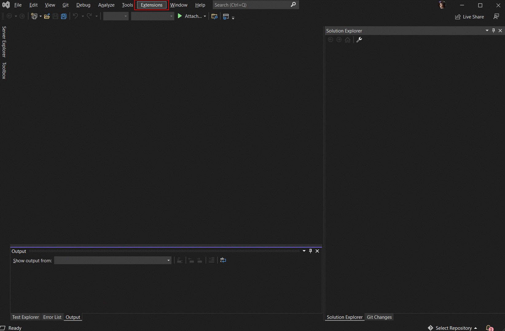
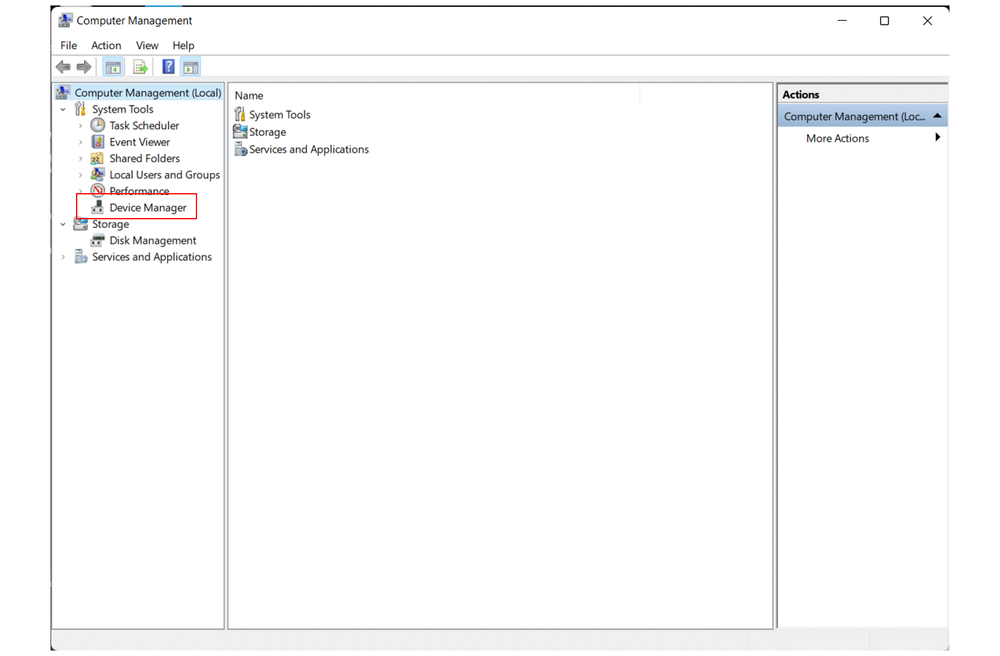
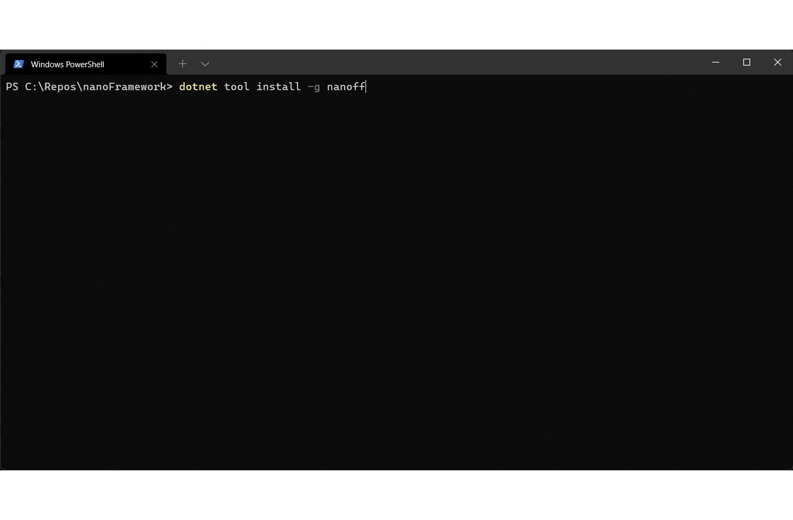

# Getting Started Guide for managed code (C#)

.NET **nanoFramework** enables the writing of managed code applications for embedded devices. Doesn't matter if you are a seasoned .NET developer or if you've just arrived here and want to give it a try.

This getting started guide will walk you through the setup of your development machine to get you coding a nice "Hello World" in no time!

You can find the video for this guide on our YouTube channel [here](https://youtu.be/iZdN2GmefXI).

Note sure where to buy a device? Check [this page](where-to-buy-devices.md) out!

## Installing and configuring Visual Studio 2022

The first part is to get Visual Studio 2022 (VS 2019 is also supported) and the .NET **nanoFramework** extension installed.

>**WARNING**: Our extension is maintained and kept up to date with the current version of VS2022 and VS2019. Generally only the latest version of Visual Studio is guaranteed to be supported. If you experience difficulties installing the extension, check that you are running the latest VS.NET version. If you need an older version for a specific VS version, you can download it from the [GitHub repository](https://github.com/nanoframework/nf-Visual-Studio-extension/releases).



1. **Download Visual Studio**  
   If you already have it installed, you can skip this step. If you don't, please download the free [Visual Studio Community](https://www.visualstudio.com/downloads) edition.
   Make sure to install the **workloads** for **.NET desktop development** and **.NET Core cross-platform development**.

1. **Install the _nanoFramework_ extension for Visual Studio**  
   Launch Visual Studio (we'll just refer to it as VS from now on) and install the **nanoFramework** extension.  
   You can do this by selecting the menu **Extensions > Manage Extensions** which will open the **Manage Extensions** dialog. Select the **Online** feed category on the left-hand and enter **_nanoFramework_** in the **search** box.

1. You will be prompted to **restart Visual Studio** to finish installing the extension

## Uploading the firmware to the board using nanoFirmwareFlasher

The second part is to load the .NET **nanoFramework** image in the board flash. The best way is to use the [nano Firmware Flasher (nanoff)](https://github.com/nanoframework/nanoFirmwareFlasher) tool. This is a .NET Core CLI command tool.

You need to know the COM Port attached to your device. Search for **Computer Management**, select **Device Manager** then expand **Ports (COM & LPT)**, you will find the COM port of the connected device.

> IMPORTANT: you may have to install drivers. Refer to the vendor website or use Windows Update to install the latest version of the drivers.



> NOTE
>
> - The [.NET 6.0 Runtime (or .NET 6.0 SDK)](https://dotnet.microsoft.com/download) must be installed



1. **Install [nanoff](https://github.com/nanoframework/nanoFirmwareFlasher)**

    ```console
    dotnet tool install -g nanoff
    ```

1. **Perform the update** by providing the target name to nano Firmware Flasher. The official name of the target (either a reference or a community board) has to be used, otherwise it won't work as the tool isn't able to guess what board is connected.
(The following includes the description for targets of several platforms for completeness)

    - To update the firmware of an ESP32 target connected to COM31, to the latest available version.

        ```console
        nanoff --platform esp32 --serialport COM31 --update
        ```

    - To update the firmware of a ST board connected through JTAG (ST-Link) to the latest available version.

        ```console
        nanoff --target ST_NUCLEO144_F746ZG --update
        ```

    - To update the firmware of a ST board connected through DFU (like the NETDUINO3) you first need to put the board in DFU mode. This can be accomplished by pressing a certain combination of buttons. It depends on the particular hardware that you are using.

        ```console
        nanoff --target NETDUINO3_WIFI --update --dfu
        ```

    - Note: to list the available serial ports, you can use the following command:

        ```console
        nanoff --listports
        ```

1. **After the upload completes**, the MCU is reset and the nanoCLR image will run. You can check if the board is properly running .NET **nanoFramework** by looking into the **Device Explorer** window in **Visual Studio**.

1. Now open the **Device Explorer** window, by selecting the menu **View > Other Windows > Device Explorer**.

## Coding a 'Hello World' application

Now you have everything that you need to start coding your first application. Let's go for a good old 'Hello World' in micro-controller mode, which is blinking a LED, shall we?


1. Go back to Visual Studio and select the **File > New > Project** menu, to open the **Create a new project** dialog.  
   1. Enter **nanoFramework** into the **Search for templates** search prompt.
   2. Choose the **Blank Application (nanoFramework)** template and press the **Next** button.
   3. Name your project and choose a location of where the project files will be saved, and press the **Create** button.  
   4. The project will be created and opened.

1. We'll code a **very simple application** that enters an infinite loop and **turns on and off an LED**. We'll skip the details because that's not the aim of this guide. Let's just grab the `Blinky` code from the .NET [**nanoFramework** samples](https://github.com/nanoframework/Samples/tree/master/samples/Blinky) repository. Make sure that the correct GPIO pin is being used. That's the line below the comment mentioning the STM32F746 NUCLEO board. If you don't know which pin to use, just enter something like "ESP32 led pin number" in your preferred search engine - assuming you are using an ESP32 device. If not, change ESP32 with the name of the device you have

1. Because GPIO is being used we need to pull that class library and a reference to it in our project. The class libraries are distributed through NuGet. To add this class, right click on **References** in the Solution Explorer and click **Manage NuGet Packages**. On the search box type **nanoFramework**. Make sure you have the **preview checkbox ticked**. Find the `nanoFramework.System.Device.Gpio` package and click **Install**. After the license confirmation box, the package will be downloaded and a reference to it will be added. You'll notice that you no longer have the unknown references hints in VS.

1. You should also make sure to update the `mscorlib` package before you move to the next step. To update this class, right click on **References** in the Solution Explorer and click **Manage NuGet Packages**. On the top of the window, click on **Updates** and make sure you check the **Include Prerelease** checkbox. Then click on **Select All** and do the update.

1. Click **Build Solution** from the Build menu. A success message shows in the Build window.

1. We are almost there. Go into the **Device Explorer** window and click on the .NET **nanoFramework** device showing there. Make sure the connection is OK by hitting the **Ping** button. On success, a message shows on the output window. <BR/><BR/>
For some STM32 devices you may need two USB cables.  For example, the STM32429I-Discovery has a mini-USB connector that is labeled USB-STLINK that powers the device and provides the USB interface for flashing the firmware and/or running the JTAG debugger for debugging native C++ code (in VSCode or other C++ IDE).  The micro-USB connector is labeled USB-USER and provides the COM/Serial interface used by the **Visual Studio nanoFramework Extension** for debugging your C# application code and for **Device Explorer**.  For that device BOTH cables must be plugged into USB ports on your computer.

1. Let's deploy the application to the board. In order to do that, right click on the Project name and choose **Deploy**. You'll see the feedback of the several operations that are running on the background in the **Output Window**. After a successful deployment you need to reset the target and your `Hello World` blinky application will start running and, _voilá_, the LED starts blinking! If you want, instead of "just" deploying the application to the target you can choose to start a **debug session**. To do that **hit** <kbd>F5</kbd> (as usual) in Visual Studio and watch it run.

## Trouble shooting

See this guide for solutions to some common problems: [Getting Started Trouble Shooting Guide](trouble-shooting-guide.md)

## Wrapping up

Congratulations! That's your first .NET **nanoFramework** C# application executing right there on the target board. How awesome is that?!

And this is it for the getting started guide.

You've went through the steps required to install Visual Studio, the .NET **nanoFramework** extension and the ST-LINK Utility.

You've also learned how to upload .NET **nanoFramework** firmware images into a target board.
And last, but not the least: how to code a simple 'Hello World' C# application and deploy it to a target board.

Check out other guides and tutorials. You may also want to join our [Discord channel](https://discordapp.com/invite/gCyBu8T), where you'll find a supportive community to discuss your ideas and help you in case you get stuck on something.
