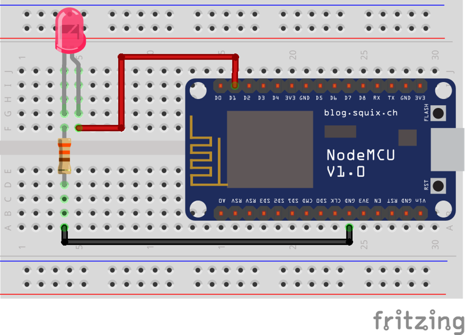

# All what you've always wanted to know about GPIO

This beginner document will explain what is GPIO and how to properly use it with concrete examples using .NET nanoFramework. You're in the perfect place if pull-up, pull-down seems like weird words for you. You're also in the good place if physical pin out and logical pin out needs a bit more clarity.

## A bit of theory

GPIO stands for "General Purpose Input/Output." In simple terms, [GPIO](https://en.wikipedia.org/wiki/General-purpose_input/output) refers to a set of pins on a microcontroller (MCU) or a computer that can be programmed to either input or output signals. These signals can be used to communicate with and control other devices or components in an embedded system.

- General Purpose: These pins can be configured by the user or programmer for various tasks. They're not dedicated to one specific function but can be adapted for different purposes based on the needs of the system.
- Input/Output: GPIO pins can either receive information (input) from external devices or send out information (output) to control external components. For instance, an input GPIO pin can detect whether a button is pressed or not, while an output GPIO pin can send a signal to turn on an LED or control a motor.

In embedded systems, GPIO pins are versatile. They're used for a wide range of tasks, including reading sensors, interfacing with buttons or switches, controlling LEDs, motors, and communicating with other devices like displays or communication modules.

Programmers can write code to configure these GPIO pins based on the specific requirements of their project. By manipulating these pins through code, developers can create complex functions and interactions within an embedded system. Those GPIO pins are used as a base for other higher level protocols like SPI, I2C, Serial and more!.

Overall, GPIO provides a flexible way to interact with the physical world by allowing a microcontroller to interface with various external devices and components in an embedded system.

## A bit of electronics theory

One of the most important law in electronic is the [Ohms law](https://en.wikipedia.org/wiki/Ohm%27s_law). The law is quite simple:

`V = R x I`

Where:

- `V` = voltage in Volt (V)
- `R` = resistor in Ohms
- `I` = intensity in Amperes (A)

Seems like useless but it's what really matter when you connect the elements together.

> [!IMPORTANT]
> Playing with electricity is sensitive for MCU, the maximum voltage is a real maximum voltage, go over and you'll damage the pin and possibly the MCU.
> Check in the documentation what is the maximum voltage the pins are tolerant to.
> ESP32, STM32 and most MCU are 3.3V, some can be 1.8V and some even tolerant to higher voltages like 5V, meaning that they are 3.3V but you can apply in their input 5V (sometimes more) and they'll be perfectly fine!

Also, few terms we will use:

- Ground = 0V = 0 = Low
- VCC = +Power, can be +5V, more often in MCU world +3.3V = 1 = High

## Controlling a LED with GPIO a bit more theory

The basic hello world in the embedded space is blinking a LED. For this, we need a bit of electronic knowledge and some hardware:

- 1 GPIO pin available as output on a MCU
- 1 LED
- 1 Resistor

And here is how look like the electronic schema, we will take the assumption our MCU provides 3.3V:


Each electronic component has a limit either in terms ov voltage you can apply/it can handle, either in terms of intensity or both. That is the case for any led. It does vary a bit depending on the led and its color but overall, 1 led is approximately 2 V and can handle a current of 0,02 A maximum.

Applying Ohm's law: `R = (3,3 - 2)/0,02 = 65 Ohms`
You can safely take a 70 or 100 Ohms or even more. If the resistor's value is too high, the light won't be bright or can even stay fully dark.

> ![IMPORTANT]
> We are assuming that we can safely connect the led and the resistor to your MCU and that it is in the limit of current that it can provide. It's in general for a simple led like this one a safe assumption. It is not the case for a motor for example. NEver directly connect motors to MCU pins!
> Make sure you properly **always** do those kind of math and **always** check the maximum input and out intensity of any pin you'll connect!

And the physical schema now looks like:



Now, you have 2 different ways to connect your pin: Either your pin will be used as power either as ground:


Code to turn on the led will be a bit different and both cases are valid.

By convention, there are few notations that means the same:

- High = 1 = True
- Low = 0 = False

Note that in the quantum world of electrons, it's the opposite!

We will assume in the following code that the pin number is 25. We will explain in more details the code in a further section. For now the code will be like this in case of the pin as power:

```csharp
GpioController gpio = new GpioController();
GpioPin = led = gpio.OpenPin(25, PinMode.Output);
led.Write(PinValue.High);
```

And in the case of the pin as ground:

```csharp
GpioController gpio = new GpioController();
GpioPin = led = gpio.OpenPin(25, PinMode.Output);
led.Write(PinValue.Low);
```

Without going too much in the details of the code, the pin is open as output as we want to write on it, meaning, we want to change its status. And then, depending on the case, to light up the led, we either write a high value, meaning we apply power, either we write a low value, meaning apply ground.

## Pull-up, pull-down and other pin mode

Let's start with a small exercise and let's try to determine what is the voltage applied on a pin in those 3 cases:


Let's go back to our Ohms law:

- Case 1: the pin is neither connected to the power, neither connected to the ground. So, you cannot determined for sure it's value! It mens that it can take any value if you try to read it!
- Case 2: the pin is attached through a resistor to the power, so, the value read will be power, meaning high.
- Case 3: the pin is attached through a resistor to the ground, so, the value read will be ground, meaning low.

You now discover what pull-up and pull-down are:

- Pull-up is the pattern where a pin is connected through a resistor to the power. That is our case 2.
- Pull-down is the pattern where the pin is connected though a resistor to the ground. That is our case 1.

Looking at the nanoFramework options, you will find few more:


To understand more in details what are Open Drain and Open Collector, refer to the excellent article [in Wikipedia](https://en.wikipedia.org/wiki/Open_collector).

> [!NOTE]
>
> Not all modes are supported in each pin! You always must refer to the MCU documentation to understand which pin supports which mode.

Why is this concept of Pull-up and Pull-down are important? Because they are the **only** way to guaranty that you will be able to properly read when a pin is an input mode the value. The first case in the example will never give you a proper value! In the open part of the case 2 and case 3, you will always have the equivalent of button, something that will be or not be connected. Reality will most of the time be more complex with a very high impedance (resistor) connected.

In the case you'll select `Input` or in the case your MCU does not support any of the modes, you are the one who will have to add this resistor to guaranty that you will be in one or the other case.

How to calculate the proper Pull-up/down resistor value? Again, we will have to apply our preferred Ohms law and check on the MCU documentation what is the limit when a read is categorized as High or Low. Without having to do maths, typically, values are usually around 10K to 200K Ohms. And also, the documentation of your MCU will tell you which typical value you should use!

## Physical and logical pin numbering

Each board integrating an MCU provides pins you can use. There are 2 sometimes very different numbering you will find: the physical and logical numbering of the pins.

Physical Pin Numbering:

- Physical pin numbering refers to the actual physical layout and arrangement of the pins on the MCU or development board.
- Each pin has a specific physical location on the board, typically arranged in rows and columns or along the edges.
- It is a direct representation of the hardware layout and how the pins are physically placed on the device.

Logical Pin Numbering:

- Logical pin numbering, on the other hand, assigns numbers or labels to the pins based on their functionality or usage in software.
- These numbers are often used in code to reference specific pins for input or output operations.
- Logical pin numbering might be organized in a way that makes it easier for developers to work with, grouping pins by functionality or assigning consecutive numbers to related pins.

The physical pin numbering directly correlates to the physical layout of the pins on the board, whereas logical pin numbering is used for software programming purposes and might not directly reflect the physical layout. The physical numbering is the number written on the board close to the pin. while the logical one is the name of the internal one.

It's important to consult the documentation or pinout diagrams provided by the manufacturer of the MCU or development board to understand the mapping between physical and logical pin numbering. This helps ensure that the correct pins are used and addressed accurately in both hardware connections and software programming.

For .NET nanoFramework, we are using the logical numbering when opening on a pin. Some functions can be used for known boards to map the physical to the logical model.

## How to use GpioController and GpioPin

In the previous example we have been using some code. Let's bring again the example and let's assume we are still using our pin 25 and we are connecting it as the power in our example. To blink the led, the code will now be:

```csharp
using System.Device.Gpio;

GpioController gpio = new GpioController();
GpioPin = led = gpio.OpenPin(25, PinMode.Output);
while (true)
{
    led.Toggle();
    Thread.Sleep(500);
}
```

All the related GPIO classes are part of the [System.Device.Gpio](https://docs.nanoframework.net/api/System.Device.Gpio.html) namespace.

The `GpioController` is the main entity you can use to open pins. You only need 1 in all you code as it's unique. But don't worry, it is made so that even if you create multiple ones, everything will work. The functions available on the [GpioController](https://docs.nanoframework.net/api/System.Device.Gpio.GpioController.html) will mainly let you open, close, write and read on pins.

The `GpioPin` is a representation of an open pin where you will be able to read, write and adjust the pin mode. The [GpioPi](https://docs.nanoframework.net/api/System.Device.Gpio.GpioPin.html) class implements various functions, properties and one event.

There are multiple detailed example to go further with .NET nanoFramework:

- [🌶️ - Blink a led](https://github.com/nanoframework/Samples/blob/main/samples/Blinky)
- [🌶️ - GPIO + Events](https://github.com/nanoframework/Samples/blob/main/samples/Gpio/Gpio%2BEvents/)
- [🌶️ - Gpio + Events (IoT Style)](https://github.com/nanoframework/Samples/blob/main/samples/Gpio/Gpio%2BEventsIoTStyle/)
- [🌶️ - ESP32 Pulse Count samples](https://github.com/nanoframework/Samples/blob/main/samples/Gpio/Esp32PulseCounter)

## Relation between GPIO and other protocols like I2C, SPI, USB, UART and more

GPIO pins enable the reading and writing of digital signals, allowing for the transmission and reception of information within an embedded system.
By leveraging GPIO pins, one can create a protocol using signal changes (high/low) synchronized with a clock signal to transmit data between devices.
These pins can alternate between being used for reading and writing, facilitating bidirectional communication between different electronic elements connected via shared wires.

Protocols like SPI, I2C, USB, and UART are established upon GPIO principles, agreeing on signal sequences to define data transfer protocols.
Typically, these communication protocols involve at least two GPIO wires, each carrying specific signals or data, allowing devices to exchange information reliably. They also requires a Ground wire. The Power one can be derivate from one of the signal one in some protocols. So in general, you need a minimum of 3 wires for any of those protocols connecting 2 different devices!
