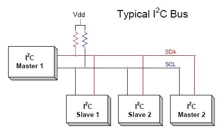

# All you've always wanted to know about I2C

This beginner document will explain what is I2C (Inter-Integrated Circuit) and how to properly use it with concrete examples using .NET nanoFramework. You're in a perfect place if you want to communicate with devices that support I2C communication.

## A bit of theory

I2C (Inter-Integrated Circuit), pronounced I-squared-C (or I-too-C is also accepted), is a synchronous, multi-master, multi-slave, packet switched, single-ended, serial communication bus invented by Philips Semiconductor (now NXP Semiconductors).

It is widely used for attaching lower-speed peripheral ICs to processors and microcontrollers (MCU) in short-distance, intra-board communication.

## A bit of electronics theory

I2C communication involves two signals represented by 2 special [GPIO](./gpio-explained.md):

- **SDA**: Serial Data Line.
- **SCL**: Serial Clock Line.

You technically needs as well a ground and in most cases a power line (this one can sometime be replaced by just using the 2 SDA and SCL lines).

Here is an architecture schema for I2C:



As you can see, there is a notion of bus. A bus is basically the name giving to the couple SDA and SCL where devices are connecting.

Both SDA and SCL require a pull up on both line, not always present in sensors or in MCU, without, the bus communication will fail! So always check this specific point!

The SDA and SCL pins are setup in [Open Drain](./gpio-explained.md#pull-up-pull-down-and-other-pin-mode). And the communication for SDA is bidirectional.

> [!Note]
>
> Those master and slave names are not inclusive. Those are the ones used in the datasheet and the industry. Some work and some resolution are ongoing to replace master by controller and slave by target.

## I2C in practice

I2C is used for communication between the MCU and other devices like sensors, EEPROMs, and RTCs (Real Time Clocks), accelerometers and many more! I2C is a good choice for communication between chips on a board because the protocol is simple and the wires are only 2 plus power and ground. I2C can also achieve moderate data rates, which is beneficial in applications where data throughput is a concern.

First, let's have a look at the bus speed, there are couple of different speeds allowed 100 Kbits/s (standard), 400 Kbits/s (fast mode) and 1 Mbits/s (super fast mode). Some other speed may be supported, included faster speed but most of the type the standard and fast modes as used.

Each device on the bus has its own and using address

One master, in the traditional I2C, can handle about 0x70 (112 decimal) slaves maximum. That's the theory, practically, no more than 10 are connected. It then creates a lot of communication noise and all will be slower as each device can only request the bus after each others.

Each device has its own address, the address **must** be unique.

In I2C communication, the master device initiates the process by generating a start condition and sending the address of the target slave device. The address is followed by a read/write bit indicating the operation to be performed. The slave device acknowledges receipt of the address and read/write bit by pulling the SDA line low during the next clock pulse, a condition known as an Acknowledge (ACK). The master and slave then exchange data, with the receiver sending an ACK after each byte. When all data has been transferred, the master generates a stop condition to release the bus.


I2C is a real communication protocol with strict rules on how to communicate ([MSB communication](./spi-explained.md#lsb-and-msb-communication) for example). The usage of this protocol is transparent in .NET nanoFramework with high classes and ability to read and write.

You need to understand what the device expect as commands and what it is replying to commands. This is usually located in the datasheet of your device. Note that even if the protocol is MSB itself, it doesn't mean that the data sent by the device are MSB, they can also be LSB.

One of the most challenging aspects of using I2C is understanding the sensor's datasheet to determine the correct communication protocol. Some devices support both SPI and I2C, and while the commands are typically the same, minor adjustments may be needed at the communication layer. However, the rest of the implementation can remain the same. Another crucial aspect to ensure reliable I2C communication is to properly set up the pull-up resistors on your bus, as this can significantly affect the signal integrity and overall performance.

> [!Tip]
>
> I2C scanner exists! A device always respond to its address, no answer means no device in general. There are few cases where the device need to be woke up. But in general the scanner will give you devices connected to your bus. See here for [.NET nanoFramework I2C scanner](https://github.com/nanoframework/Samples/blob/main/samples/I2C/NanoI2cScanner/Program.cs).

In .NET nanoFramework, you simply have to create a device and then you can read and write on it assuming in this case that the device address is 0x42:

```csharp
using System.Device.I2c;
I2cDevice i2c = new(new I2cConnectionSettings(1, 0x42));
// Example of writing a byte
var res = i2c.WriteByte(0x07);
// Example of reading 5 bytes
SpanByte span = new byte[5];
res = i2c.Read(span);
// res does contain the status.
Console.Write($"0x42 read status: {res.Status}, number of bytes transferred: {res.BytesTransferred}");
// Success is when res.STatus is equal to I2cTransferStatus.FullTransfer
```

## How to use I2cConnectionSettings and I2cDevice

[I2cConnectionSettings](https://docs.nanoframework.net/api/System.Device.I2c.I2cConnectionSettings.html) is an immutable configuration file containing mainly the bus ID and the address of the device. Please check your MCU datasheet to understand which SDA/SCL pins are connected to which bus ID.

For ESP32 MCU, you can setup most of the pins as SDA or SCL pins. You will need to use the [ESP32 hardware nuget](https://docs.nanoframework.net/api/nanoFramework.Hardware.Esp32.html). Then the code is quite straight forward to define pins:

```csharp
// Redefine I2C2 data pin (SDA) from GPIO 25 (default) to GPIO 17
Configuration.SetPinFunction(17, DeviceFunction.I2C2_DATA);
```

[I2cConnectionSettings](https://docs.nanoframework.net/api/System.Device.I2c.I2cConnectionSettings.html) is an immutable configuration file containing mainly the bus ID and the address of the device. Please check your MCU datasheet to understand which SDA/SCL pins are connected to which bus ID.
[I2cDevice](https://docs.nanoframework.net/api/System.Device.I2c.I2cDevice.html) represents a device, once created with an I2cConnectionSettings, you can use the `Read` and `Write` functions either individual byte either a [SapnByte](https://docs.nanoframework.net/api/System.SpanByte.html). A `SpanByte` is in short, a smart byte array.

## I2C specific challenges

Managing multiple devices on the same I2C bus can be challenging. Each device needs a unique address, and all devices on the bus must be able to operate at the same clock frequency. If you have 2 devices with the same address, you will have to use specific hardware to handle this.

The clock speed of the I2C bus is often limited by the slowest device on the bus. If you have a mix of slow and fast devices, you may not be able to communicate with the fast devices at their maximum speed. In that case, use one bus running at a lower speed for the slower devices and one bus for the high speed devices.

The total capacitance of the I2C bus can affect the signal quality and the maximum speed of the bus. This can be a problem in designs with long bus wires or a large number of devices. As well as I2C requires pull-up resistors on the SDA and SCL lines. Choosing the correct resistor values is important to ensure reliable communication. Some devices will come with their own pull up, some not and you will have to understand and calculate the overall resistor of the bus to check and potentially correct to be in proper values.

I2C is not as noise-resistant as some other communication protocols. Noise on the SDA or SCL lines can cause data corruption. Most devices do not offer checksum in the data they provide. So pay attention to this phenomena.
