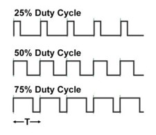
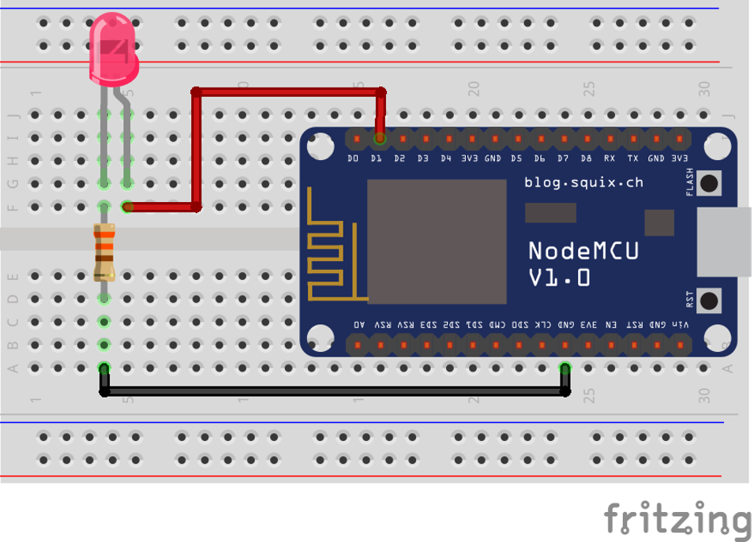

# All you've always wanted to know about PWM

This beginner document will explain what is PWM and how to properly use it with concrete examples using .NET nanoFramework. You're in a perfect place if you want to control the amount of power delivered to a device, such as an LED or motor.

## A bit of theory

In the world of microcontrollers (MCU), a Pulse Width Modulation (PWM) serves as a technique for getting analog results with digital means. Digital control is used to create a square wave, a signal switched between on and off. This on-off pattern can simulate voltages in between full on (for example 5 Volts) and off (typically 0 Volts) by changing the portion of the time the signal spends on versus the time that the signal spends off. The duration of "on time" is called the pulse width.

PWMs are used a lot in scenarios where the MCU needs to control the intensity of devices such as LEDs or speed of motors motors. They allow the MCU to control the power level of devices, enabling the control and manipulation of device behavior.

## A bit of electronics theory

PWM signals are generated by switching the output pin high and low. The ratio of the time the signal is high (on) to the total period of the signal is called the duty cycle. The duty cycle can be varied between 0% (always off) and 100% (always on), to create the effect of varying power levels.



We will not explained how those signals are generated.

## PWM in practice

PWM pin is a special [GPIO pin](./gpio-explained.md). Most of the time you will use PWM to control the power delivered to a device. For example, you can control the brightness of an LED or the speed of a motor. You can also use PWM to create analog signals from a digital source, such as creating audio signals.

PWM are used as well as clocks for various protocols with a duty cycle of 50%.

Another usage is to modulate a signal. You can mix a signal with a PWM. You will get an encoded signal that you can later decode by removing removing the clock. Those are more advance cases and we will focus on the main ones.

The electronic needed to control the brightness of a LED is the exact same as just blinking it in the [GPIO example](./gpio-explained.md#controlling-a-led-with-gpio-a-bit-more-theory). So, the electronic schema is:


And the cabling is the exact same as well:



The exact same math can be done for the LED and the resistor. And same warnings apply:

> ![IMPORTANT]
>
> We are assuming that we can safely connect the LED and the resistor to your MCU and that it is in the limit of current that it can provide. It's in general for a simple LED like this one a safe assumption. It is not the case for a motor for example. NEver directly connect motors to MCU pins!
> Make sure you properly **always** do those kind of math and **always** check the maximum input and out intensity of any pin you'll connect!

The only difference is the code assuming here, we are using the pin 18.

```csharp
PwmChannel pwmPin = PwmChannel.CreateFromPin(18, 40000, 0.3);
pwmPin.Start();
// Do something here
// You can even adjust the duty cycle
pwmPin.DutyCycle = 0.5
// And at the end, you can stop it
pwmPin.Stop();
```

Yes, it is that simple! The second parameter in the `CreateFromPin` function is the frequency in Hertz and the last one the the period. The period varies between 0.0 (representing 0%) and 1.0 (representing 100%).

> [!IMPORTANT]
>
> In some MCU only **specific** pins can be used as PWM. Also only a specific set of frequencies can be used. Please refer to the specifications of your board to know more about it.

The full sample with PWM is [located here](https://github.com/nanoframework/Samples/blob/main/samples/PWM/System.Device.Pwm/Program.cs).

## Impact of the frequency on PWM

The frequency of a PWM signal determines how fast the PWM completes a cycle (i.e., a single period), and is measured in cycles per second, or Hertz (Hz). The frequency of a PWM signal significantly affects how the connected device behaves.

For instance, if you're using PWM to control the brightness of an LED, a low-frequency PWM signal (e.g., 100 Hz) might cause the LED to visibly flicker, as it's being turned on and off 100 times per second. Even more, if you are using a 1 Hz frequency and a duty cycle of 0.5, you will see the LED blinking every half second! On the other hand, a high-frequency PWM signal (e.g., 10,000 Hz or 10 kHz) would cause the LED to appear to glow steadily, as it's being turned on and off so quickly that the human eye can't perceive the flickering.

In the case of motors, a low-frequency PWM signal might cause the motor to jerk or vibrate, as it's being powered on and off slowly. A high-frequency PWM signal would result in smoother motion.

However, it's important to note that the optimal PWM frequency can vary depending on the specific device and application. Some devices might not respond well to high frequencies, or might require a specific frequency to operate correctly. Therefore, it's **always** a good idea to check the device's datasheet or consult with the manufacturer if you're unsure.

## How to use PwmChannel

The use of [PwmChannel](https://docs.nanoframework.net/api/System.Device.Pwm.PwmChannel.html) as shown in the example is very straight forward. It is recommended to use the `CreateFromPin` function as it simplifies your life. PWM are on the MCU based on channels and chips. This is abstracted for you!

Then, there are functions to `Start` and `Stop` the PWM. And properties`Frequency` and `DutyCyle` to adjust respectively the frequency and the duty cycle (from 0.0 to 1.0 representing 0% to 100%).

For ESP32 MCU, you can setup specific pins as PWM. Not all pins can be setup but some. You can use this function by installing the [ESP32 hardware nuget](https://docs.nanoframework.net/api/nanoFramework.Hardware.Esp32.html):

```csharp
// Define LED PWM channel 1 GPIO 16
Configuration.SetPinFunction(16, DeviceFunction.PWM1);
```

Refer to the documentation to understand which pin can be setup. Also, some of the pins can only be low resolution and others high resolutions timers.

## Specific PWM challenges

The resolution of a PWM signal is determined by the number of distinct steps that can be represented in one period of the signal. If the resolution is too low, the output might not be smooth enough for the application. Also switching quickly the resolution and adjusting it can be quite complex and not very efficient.

Some MCU may only support PWM signals within a certain frequency range. This can limit the types of applications that can be supported. Not all pins on a MCU may support PWM output. This can limit the design of your circuit. It is important to check the documentation to understand which pin can be used.

PWM signals can consume more power than a steady DC signal, particularly at higher frequencies. This can be a concern in low-power applications.

The rapid switching of a PWM signal can generate EMI (Electromagnetic Interference), which can interfere with other electronics in the vicinity.
