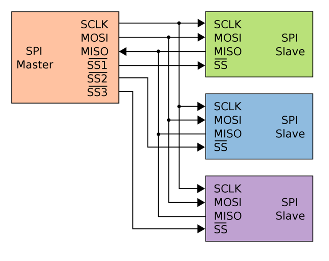
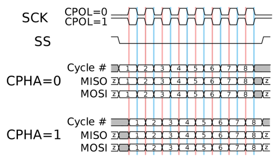
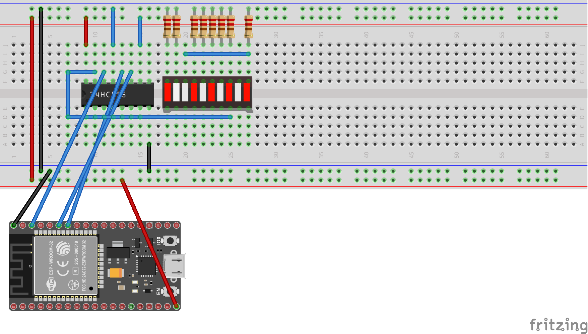

# All you've always wanted to know about SPI

This beginner document will explain what is SPI (Serial Peripheral Interface) and how to properly use it with concrete examples using .NET nanoFramework. You're in a perfect place if you want to communicate with devices that support SPI communication.

## A bit of theory

In the world of microcontrollers (MCU), the Serial Peripheral Interface (SPI) is a synchronous serial communication interface specification used for short-distance communication, primarily in embedded systems. SPI devices communicate in full duplex mode using a master-slave architecture with a single master. The master device originates the frame for reading and writing. Multiple slave devices are supported through selection with individual slave select lines.

## A bit of electronics theory

SPI communication involves four signals which represented by special [GPIO](./gpio-explained.md):

- **SCLK**: Serial Clock (output from master).
- **MOSI**: Master Output, Slave Input (output from master).
- **MISO**: Master Input, Slave Output (output from slave, input in master).
- **SS**: Slave Select (possibly multiple output from master).

Here is an equivalent electronic schema for SPI:



> [!Note]
>
> Those master and slave names are not inclusive. Those are the ones used in the datasheet and the industry. Some work and some resolution are ongoing to [find better names](https://www.oshwa.org/2022/01/10/new-spi-terminology/).

## SPI in practice

SPI is used for communication between the MCU and other devices like sensors, SD cards, and shift registers. SPI is a good choice for communication between chips on a board because the protocol is simple, fast and the wires are few. SPI can also achieve high data rates, which is beneficial in applications where data throughput is a concern.

The SPI protocol is defined like this:

- At every clock a data can be read or write,
- Read on MOSI for the Slave while the Master will write,
- Write on MISO for the Slave while the Master will read,
- All has to be precise because you can read and write at the same time, you need to agree on when during the clock time you can read or write = SPI Mode. We will discuss [SPI Mode](#spi-mode) later.

The rest of the protocol is **not** determined:

- The number of bytes is not determined,
- The operation frequency is not determined,
- Can be [LSB (Least Significant Bit) or MSB (Most Significant Bit) communication](#lsb-and-msb-communication).

## SPI Mode

It is important to understand the different SPI modes. To have a better view, let's look at the following picture:



CPOL (Clock Polarity) and CPHA (Clock Phase) are two key parameters that define a clock format to be used by the Serial Peripheral Interface Bus (SPI):

- **CPOL** determines the polarity of the clock. If CPOL=0, the clock is considered idle when it's low, and the data is sampled on the rising edge and shifted on the falling edge. If CPOL=1, the clock is considered idle when it's high, and the data is sampled on the falling edge and shifted on the rising edge.

- **CPHA** determines the phase of the clock. If CPHA=0, data is sampled on the first clock edge (either rising or falling, depending on CPOL). If CPHA=1, data is sampled on the second clock edge (again, either rising or falling, depending on CPOL).

These two parameters define four different SPI modes (0, 1, 2, 3), each with a different combination of CPOL and CPHA:

|SPI Mode|CPOL|CPHA|
|---|---|---|
|0|0|0|
|1|0|1|
|2|1|0|
|3|1|1|

> [!IMPORTANT]
>
> The correct mode to use depends on the specific SPI device you're communicating with, and should be specified in the device's datasheet.

## LSB and MSB communication

LSB stands for Least Significant Bit, and MSB stands for Most Significant Bit. These terms are used to describe the order in which bits are transmitted or received in digital communication protocols, including SPI.

- **LSB**: This is the bit position in a binary number having the least value. It's typically the rightmost bit in the number. For example, in the binary number 1010, the LSB is 0.

- **MSB**: This is the bit position in a binary number having the greatest value. It's typically the leftmost bit in the number. For example, in the binary number 1010, the MSB is 1.


In the context of SPI communication, whether data is transmitted LSB-first or MSB-first depends on the specific devices being used and their configuration. Some devices can be configured to use either mode, while others are fixed to one mode or the other.

> [!IMPORTANT]
>
> Ensure that both the master and slave devices are configured to use the same mode to ensure correct communication.

## Example of using SPI with a shift register

The Serial Peripheral Interface (SPI) is typically used to convert data from a serial flow to a parallel one. This is particularly useful when you need to control multiple outputs with fewer pins on your MCU.

One common application of this is in controlling LED panels, where you might need to control many LEDs individually. By using SPI, you can send data to the panel serially from your MCU, and then convert it to parallel within the panel to control each LED.

SPI devices can also be chained together, allowing you to control multiple devices in sequence with the same SPI bus. This can greatly simplify the wiring and control of complex systems.

A typical component that uses SPI and supports these features is the 74HC595 shift register. This chip takes in data serially through SPI, and then outputs it in parallel. It can also be chained with other 74HC595s to control even more outputs. Here is an example:



The following example shows how to setup SPI, write and read data.

```csharp
using System.Device.Spi;

SpiDevice spiDevice;
SpiConnectionSettings connectionSettings;

// Note: the ChipSelect pin should be adjusted to your device, here 12
connectionSettings = new SpiConnectionSettings(1, 12);
// You can adjust other settings as well in the connection
connectionSettings.ClockFrequency = 1_000_000;
connectionSettings.DataBitLength = 8;
connectionSettings.DataFlow = DataFlow.LsbFirst;
connectionSettings.Mode = SpiMode.Mode2;

// Then you create your SPI device by passing your settings
spiDevice = SpiDevice.Create(connectionSettings);

// You can write a SpanByte
SpanByte writeBufferSpanByte = new byte[2] { 42, 84 };
spiDevice.Write(writeBufferSpanByte);

// The read operations are similar
SpanByte readBufferSpanByte = new byte[2];
// This will read 2 bytes
spiDevice.Read(readBufferSpanByte);
```

You have a [detailed example here](https://github.com/nanoframework/Samples/blob/main/samples/SPI/Program.cs).

## How to use SpiDevice and SpiConnectionSettings

[SpiConnectionSettings](https://docs.nanoframework.net/api/System.Device.Spi.SpiConnectionSettings.html) is a class specifying an immutable configuration for SPI. This class includes the clock frequency, in Hertz, the data bit length, the data flow and the SPI Mode. Note that all the devices on the same bus will have to share the same configuration.

Once created, the [SpiDevice](https://docs.nanoframework.net/api/System.Device.Spi.SpiDevice.html) will allow you through functions to read, write or transfer (writes and reads data at the same time).

## Specific SPI challenges

While SPI is great, like any other protocol it has its own challenges. We've already mentioned some in the previous sections.

Managing multiple devices on the same SPI bus can be challenging. Each device needs a separate chip select line, and all devices on the bus **must** use the same SPI configuration including the SPI mode and frequency. This for example implies that as the clock speed of the SPI bus is often limited by the slowest device on the bus. If you have a mix of slow and fast devices, you may not be able to communicate with the fast devices at their maximum speed.

As with any high-speed digital interface, signal integrity can be a challenge. Long wires, inadequate grounding, or poor power supply decoupling can lead to signal integrity issues. This happens very often on bread board prototyping for example.

SPI is a full-duplex communication protocol, meaning it can send and receive data at the same time. This can add complexity to the design and programming of your device. This is at the same time quite an advantage as it speeds up a lot the data exchange with devices.

SPI doesn't have a built-in mechanism for flow control. If the slave device isn't ready to send or receive data when the master device initiates a transfer, data can be lost. Also, Unlike some other communication protocols, SPI doesn't have an acknowledgement mechanism. The master has no direct way of knowing whether the slave received the data correctly. So it is up to you and looking at the devices you connect to understand if there is a software mechanism existing to check data integrity.
