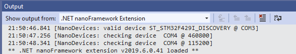
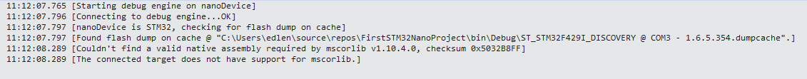

# Getting Started Trouble Shooting Guide

Here are solutions to some common problems when getting started.

## No devices appear in **Device Explorer** in Visual Studio (View/Other Windows/Device Explorer)

- The **Visual Studio nanoFramework Extension** communicates to the device using serial/COM ports.  The extension must first detect that the COM port is active, and then ping the port for a response to a specific query.  The device drivers for serial ports come in many flavours and versions, and are probably the #1 problem with detecting and communicating with a device.  Install the latest drivers for the USB chipset used by your board.  Check the version using Windows Device Manager.  
- Sometimes unplugging and replugging the USB port will "wake up" a serial device driver
- Try pressing the RESET button on your device to reboot it
- Reflash your device to make sure it has nanoFramework installed
- On the **Device Explorer** enable the **Show Internal Errors** button . Check for messages in the Visual Studio Output Window and select **.Net nanoFramework Extension** in the `Show output from:` dropdown. <BR/>
- Toggle the **Disable Device Watchers** button  on the **Device Explorer** ON then back OFF.  This will cause the extension to rescan all of the COM ports.
- Try a different USB cable, or test cable on a known good device.  Sometimes it is difficult to tell if a cable was only intended to be used for charging and does not carry the signal wires.  Cables over 2M/6FT are to be suspected since those are often power only cables.
- Some STM32 devices need to use two USB cables - one for power and one for serial/COM. See [Getting Started Guide for managed code (C#)](../getting-started-guides/getting-started-managed.md).

## When you attempt to debug you get a deployment error and you see a message "Couldn't find a valid assembly required by mscorlib..." in the Output Window/.NET nanoFramework Extension

- An example of the error when the problem is version number.  This was done by back-levelling the CoreLibrary to 1.10.4-preview.11 which was for the previous checksum. In this case the checksum was not checked - since the required native assembly version did not match the deploy failed prior to checking the checksum:

>

- The C# and native C++ assemblies are not version aligned.
- The C# version is determined by NuGet and the version of the component you selected. nanoFramework.CoreLibrary is the most common problem seen since it tends to load early.  
- The description of the NuGet package will contain the version and checksum of the native assembly that is required.
- See [Guide for package and assembly versions and checksums](../architecture/guide-version-checksums.md) for more info.
- Use the **Device Capabilities** button  on the **Device Explorer** to see what assembly versions and checksums are installed on the device as part of the firmware.
- If you are changing a nanoFramework component and you change the interface/contract of either the C# code or the C++ code, you will get a checksum mismatch error instead of a version mismatch error.  This is the mechanism that prevents developers from breaking the contract without generating new versions and checksums.

## nanoff does not load correct version of firmware

- Clear the cache at [username]\\.nanoFramework\\[device-name] - or just delete all of the cache folders.
- Use the **Device Capabilities** button  in the **Device Explorer** to verify the firmware version that is installed on the device.

## nanoff ends with Ennnn error

- Update your copy of the `nanoff` tool using the command

    ```console
    dotnet tool update nanoff --global
    ```

- Run `nanoff` again, this time with detailed output messages by adding `-v diag` at the end. This will output verbose messages on the progress of the tool execution, hopefully detailing what could be wrong.
- Make sure you have the latest drivers of the serial devices connected. Check the driver manufacturer website as not all of them make available the latest versions through Windows Update.
- Check permissions for the cache folders at [username]\\.nanoFramework.  Deleting the cache files can sometimes fix problems.
- Like the **Device Explorer** the flash utility depends on serial/COM drivers for most devices.  Check that USB cables are not power-only cables (i.e. no signal wires), and that you are using the most recent USB drivers.
