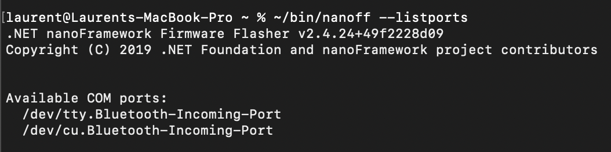

# Troubleshooting device connection

Sometimes, you may have problem with a device. You may have hard time to find it, hard time to flash it and after flash you may not find it in the Visual Studio extension. So this article is for you and will give you elements to figure out the root cause.

This example will use an ESP32 device but it works in a similar way for other devices.

## Assumptions

We assume you have properly installed the .NET nanoFramework flash tool called `nanoff`. If not, go [here](https://github.com/nanoframework/nanoFirmwareFlasher).

We also assume you have properly installed the Visual Studio Extension. If not the case, then go [here](./getting-started-managed.md).

And finally, we assume you have a tool to watch port serial traffic like `putty`. If you don't have any, go [here](https://www.chiark.greenend.org.uk/~sgtatham/putty/latest.html).

## Finding the serial port of your device

The main trick here is to run 2 times the following command: `nanoff --listports`

### Finding ports on Windows

The first time it will look like this on Windows:

Then once you plug your device and rerun the command, you will see your port:

In this case, the com port is `COM3` on Windows. Bravo!

In case you don't see anything at all, then make sure you have the proper drive installed. If you don't have the proper driver installed, you'll get in the device explorer an error. If all is properly installed, you'll also be able to find the port:

### Finding ports on Linux/MacOS

And like this on MacOS/Linux with no device plugged in:

Once you plug the device, you'l get the port details:

We'll use the tty one, so `/dev/tty.usbserial-531F00209021`. The naming can be very different depending on the device you are using. In all the cases, make sure the latest drivers are installed.

In case you won't find your device, it's recommended to install `lsusb`. For linux, depending on the version, just use `apt-get install lsusb` and for MacOS `brew install lsusb` (you may have to use higher privileges using `sudo`).

Then similar to using the nanoff command, unplug your device and run `lsusb` to list the connected devices. Run it a second time with the device connected to figure out what it is and which drivers are required. The result will looks like this:

And with the added device:

You can refer to the hardware found and then to the vendor to find out what drivers are needed.

## My device flashes but I can't find it in Visual Studio extension

You've flashed the device successfully using `nanoff` but you don't see it in the Visual Studio Extension.

First, check [this troubleshooting guide](./trouble-shooting-guide.md)!

Still nothing? OK, let's debug the device itself.

### Special ESP32

ESP32 devices at boot time will output quite a lot of things. For this, you need to connect your deviceESP32 with the proper serial port (in the previous example `COM3` for Windows and `/dev/tty.usbserial-531F00209021` for Linux/Mac) with a baud rate of 115200.

And when you connect **and** reset the device by pressing the little EN or BOOT or equivalent button of your ESP32, you'll get a result like this:

If your device is ok, you should see all green, no red lines. If you have red lines, it may be related to an issue, that can point you on something broken in your device. If the device reboots all the time, you'll get this screen over and over, it then means the device can be out of order or you have a problem with the image.

If at this point all is good for your device, go to the next step.

### Finding if nanoFramework booted

To know if your device boots properly, use putty or equivalent and open the serial port your device is connected to with the baud rate of `921600`, this is the baud rate used by `Console.WriteLine` or `Debug.WriteLine` and whenever you have exceptions or equivalent raised by the CLR.

Regardless of your device, once you connect it, you will see the message `NFPKTV1` appearing. This means that .NET nanoFramework is properly loaded and working. To see it, you may have to reboot your device by pressing buttons like EN, RST, BOOT or equivalent.

Don't worry about the possible scramble characters before, they are the ones from the boot of the device itself. Some devices like ESP32 are quite chatty (see previous section), some devices like STM32 are very quite!

From that point, seeing this message means the device is properly working, so look again at [this troubleshooting guide](./trouble-shooting-guide.md).
