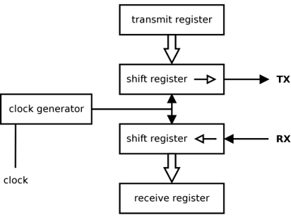
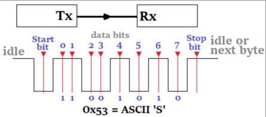

# All you've always wanted to know about Serial Port Communication

This beginner document will explain what is Serial Port Communication and how to properly use it with concrete examples using .NET nanoFramework. You're in a perfect place if you want to communicate with devices that support Serial Port Communication, and if you want to learn about stop bit, parity, baud rate and more.

## A bit of theory

Serial Port Communication, also known as UART (Universal Asynchronous Receiver/Transmitter), is a hardware device that translates data between parallel and serial forms. UARTs are commonly used in conjunction with communication standards such as EIA/RS-232.

The architecture of UART can be summarize as:



Note that the clock is implicit. Each party knows in advance the clock speed and a condition, called start bit/signal is raised to start a communication.

## A bit of electronics theory

Serial communication involves two signals which are special [GPIO pins](./gpio-explained.md):

- **TX (Transmit)**: The line that transmits data from the device.
- **RX (Receive)**: The line that receives data into the device.

You also need a minimum of a ground line. Additional pins can be needed for [hardware control](#rts-and-cts-for-hardware-control).

For simplicity reasons and because we will use RS-232 so called Serial Port moving forward.

Here is an example of a transfer using RS-232 protocol:



Following the start bit, the data bits are sent, typically 7 or 8 bits. The least significant bit is sent first, so using [LSB](./spi-explained.md#lsb-and-msb-communication).

After the data bits, an optional parity bit may be sent. The parity bit is used for error checking. If even parity is used, the parity bit is set so that the total number of logic high bits in the data and parity bits is even. If odd parity is used, the parity bit is set so that the total number of logic high bits is odd.

Finally, one or more stop bits are sent. The stop bit is always a logic high (or '1') signal. This signals the receiver that the data packet has ended. The stop bit also ensures that there is a minimum period of line idle time between data packets.

The combination of start bit, data bits, parity bit, and stop bit forms a data frame in the RS-232 protocol. The receiver synchronizes itself to the sender with the start bit, then reads in each bit at the specified baud rate, checking the parity bit if used, and finally waits for the stop bit before getting ready to receive the next data frame.

Here is another example of a transmission with 1 start bit, 8 bits, an even parity and 1 stop bit:


> [!Tip]
>
> The RX pin of one device connects to the TX pin of the other device and vice versa!

## Baud rate

In serial communication, the baud rate refers to the number of signal or symbol changes that occur per second. A symbol can represent one or more bits of data, depending on the specific communication protocol.

In the context of UART or Serial Port Communication, the baud rate is often used interchangeably with bits per second (bps). This is because in UART communication, each symbol represents exactly one bit.

Common baud rates include 9600, 19200, 38400, 57600, and 115200. The chosen baud rate for a particular connection must be supported and set the same on both devices for the communication to work correctly.

The baud rate is a crucial parameter in serial communication as it determines the speed at which data is sent and received. Higher baud rates allow for faster data transmission, but they may also increase the chance of errors due to factors like noise or signal degradation, especially over longer distances.

## RTS and CTS for hardware control

RTS (Request to Send) and CTS (Clear to Send) are control signals used in hardware flow control for serial communication, such as in the RS-232 protocol. This requires 2 more [GPIO](./gpio-explained.md).

- RTS signal is sent by the transmitting device to the receiving device to indicate that it wants to send data.
- CTS signal is sent in response to an RTS signal, the receiving device sends a CTS signal to indicate that it is ready to receive data.

The RTS and CTS signals help manage the flow of data between devices to prevent data loss. When the receiving device is not ready to accept more data (for example, if its buffer is nearly full), it can stop the transmitting device from sending more data by not sending a CTS signal in response to an RTS. Once the receiving device is ready to receive more data (for example, after it has emptied its buffer), it can signal the transmitting device to start sending data again by sending a CTS signal.

## XON and XOFF for software control

XON (Transmit On) and XOFF (Transmit Off) are control characters used in software protocols for flow control. They are part of the ASCII character set and are often used in serial communication protocols like RS-232.

- XON is a character is sent by a receiver to tell the sender to resume transmission. It's ASCII value is 17 (or 0x11).
- XOFF is a character is sent by a receiver to tell the sender to stop transmission. It's ASCII value is 19 (or 0x13).

The XON/XOFF protocol is also known as software flow control as it doesn't require any additional hardware lines, unlike hardware flow control protocols like RTS/CTS. The sender must monitor the data it receives for XON and XOFF characters and start or stop transmitting data accordingly. This can be used to prevent data loss when the receiver is not able to process incoming data fast enough.

## Serial Port Communication in practice

Serial Port Communication is used for communication between the MCU and other devices like sensors, modems, and GPS modules. It's a good choice for communication between devices due to its simplicity and the fact that it requires only two wires (TX and RX) and also it can be relatively long distances compared to [I2C](./i2c-explained.md) or [SPI](./spi-explained.md).

> [!IMPORTANT]
>
> As you have guessed now, there are few critical parameters to know to create a Serial Port: baud rate, parity, stop bit, number of bits, if the device uses hardware and or software control! So refer carefully to the device datasheet.

Here is an example of how to use Serial Port in .NET nanoFramework:

```csharp
using System.IO.Ports;
// open COM2
var serialPort = new SerialPort("COM2");
// set parameters
serialPort.BaudRate = 9600;
serialPort.Parity = Parity.None;
serialPort.StopBits = StopBits.One;
serialPort.Handshake = Handshake.None;
serialPort.DataBits = 8;
// Additional properties can be adjusted like the timeout, here 4 seconds = 4000 milliseconds
serialPort.ReadTimeout = 4000;
// Open the Serial Port!
serialPort.Open();
// Write string data
serialPort.WriteLine(DateTime.UtcNow + " hello from nanoFramework!");
// Read some data
byte[] buffer = new byte[5];
var bytesRead = serialPort.Read(buffer, 0, buffer.Length);
// Convert those data as a string
if (bytesRead > 0)
{
    String temp = Encoding.UTF8.GetString(buffer, 0, bytesRead);
    Debug.WriteLine("String: >>" + temp + "<< ");
}
```

## How to use SerialPort

[SerialPort](https://docs.nanoframework.net/api/System.IO.Ports.SerialPort.html) offers quite some properties and functions also including events. In the flow, as shown in the example before, you need to setup the core elements like the baud rate, parity before opening the port.

Naming convention wise, all ports have a name starting with `COM` followed by a number. If you are not sure which ports are available for your board, you can always list them:

```csharp
// get available ports
var ports = SerialPort.GetPortNames();
Debug.WriteLine("Available ports: ");
foreach (string port in ports)
{
    Debug.WriteLine($" {port}");
}
```

You will still need to understand from the MCU data sheet which pins are related to which ports.

For ESP32 MCU, you can setup most of the pins as SDA or SCL pins. You will need to use the [ESP32 hardware nuget](https://docs.nanoframework.net/api/nanoFramework.Hardware.Esp32.html). Then the code is quite straight forward to define pins:

```csharp
// Here setting pin 32 for RX and pin 33 for TX both on COM2
Configuration.SetPinFunction(32, DeviceFunction.COM2_RX);
Configuration.SetPinFunction(33, DeviceFunction.COM2_TX);
```

The interesting part with SerialPort is the eventing part. You can be called in a call back function once a specific character set is reached. Your code will looks like:

```csharp
using System;
using System.Diagnostics;
using System.IO.Ports;
using System.Text;
using System.Threading;

// Us the initialization explained before

// setup read timeout
// because we are reading from the UART it's recommended to set a read timeout
// otherwise the reading operation doesn't return until the requested number of bytes has been read
SerialPort.ReadTimeout = 2000;
// setup an event handler that will fire when a char is received in the serial device input stream
SerialPort.DataReceived += SerialDevice_DataReceived;
// set a watch char to be notified when it's available in the input stream
SerialPort.WatchChar = '\r';
Thread.Sleep(Timeout.Infinite);

SerialDevice_DataReceived(object sender, SerialDataReceivedEventArgs e)
{
    SerialPort serialDevice = (SerialPort)sender;

    if (e.EventType == SerialData.Chars)
    {
        Debug.WriteLine("rx chars");
    }
    else if (e.EventType == SerialData.WatchChar)
    {
        Debug.WriteLine("rx watch char");
    }

    // need to make sure that there is data to be read, because
    // the event could have been queued several times and data read on a previous call
    if (serialDevice.BytesToRead > 0)
    {
        byte[] buffer = new byte[serialDevice.BytesToRead];

        var bytesRead = serialDevice.Read(buffer, 0, buffer.Length);

        Debug.WriteLine("Read completed: " + bytesRead + " bytes were read from " + serialDevice.PortName + ".");

        string temp = Encoding.UTF8.GetString(buffer, 0, bytesRead);
        Debug.WriteLine("String: >>" + temp + "<< ");
    }
}
```

A detailed sample can be [found here](https://github.com/nanoframework/Samples/tree/main/samples/SerialCommunication).

## Serial Port specific challenges

Both devices need to operate at the same baud rate. If the baud rates don't match, the receiving device may interpret the received bits incorrectly, leading to communication errors. You have patterns to discover baud rate by using specific known baud rates and trying to write a command that will response will a know answer to find out if you are using the correct one. Quite some devices uses this pattern. But this is taking time during the initialization phase as you will have to test quite a lot of possibilities.

Serial communication relies on correctly framed data packets. If the start and stop bits aren't correctly identified, the data received will be incorrect. IT is very important to read the datasheet to know those values.

If the receiving device can't process incoming data quickly enough, its buffer may overflow, leading to lost data. You can adjust those in .NET nanoFramework:

```csharp
// if dealing with massive data input, increase the buffer size
serialPort.ReadBufferSize = 2048;
```

Serial communication can be susceptible to electrical noise and interference, especially over longer distances. This can lead to corrupted data. Make sure you protect properly the cables. Modern devices have a great filtering but still, cabling quality is important.

Managing the flow of data can be challenging, especially at higher baud rates. Without proper flow control, data can be lost if the sender transmits data faster than the receiver can process it. The maximum distance for reliable communication is limited, especially at higher baud rates. Signal repeaters may be needed for longer distances. The speed of serial communication is limited by the baud rate. While higher baud rates allow for faster data transmission, they also increase the chance of errors. For RS-232, a commonly used serial communication standard, the maximum cable length is typically around 15 meters at a baud rate of 19200 bps. However, this can be extended to several hundred meters at lower baud rates and by a good cabling protection.
