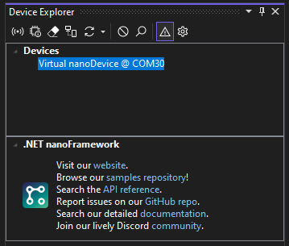
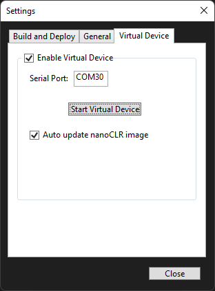

# .NET **nanoFramework** Virtual Device

A .NET **nanoFramework** _Virtual Device_ is available as a [.NET Tool](https://docs.microsoft.com/en-us/dotnet/core/tools/global-tools). It allows to run nanoCLR on Windows machines. This can be useful for development purposes, performing automated tests on pipelines and other usage scenarios that benefit from having a virtual device opposed to real physical hardware. The virtual device can be accessed just like a real one through a virtual serial port or a TCP/IP port.

The Visual Studio extension can interact with the .NET **nanoFramework** virtual device just like it does with a real device. It will be listed in Device Explorer window and will offer the same option as a real device.



> Note: the .NET Tool with the **nanoFramework** virtual device is not exclusive of the Visual Studio extension. It's a global tool that can be use standalone. Read below instructions on how to use it.

The serial port that exposes the **nanoFramework** virtual device is provided by [HHD Software](https://www.hhdsoftware.com/) which has kindly sponsored a free license for running their tool in .NET **nanoFramework** tools.

## Configuring the Virtual Device

To enable and configure .NET **nanoFramework** virtual device, open the `Settings` configuration dialog in Device Explorer (click on the cog wheel icon in the toolbar). Navigate to the `Virtual Device` tab.



To enable the Virtual Device, simply check the "Enable Virtual Device" check box. This will start **nanoFramework** virtual device with Visual Studio. If the tool is not installed, Visual Studio will do it in the background. If the Virtual Device is not needed, uncheck the option and it won't be started.

A specific serial port can be configured to expose the Virtual Device. Enter a valid COM port name in the `Serial Port` text box and this will be used. If the virtual serial port doesn't exist yet, it will be created.

The virtual device can be started & stopped by clicking the respective button.

Last configuration pertains the automatic update of the nanoCLR image that the virtual device will be running. To have the tool automatically update and use the latest available version, just enable the checkbox.

> Note: if a specific nanoCLR version was installed, the virtual device will use that one. This is useful if you're testing a specific version of a library of firmware version, for example.

## Output from Virtual Device

The output from the virtual device is made available in Visual Studio Output pane, just select `.NET nanoFramework Virtual Device`.


## Known limitations

The virtual device has implemented most of the libraries and APIs that do not require hardware interaction. For those a "stubbed" version is offered meaning that a call to those APIs will result on a `Not Implemented Exception`. There is also no support for network. This will be added in a future version.

## Usage

Once the tool is installed, you can call it by using its command `nanoclr`, which is a short version of the name to ease typing.

```console
nanoclr [command] [args]
```

The tool includes help for all available commands. You can see a list of all available ones by entering:

```console
nanoclr --help
```

## Virtual Serial Ports

This verb allows managing the virtual serial port exposing the virtual device.
The virtual serial port is only available in Windows machines. It's made available with the sponsorship of [HHD Software](https://www.hhdsoftware.com/) which has kindly sponsored a free license for running their tool.

### List Virtual Serial ports

This command lists the installed virtual serial port bridges in the system.

```console
nanoclr virtualserial --list
```

### Create Virtual Serial port

This command creates a virtual serial port that will be used to expose the nanoCLR instance. A random COM port will be created.
A COM port can be optionally specified as an option. In this case, if that COM port it's not being used, it will be created.

```console
nanoclr virtualserial --create [COM99]
```

### Remove Virtual Serial port

This command removes an existing virtual serial port.

```console
nanoclr virtualserial --remove [COM99]
```

### Install Virtual Serial Port tools

This command installs [HHD Software](https://www.hhdsoftware.com/) Virtual Serial Port Tools software. The installer is downloaded from their website and executed. Executing the installer requires "Install Driver" privilege and must be elevated. If the process running it doesn't have the required permissions an UAC prompt will be show.

```console
nanoclr virtualserial --install
```

## Running the virtual nanoCLR

These options run the nanoCRL instance loading the specified assemblies and exposing the device on a specified interface. Please note that for successfully running a nanoCLR instance it's require to load a set of assemblies _and_ specify an interface to expose it, otherwise it has no use.

### Load a set of assemblies

This loads a set of .NET nanoFramework assemblies and runs the nanoCLR. These have to be in .NET nanoFramework PE (Portable Executable) format.
They are found in the output folder of a Visual Studio project (typically `bin\Debug` or `bin\Release`). Full path of the PE files is required.

```console
nanoclr run --assemblies "C:\nano\my_nice_project\bin\Debug\mscorlib.pe" "C:\nano\my_nice_project\bin\Debug\my_nice_project.pe"
```

### Specify Serial Port

This option specifies the COM port that will be used to expose the virtual nanoCLR that will be running. It requires a previous setup of a Virtual Serial Port (see [Create Virtual Serial port](#create-virtual-serial-port)).

```console
nanoclr run --serialport COM99 (--assemblies ...)
```

### Specify Named Pipe

This option specifies a [Named Pipe](https://learn.microsoft.com/en-us/windows/win32/ipc/named-pipes) that will be used to expose the virtual nanoCLR that will be running.

```console
nanoclr run --namedpipe MyNanoDevice (--assemblies ...)
```

### Resolve references

This option tries to resolve cross-assembly references between the loaded assemblies.

```console
nanoclr run --resolve (--assemblies ...)
```

## Maintenance operations with the nanoCLR

The nanoCLR is, in fact, a wrapper to the nanoCLR instance that is distributed as DLL so it can be easily updated.
The following operations are available to manage this.

### Version of nanoCLR

Gets the version of the current nanoCLR instance.

```console
nanoclr instance --getversion
```

### Update nanoCLR instance

Checks for stable versions of nanoCLR and updates it, if there is one. A version can be specified. To check preview versions add the `--preview` option.

```console
nanoclr instance --update [--preview] [--clrversion 1.22.333.4444]
```
