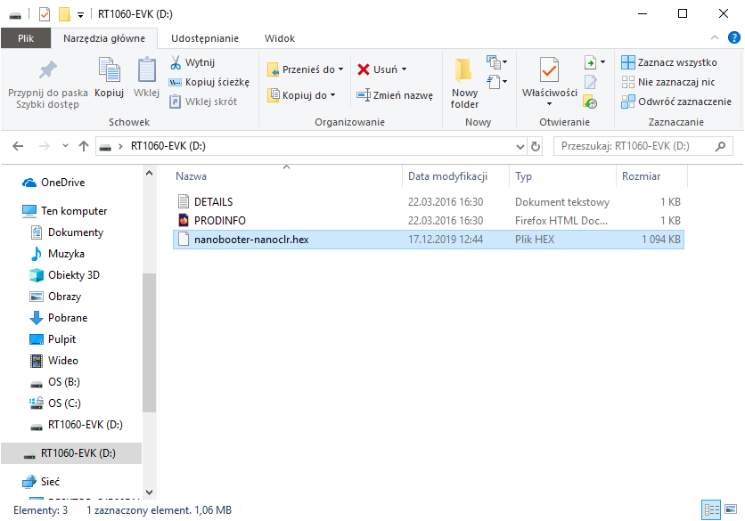

# Flash a nanoCLR image/nanoBooter in a NXP MIMXRT1060_EVAL board

## How To guide

The easiest way to flash nanoBooter and nanoCLR image onto i.MX RT1060 board is through mbed, which provides virtual disk after you connect the board to PC.

> NOTE: If you overwritten DAPLink firmware, you will need proper DAPLink firmware for OpenSDA serial and debug adapter that is built into eval board, it provides USB host (IDE, file system and serial terminal).
You can download it from here: [OpenSDA](https://www.nxp.com/design/microcontrollers-developer-resources/ides-for-kinetis-mcus/opensda-serial-and-debug-adapter:OPENSDA?&tid=vanOpenSDA#MIMXRT1060-EVK). Then follow the procedure described in a link.

1. Download the image from .NET **nanoFramework** repository.
2. Check that **J1** is in middle position (power from micro-usb port) and connect usb cable to **J41** usb.
3. Removable disk "rt1060-evk" should appear in file manager.
4. Extract downloaded image and copy nanoFramework image "nanobooter-nanoclr.hex" to removable disk.

5. Device should automatically program flash and reset itself after short time.
6. Check if programming was successful by reseting the board while pressing **SW8** button. If a green led starts blinking it means that nanoBooter is working correctly.
7. Finally reset the board and open Visual Studio. Device should be recognized by Device Explorer nanoFramework plugin.

## FAQ

- Device is not recognized by Device Explorer.

> Try to restart Visual Studio
> Check that firmware was properly programmed, try booting to nanoBooter, device should be listed in Devices Explorer

- In FAIL.txt on removable disk error: "The interface firmware FAILED to reset/halt the target MCU"

> Check that jumpers J47, J48, J49 are present and J44 is not
> Jumper J1 must be in middle position if your not using external power

- Device correctly boots to nanoBooter but is not detected otherwise

> If you flashed nanoBooter.hex and then nanoCLR.hex, programmer erases memory every flashing process.
