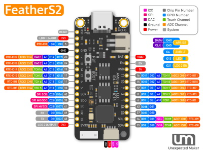
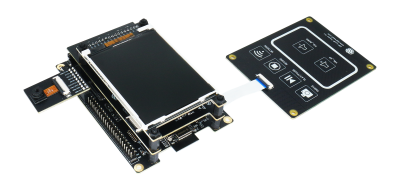

# Espressif ESP32-S2 Series

These are the firmware images:

- FEATHER_S2 that *fits* all ESP32-S2 boards exposing the embedded USB CDC through GPIO19 and GPIO20. These can be FeatherS2, TinyS2 or any other similar hardware with or without PSRAM.
- KALUGA_1 specific for the ESP32-S2-Kaluga-1 Kit. This one includes the UI features and driver for the ILI9341.

You can check Espressif [Product Selector](https://products.espressif.com/#/product-selector?names=&filter={%22Series%22:[%22ESP32-S2%22]}) for details on all the existing variants, chips, modules and respective development kits.

## FeatherS2

[FeatherS2 Product page](https://feathers2.io/)

## TinyS2

[TinyS2 Product page](https://unexpectedmaker.com/tinys2/)

## ESP32-S2-Kaluga-1 Kit

[ESP32-S2-Kaluga-1 Kit Product page](https://docs.espressif.com/projects/esp-idf/en/latest/esp32s2/hw-reference/esp32s2/user-guide-esp32-s2-kaluga-1-kit.html)

## Firmware images (ready to deploy)

| Target | Firmware |
|:---|---|
| FEATHER_S2 |  |
| KALUGA_1 |  |

:warning: To update FeatherS2 and TinyS2 with [nanoff](https://github.com/nanoframework/nanoFirmwareFlasher) the boards need to put in **download mode** by holding [BOOT], clicking [RESET] and then releasing [BOOT].
