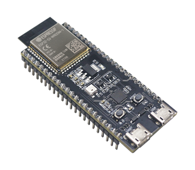
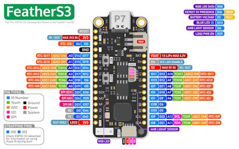

# Espressif ESP32-S3 Series

These are the firmware images:

- ESP32_S3 that *fits* all ESP32-S3 boards exposing the embedded USB CDC through GPIO19 and GPIO20. These can be ESP32-S3-WROOM, ESP32-S3-DevKit's or any of the amazing S3 boards from Unexpected Maker, or any other similar hardware with or without PSRAM.
- ESP32_S3_BLE same as above, but including support for BLE.

You can check Espressif [Product Selector](https://products.espressif.com/#/product-selector?names=&filter=%7B%22Series%22%3A%5B%22ESP32-S3%22%5D%7D) for details on all the existing variants, chips, modules and respective development kits.

## ESP32-S3 Modules

[ESP32-S3 Modules List](https://www.espressif.com/en/products/modules?id=ESP32-S3)

## ESP32-S3 Dev Kits

[ESP32-S3 Dev Kits List](https://www.espressif.com/en/products/devkits?id=ESP32-S3)

## Unexpected Maker S3 boards

[Unexpected Maker ESP32-S3 Product page](https://esp32s3.com/)

## Firmware images (ready to deploy)

| Target | Firmware |
|:---|---|
| ESP32_S3 |  |
| ESP32_S3_BLE |  |

:warning: In order to update most of the S3 boards with [nanoff](https://github.com/nanoframework/nanoFirmwareFlasher) the board needs to be put in **download mode** by holding [BOOT], clicking [RESET] and then releasing [BOOT]. In doubt please check the instructions from the respective manufacturer.
