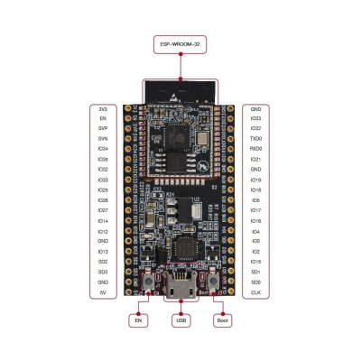

# Espressif ESP32 Series

These are the firmware images:

- ESP32_PSRAM_REV0 that *fits* all ESP32 boards carrying an ESP32 chip *with* PSRAM support. These can be ESP32-DevKitC, ESP32-WROOM and ESP32-WROVER variants *with* PSRAM.
- ESP32_REV0 that *fits* all ESP32 boards carrying an ESP32 chip *without* PSRAM support. These can be ESP32-DevKitC, ESP32-WROOM and ESP32-WROVER variants *without* PSRAM.
- ESP_WROVER_KIT specific for the ESP WROVER KIT. This one includes the UI features, support for PSRAM and driver for the ILI9341.
- ESP32_PICO that *fits* all ESP32 boards carrying an ESP32 PICO without support for PSRAM, like the ESP32-PICO-KIT and the M5Stack ATOM.
- ESP32_PSRAM_REV3 that *fits* all ESP32 boards carrying an ESP32 chip **revision 3** *with* PSRAM support.
- ESP32_LILYGO specific for the LilyGO ESP32 board which includes support for Ethernet PHY.

You can check Espressif [Product Selector](https://products.espressif.com/#/product-selector?names=&filter={%22Series%22:[%22ESP32%22]}) for details on all the existing variants, chips, modules and respective development kits.

> NOTE: Revision 3 chips are the most recent ones. (nanoff reports the revision of the chip right after connecting to the device). An image built for revision 0 will run perfectly on a revision 3 chip. The other way around won't work.

All other images are built with variations of those images. There are variants then exist with or without BLE, with or without screen drivers, etc.

[ESP32-DevKitC Product page](https://www.espressif.com/en/products/hardware/esp32-devkitc/overview)

[ESP32-WROVER-KIT Product page](https://www.espressif.com/en/products/hardware/esp-wrover-kit/overview)

All M5Stack boards carry ESP32 chips. Some are revision 1, others 3, and others PICO. Please checkout the [official documentation](https://docs.m5stack.com/en/products?id=core) to understand which one is based on which chip.

## Firmware images (ready to deploy)

| Target | Firmware |
|:---|---|
| ESP32_PSRAM_REV0 |  |
| ESP32_REV0 |  |
| ESP32_BLE_REV0 |  |
| ESP32_PSRAM_REV3 |  |
| ESP_WROVER_KIT |  |
| ESP32_PICO |  |
| ESP32_LILYGO |  |

> Note: You will find additional ESP32 based targets including screen driver names like:

- ESP32_REV0_ILI9342 (driver for M5Stack)
- ESP32_WROVER_KIT (this is the one containing the ILI9341 driver)
- ESP32_PICO_ST7735S (driver for M5Stick)
- ESP32_PICO_ST7789V (driver for M5Stick C Plus)
- ESP32_PSRAM_REV3_ILI9342
- ESP32_PSRAM_REV3_ILI9341

Check the details on the ESP32 pin-out available in nanoFramework [here](../esp32/esp32_pin_out.md).
