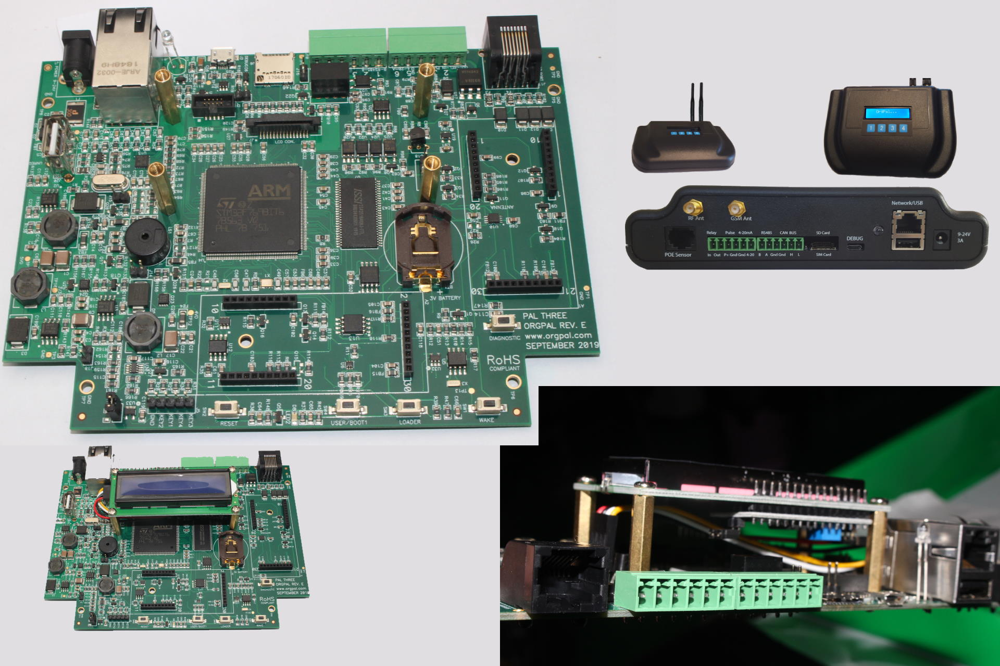

# OrgPal PalThree

[Product page](https://www.orgpal.com/palthree-iot-azure)

## Features

### STM32F769BIT MCU

- Powerful 216-MHz Arm® Cortex®-M7
- 2 Mbytes Flash, and 1 MB External SDRAM

### PalThree Board

- Versatile board for many applications with integrated sensor protocol support
- Broad sensor protocol support via RS 485/Modbus, 4-20mA, UART, I2C, Analog/Digital GPIO on a single board
- On-board micro USB gets you started with instant code development using Visual Studio 2017 or later
- Can be expanded with many plug in boards using the two 30 pin ports
- 16 MB QSPI Flash, and 8 MB SPI Flashfor onboard storage
- SD Card
- USB multiplexed with 2 connectors
- microUSB for debugging and programming
- Ethernet (LAN8742A) with SSL support
- 16x2 LCD I2C, expandable to use any I2C LCD
- DSI LCD Connector with I2C (Raspberry Pi LCD connector)
- Peripherals and Sensor Protocols:
  - RS 485
  - 4-20mA
  - 1 Relay (optically isolated)
  - 1 Flow/Pulse count
  - Digital and Analog GPIOs
  - UART, I2C and SPI
  - 3 user LEDs
  - 2 user buttons
  - 4 key matrix key pad connector
  - Real-Time Clock (RTC)
  - Speaker (buzzer)
  - Integrated temperature and battery monitor
- 2 30 pin Expansion Ports
- JTAG 10 pin ARM Micro connector
- Low power design, power use as low as 0.4mA in auto off mode
- 9-24V power input range with reverse polarity protection

## Firmware images (ready to deploy)

The ready to use firmware images provided include support for the class libraries and features marked bellow.

| Gpio | Spi | I2c | Pwm | Adc | Serial | Events | SWO | Networking | Large Heap |
|:---:|:---:|:---:|:---:|:---:|:---:|:---:|:---:|:---:|:---:|
| :heavy_check_mark: | :heavy_check_mark: | :heavy_check_mark: | :heavy_check_mark: | :heavy_check_mark: | :heavy_check_mark: | :heavy_check_mark: | :heavy_check_mark: | :heavy_check_mark: | :heavy_check_mark: |

