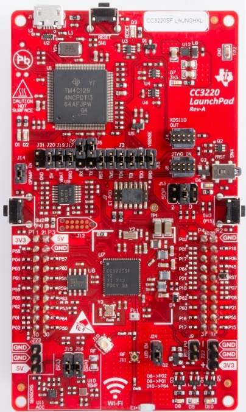

# TI CC3220SF-LAUNCHXL

## [Product page](http://www.ti.com/tool/CC3220SF-LAUNCHXL)

## Features

### CC3220SF mcu

- CC3220SF single-chip wireless microcontroller
- Dual-Core Architecture:
  - User-Dedicated Application MCU Subsystem
  - Highly-Integrated Wi-Fi Network Processor
- Arm® Cortex®-M4 Core at 80 MHz
- Embedded Memory:
  - 256KB of RAM
  - Optional 1MB of Executable Flash
  - External Serial Flash
- Peripherals:
  - McASP Supports Two I2S Channels
  - SD, SPI, I2C, UART
  - 8-Bit Synchronous Imager Interface
  - 4-Channel 12-Bit ADCs
  - 4 General-Purpose Timers (GPT) With 16-Bit PWM Mode
  - Watchdog Timer
  - Up to 27 GPIO Pins
  - Debug Interfaces: JTAG, cJTAG, SWD
- Wi-Fi Network Processor (NWP) Subsystem:
  - Wi-Fi Modes:
    - 802.11b/g/n Station
    - 802.11b/g Access Point (AP) Supports up to Four Stations
    - Wi-Fi Direct® Client and Group Owner
- WPA2 Personal and Enterprise Security: WEP, WPA™/WPA2™ PSK, WPA2 Enterprise (802.1x)
- IPv4 and IPv6 TCP/IP Stack
- SimpleLink Connection Manager for Autonomous and Fast Wi-Fi Connections
- Flexible Wi-Fi Provisioning With SmartConfig™ Technology, AP Mode, and WPS2 Options
- Hardware Crypto Engine for Advanced Fast Security, Including: AES, DES, 3DES, SHA2, MD5, CRC, and Checksum
- Secure Sockets (SSLv3, TLS1.0, TLS1.1, TLS1.2)
- Secure Boot: Validate the Integrity and Authenticity of the Runtime Binary During Boot

### Launchpad board

- Standalone development platform featuring sensors, LEDs and push-buttons
- On-board chip antenna with option for U.FL-based testing 
- 2x20-pin stackable connectors (BoosterPack headers) to connect to TI LaunchPads and other BoosterPacks
- Back-channel universal asynchronous receiver/transmitter (UART) through USB to PC
- XDS110-based JTAG emulation with serial port for flash programming

## Firmware images (ready to deploy)

The ready to use firmware images provided include support for the class libraries and features marked bellow.

| Gpio | Spi | I2c | Pwm | Adc | Serial | Events | SWO | Networking | Large Heap |
|:-:|:-:|:-:|:-:|:-:|:-:|:-:|:-:|:-:|:-:|
| :heavy_check_mark: | :heavy_check_mark: | :heavy_check_mark: | :heavy_check_mark: | :heavy_check_mark: | | :heavy_check_mark: | | :heavy_check_mark: | | |

| Stable | Preview |
|---|---|
|  |  |
