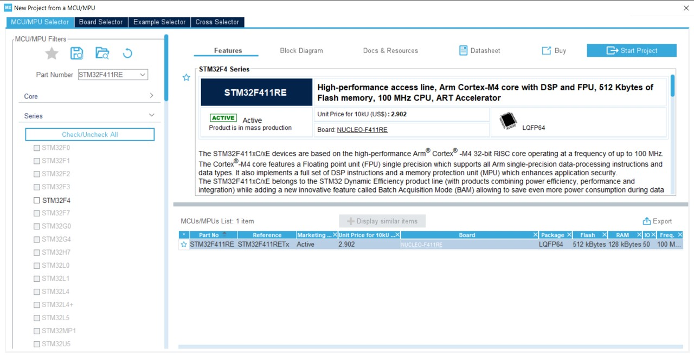
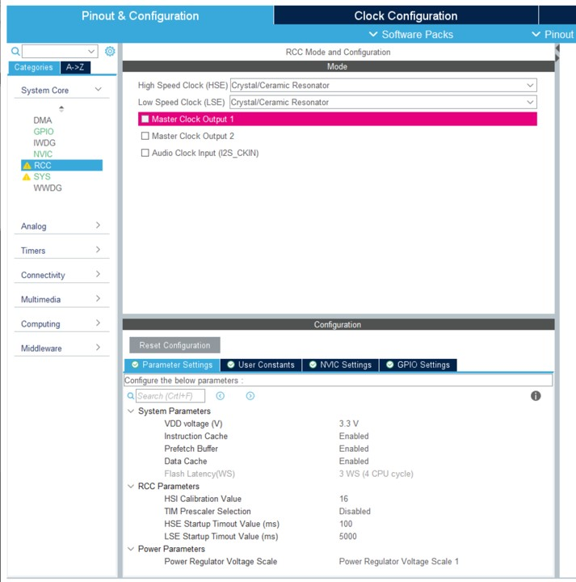
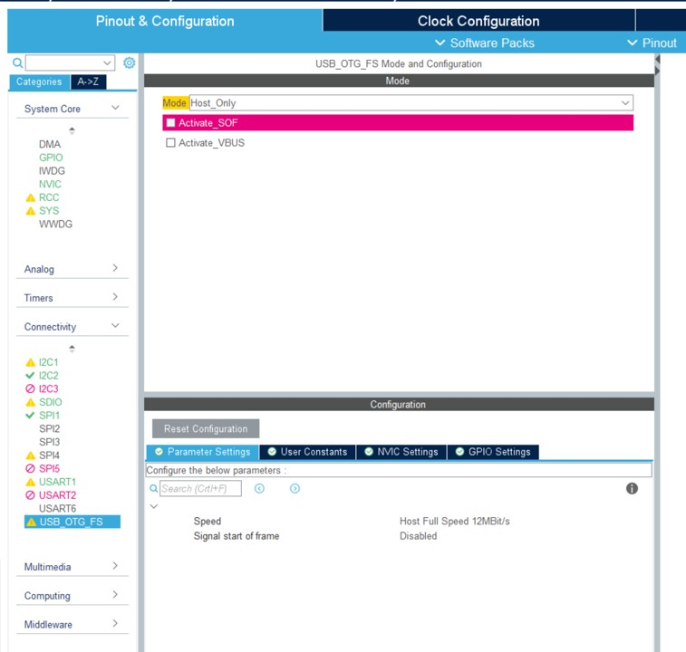
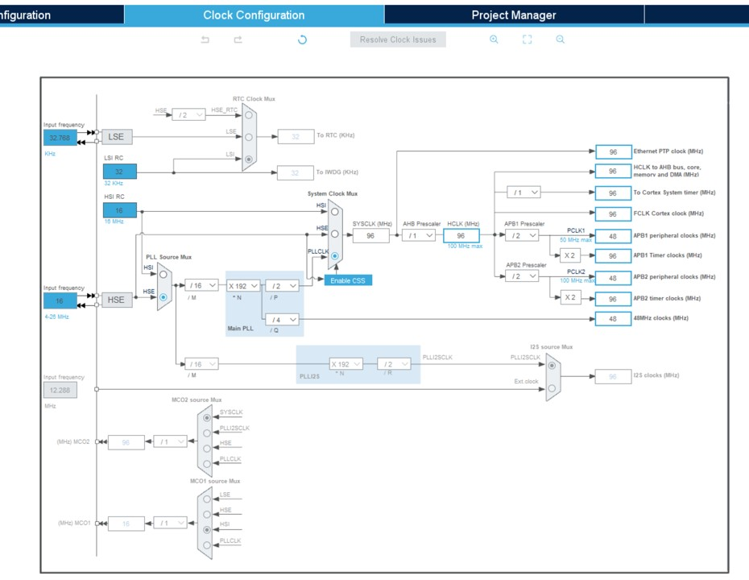
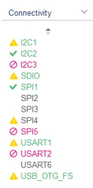
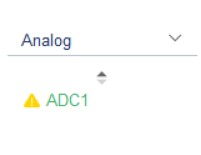
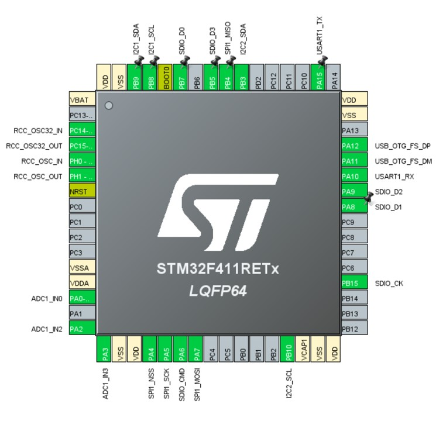

# How to create an STM32 based community board

This article will explain what needs to be adjusted to create a community board for STM32 based processors.

## Start with a similar board

Find a board that is close to your board. Check both the official boards and the community boards.

It is important to find the same MCU or a close one. Once done, copy/paste the folder in your cloned [nf-interpreter](https://github.com/nanoframework/nf-interpreter) repo. and rename the folder. Note that it is recommended to create a new branch so you won't mix it up with anything else. You can as well clone the repository in a temporary place just for the occasion. In all cases, make sure you have the latest up to date `main` branch.

> Tip: keep the folder into the target folder in nf-interpreter the time of your development. You will be able to move it later on to the `nf-Community-Targets` one and do a proper PR.

## Create your project in CMakeUserPresets.json

Create a proper section in your `CMakePresets.json` and `CMakeUserPresets.json`. Reuse the one from the board you're starting. Use the exact same settings as the recommended ones to build it. Just to make sure all is OK, build it with the exact same settings as the board you have cloned. This will ensure you're starting with a clean state.

> Tip: you can use the [dev containers](../building/using-dev-container.md) to avoid having to clone all the source repositories and build in a safe always working environment.

## Adjust the clock settings

This is the very first step and one of the most important one. And this is where things can be a bit tricky. You will need to understand what is the clock source and how it is connected to the MCU. For this you need to make sure you find the schematics of your board.

> To make the math, install and use [STM32CubeMX](https://www.st.com/en/development-tools/stm32cubemx.html). You will need this software later on for the pin settings.

This is the example of using an STM32F411RET MCU:



In most of the cases, you'll have to use an external clock. In this case, you'll need to activate the RCC element:



Then it's time to resolve external clock by enabling USB OTG:



> Note: Those screen captures include already some more elements setup for this project. The more you'll setup elements and the more you'll see in the menu green entrees, warnings and red elements. It will help you to understand if your configuration and the pin setup are correctly done. You should not get any impossible case at all.

The clock adjustment is the most difficult. You need to understand which clock settings to select from the documentation of your board. Here is an example:



> Tip: The tool offers a resolver but it may not be the best regarding your setup. After a first try, you may have to come back and adjust more of those elements. You may have to do a few trial errors if the documentation or schema is not the best.

## Build it and deploy it

Once you are at this stage, the best is to adjust the core elements of the clock, build, deploy and check those core part are working.

### board.h

The file `board\board.h` is one of the most important one. You'll have to adjust quite some elements in this one.

To start with, the name of your board as well as the frequency and setup elements found in the clock setting. To follow the example, you'll adjust all this:

```cpp
/*
 * Board identifier.
 */
#define BOARD_PYBSTICK2X
#define BOARD_NAME                  "PYBStick standard 26"

/*
 * USB OTG Force
 */
#define BOARD_OTG_NOVBUSSENS

/*
 * Completely wacko definition of a flash sector here
 */
#define FLASH_SECTOR_11    ((uint32_t)11U)

/*
 * Board oscillators-related settings.
 * NOTE: LSE is fitted and is of course 32768.
 * NOTE: HSE is fitted and set to a 16 MHz one.
 */
#if !defined(STM32_LSECLK)
#define STM32_LSECLK                32768U
#endif

#if !defined(STM32_HSECLK)
#define STM32_HSECLK                16000000U
#endif
```

### mcuconf.h in nanoCLR and nanoBooter

you have then **2 files** to adjust with the exact same settings. `nanoCLR/mcuconf.h` and `nanoBooter/mcuconf.h`. Both need to be adjusted with the second set of constants you've determined in the clock settings. Here is the example of the example project:

```cpp
#define STM32_NO_INIT                       FALSE
#define STM32_HSI_ENABLED                   TRUE
#define STM32_LSI_ENABLED                   TRUE
#define STM32_HSE_ENABLED                   TRUE
#define STM32_LSE_ENABLED                   TRUE
#define STM32_CLOCK48_REQUIRED              TRUE
#define STM32_SW                            STM32_SW_PLL
#define STM32_PLLSRC                        STM32_PLLSRC_HSE
#define STM32_PLLM_VALUE                    16
#define STM32_PLLN_VALUE                    192
#define STM32_PLLP_VALUE                    2
#define STM32_PLLQ_VALUE                    4

#define STM32_HPRE                          STM32_HPRE_DIV1
#define STM32_PPRE1                         STM32_PPRE1_DIV2
#define STM32_PPRE2                         STM32_PPRE2_DIV2
#define STM32_RTCSEL                        STM32_RTCSEL_LSE
#define STM32_RTCPRE_VALUE                  8
#define STM32_MCO1SEL                       STM32_MCO1SEL_HSE
#define STM32_MCO1PRE                       STM32_MCO1PRE_DIV1
#define STM32_MCO2SEL                       STM32_MCO2SEL_SYSCLK
#define STM32_MCO2PRE                       STM32_MCO2PRE_DIV1
#define STM32_I2SSRC                        STM32_I2SSRC_CKIN
#define STM32_PLLI2SN_VALUE                 192
#define STM32_PLLI2SR_VALUE                 2
#define STM32_PVD_ENABLE                    FALSE
#define STM32_PLS                           STM32_PLS_LEV0
#define STM32_BKPRAM_ENABLE                 FALSE
```

Build your target and deploy it. See [how to flash a target using STM 32 Cube Programmer](./flash-cube-programmer.md) (you'll have to install the tool).

> Note: even if you get an error message about not being able to start the program, disconnect and reconnect your board, if it does show up in Visual Studio in the Device Explorer nanoFramework extension, it means all went well. Some DFU may have been reflashed compared to the original and may have a weird behavior.

If you get a deployment error, try the deployment again.

If the device shows up, it means you are successful, the most complicated part is done!

> Note: moving forward the most important file to adjust from both is `nanoCLR/mcuconf.h`. You can add more if you're adding anything into your nanoBooter.

## Adjust the default pin behavior and setup all pin behaviors

You will now have to adjust the default behavior of the pins when the board is booted up. But also create all the SPI, I2C, UART configurations.

We will use the STM32 Cube program installed before. This will help setup your pins, make sure all is coherent and reduces the number of potential errors. All the setup is done thru the `Connectivity` and `Analog` sub menu:





Check you board schema and start using the tool to setup the tool.  This is how you MCU will look like with a real configuration:



> Tip: if you start making non possible configuration, you'll know it quickly as you'll get red elements or the non possibility to setup more elements. The screen captures above shows you that IC3 and SPI5 can't be setup any more for example. Which is the case in this board example. If you arrive to a situation when you get an error where you should not, then double check, you may have an issue somewhere!
> Note: sometimes some pins may have multiple functions. **BUT** you can't use all those functions at the same time. While setting up all the pins, make sure you select the primary function of those pins rather than trying to make all the combinations possible.

Now, it's time to ask the tool to build the source, click on `Generate Code`, you won't need the SDK so you can answer `No` to the various questions. We only need the generated project to check the Alternate pin configuration.

Then you need to adjust the `board\board.h` file. Find the pin name and rename them to reflect your board. Here is a real example:

```cpp
/*
 * IO pins assignments.
 */
#define GPIOA_ADC1_0                0U
#define GPIOA_PIN1                  1U
#define GPIOA_ADC1_2                2U
#define GPIOA_ADC1_3                3U
#define GPIOA_PIN4                  4U
#define GPIOA_SPI1_CLK              5U
#define GPIOA_SD_CMD                6U
#define GPIOA_SPI1_MOSI             7U
#define GPIOA_SD_D1                 8U
#define GPIOA_SD_D2                 9U
#define GPIOA_UART1_RX              10U
#define GPIOA_OTG_FS_DM             11U
#define GPIOA_OTG_FS_DP             12U
#define GPIOA_LED_RED               13U
#define GPIOA_LED_GREEN             14U
#define GPIOA_UART1_TX              15U
```

> Tip: Rename all the pins you are using, this will help to make is easier to find and reduces mistakes. To rename use global replace in the file, the name of the pin are present multiple times.

Once the rename is done, you will have to adjust the pins initial values. This is done in the various `MODER, OTYPER, OSPEEDR, PUPDR, ODR, AFRL, AFRH` defines. Please make sure to refer to the docs or the generated code if you have a doubt. The below explanation is here just to help.

### MODER

Here are the values to use:

- PIN_MODE_ANALOG for any ADC pin.
- PIN_MODE_OUTPUT for leds and other known output pins.
- PIN_MODE_ALTERNATE for any SPI, I2C, UART elements.
- PIN_MODE_INPUT for anything else.

### OTYPER

Here are the values to use:

- PIN_OTYPE_OPENDRAIN for I2C.
- PIN_OTYPE_PUSHPULL for anything else.

### OSPEEDR

- PIN_OSPEED_MEDIUM for the Leds.
- PIN_OSPEED_HIGH for anything else.

### PUPDR

- PIN_PUPDR_FLOATING for anything that is output or I2C, SPI, UART or defined like clock.
- PIN_PUPDR_PULLUP for the rest which should be only normal GPIO, non yet defined PWM or equivalent.

### ODR

This is the initial state of the pin:

- PIN_ODR_LOW for leds, ADC and other elements like that.
- PIN_ODR_HIGH for the rest.

> Tip: Any unused pin should be input pull-up high

### AFRL and AFRH

This is where you can define the alternate configuration to use. This must be done properly for all the SPI, I2C, UART, SD Card configurations.

A configuration for a pin will look like that:

```cpp
PIN_AFIO_AF(GPIOA_SPI1_MOSI, 5U)
```

In this case, `5U` means alternate 5.

> Tip: In the generated files from STM32 Cube, you will find the alternate with AFx where x is the number
Here is an example of what you need to adjust:
> Tip: From the tool, you can get access to your processor datasheet configuration file. This file contains all the possible configuration and alternate as well.

Now you have adjusted your pins, you will have to add the proper CPP files relates to the various API.
As for the original device cloned you have made, copy/paste a file from another device and adjust.

### The LINE section

The LINE section will create GPIO for internal native level usage. For example if you have an SD Card reader with an insert detection, you'll have to have a line setup for that. Here is an example of setup including the OTG nines and the Leds:

```cpp
/*
 * IO lines assignments.
 */
#define LINE_LED_GREEN              PAL_LINE(GPIOA, 14U)
#define LINE_LED_BLUE               PAL_LINE(GPIOB, 1U)
#define LINE_LED_YELLOW             PAL_LINE(GPIOB, 0U)
#define LINE_LED_RED                PAL_LINE(GPIOA, 13U)
#define LINE_OTG_FS_DM              PAL_LINE(GPIOA, 11U)
#define LINE_OTG_FS_DP              PAL_LINE(GPIOA, 12U)
#define LINE_SD_DETECT              PAL_LINE(GPIOB, 14U)
```

## ADC

The file to add or adjust is `target_windows_devices_adc_config.cpp`.

For ADC, those are indexed based. You can add as many channels as available, just make sure you document them properly as they won't match the channel number. As you'll see in the example below, the order is not necessary related to the available ADC, it is your own choice.

Also for ADC, for STM32  devices you have 3 additional channels which you can add at the end, those are respectively the board temperature (which is kot accurate in absolute but OK when relative measure is done), the reference voltage at 1.21V and the battery voltage. What you will measure for those is, like for any other channel the raw value. By convention, those 3 additional sensors are always at the end of the first ADC.

The file look like that:

```cpp
const NF_PAL_ADC_PORT_PIN_CHANNEL AdcPortPinConfig[] = {

    // ADC1
    {1, GPIOA, 2, ADC_CHANNEL_IN2},
    {1, GPIOA, 3, ADC_CHANNEL_IN3},
    {1, GPIOA, 0, ADC_CHANNEL_IN0},
    {1, GPIOA, 4, ADC_CHANNEL_IN4},
    {1, GPIOA, 5, ADC_CHANNEL_IN5},
    {1, GPIOA, 7, ADC_CHANNEL_IN7},

    // these are the internal sources, available only at ADC1
    {1, NULL, 0, ADC_CHANNEL_SENSOR},
    {1, NULL, 0, ADC_CHANNEL_VREFINT},
    {1, NULL, 0, ADC_CHANNEL_VBAT},
};

const int AdcChannelCount = ARRAYSIZE(AdcPortPinConfig);
```

## SPI

Make sure you add your SPI channels in the file `target_windows_devices_spi_config.cpp`.

Here is how it looks like to add SPI1:

```cpp
// pin configuration for SPI1
// port for SCK pin is: 5 SPI1_SCLK
// port for MISO pin is: 4 SPI1_MISO
// port for MOSI pin is: 7 SPI1_MOSI

// GPIO alternate pin function is 5 (see alternate function mapping table in device datasheet)
SPI_CONFIG_PINS(1, GPIOA, 5, GPIOB, 4, GPIOA, 7, 5)
```

You will have as well the `mcuconf.h` files to adjust as well. Find the SPI section and put any channel you want to expose to TRUE:

```cpp
/*
 * SPI driver system settings.
 */
#define STM32_SPI_USE_SPI1                  TRUE
#define STM32_SPI_USE_SPI2                  FALSE
#define STM32_SPI_USE_SPI3                  FALSE
```

If the MCU  you're using is the same as one of the existing board, then the rest of the SPI configuration should be good. Otherwise, please adjust with the documentation.

## I2C

The process is the same as for SPI. The file to add or adjust is `target_windows_devices_i2c_config.cpp`. Here is an example with 2 I2C channels:

```cpp
//////////
// I2C1 //
//////////

// pin configuration for I2C1
// port for SCL pin is: GPIOB
// port for SDA pin is: GPIOB
// SCL pin: is GPIOB_8
// SDA pin: is GPIOB_9
// GPIO alternate pin function is 4 (see alternate function mapping table in device datasheet)
I2C_CONFIG_PINS(1, GPIOB, GPIOB, 8, 9, 4)

//////////
// I2C1 //
//////////

// pin configuration for I2C1
// port for SCL pin is: GPIOB
// port for SDA pin is: GPIOB
// SCL pin: is GPIOB_10
// SDA pin: is GPIOB_3
// GPIO alternate pin function is 9 (see alternate function mapping table in device datasheet)
I2C_CONFIG_PINS(2, GPIOB, GPIOB, 10, 3, 9)
```

Make sure as well the channels are TRUE in the `mcuconf.h` files. Here is an example with 2 I2C:

```cpp
/*
 * I2C driver system settings.
 */
#define STM32_I2C_USE_I2C1                  TRUE
#define STM32_I2C_USE_I2C2                  TRUE
#define STM32_I2C_USE_I2C3                  FALSE
```

## UART

The same principle exist for UART. Both `target_windows_devices_serialcommunication_config.h` and `target_windows_devices_serialcommunication_config.cpp` need to be adjusted.

This is how to add UART2 in the header file:

```cpp
// enable USART2
#define NF_SERIAL_COMM_STM32_UART_USE_USART2   TRUE
```

And in the CPP file:

```cpp
///////////
// UART2 //
///////////

// pin configuration for UART2
// port: GPIOA
// TX pin: is GPIOA 15
// RX pin: is GPIOA 10
// GPIO alternate pin function is 7 (see "Table 9. Alternate function mapping" in STM32F411xC and STM32F411xE datasheet)
UART_CONFIG_PINS(2, GPIOA, GPIOA, 2, 3, 7)

// buffers
// buffers that are R/W by DMA are recommended to be aligned with 32 bytes cache page size boundary
// because of issues with cache coherency and DMA (this is particularly important with Cortex-M7 because of cache)
#if defined(__GNUC__)
__attribute__((aligned (32)))
#endif
uint8_t Uart2_TxBuffer[UART2_TX_SIZE];
#if defined(__GNUC__)
__attribute__((aligned (32)))
#endif
uint8_t Uart2_RxBuffer[UART2_RX_SIZE];

// initialization for UART2
UART_INIT(2, UART2_TX_SIZE, UART2_RX_SIZE)

// un-initialization for UART2
UART_UNINIT(2)
```

The specificity is that you cannot use UART1. All others can be used. Make sure do document this properly for your users.

> Tip: you can add more than 1 additional UART, in most cases for STM32, either UART2 or 6 are used. They'll show up as COM2, COM6 on the managed side.

## SD Card

Add or adjust the existing file `target_windows_storage_config.h`. You'll have to add the line detect:

```cpp
// maps the SD Card driver
#define SD_CARD_DRIVER      SDCD1

// maps the SD Card detect GPIO definition (in Target_Windows_Storage.c) to board GPIO line (in board.h)
#define SDCARD_LINE_DETECT  LINE_SD_DETECT

// includes SPIFFS in storage
#define USE_SPIFFS_FOR_STORAGE  FALSE
```

The LINE **must** exist and be properly setup in the board.h file.

Add a file `ff.conf`, copy/paste it from another STM32 board. All the settings in this file should be fine.

If the section does not exist, add it in file `nanoCLR\mcuconf.h`:

```cpp
/*
 * SDC driver system settings.
 */
#define STM32_SDC_SDIO_DMA_PRIORITY         3
#define STM32_SDC_SDIO_IRQ_PRIORITY         9
#define STM32_SDC_WRITE_TIMEOUT_MS          250
#define STM32_SDC_READ_TIMEOUT_MS           25
#define STM32_SDC_CLOCK_ACTIVATION_DELAY    10
#define STM32_SDC_SDIO_UNALIGNED_SUPPORT    TRUE
#define STM32_SDC_SDIO_DMA_STREAM           STM32_DMA_STREAM_ID(2, 3)
```

## adjust your variant accordingly

For the various API make sure you have the proper API. You need some special one for the card.

Before `Windows.Devices` namespaces will be removed you need both the `Windows.Devices` **and** `System.Devive` namespaces.

> Tip: do not try to adjust everything at the same time, make baby steps if it's your first board. Add SPI then I2C then UART and finish wby the SD Card. Test the image at every build, adjust any error at every stage.

## Create an extension for your board

Make it easy for your user to create an SPI device or I2C or anything else. Also create a mapping with the board pin, the names. Make it easy for ADC. Use enums if you want. Place your code in the folder `managed_helpers`. Add a nuspec file. You can find a great example [here](https://github.com/nanoframework/nf-interpreter/blob/develop/targets/ChibiOS/ST_STM32F769I_DISCOVERY/managed_helpers/package.nuspec).

He is an extract of of function definition for a board extension class:

```csharp
namespace nanoFramework.Targets.Community.PybStick2x
{
    /// <summary>
    /// This extension class will help opening the right pins
    /// </summary>
    public static class Board
    {
        /// <summary>
        /// Creates a default SPI Device on SPI1 with Chip Select A4.
        /// </summary>
        /// <returns></returns>
        public static SpiDevice Create() => Create(PinNumber('A', 4));

        /// <summary>
        /// Creates a default SPI Device on SPI1 with a custom Chip Select
        /// </summary>
        /// <param name="chipSelect"></param>
        /// <returns></returns>

        public static SpiDevice Create(int chipSelect) => SpiDevice.Create(new SpiConnectionSettings(1, chipSelect));

        /// <summary>
        /// Gets the pin number based on port and pin. Example A5
        /// </summary>
        /// <param name="port">The port</param>
        /// <param name="pin">The port pin</param>
        /// <returns>The pin number</returns>
        public static int PinNumber(char port, byte pin)
        {
            if (port < 'A' || port > 'J')
                throw new ArgumentException();

            return ((port - 'A') * 16) + pin;
        }

        /// <summary>
        /// Get the pin number for the board pin. Example: S5 will be 5
        /// </summary>
        /// <param name="num">The board pin number</param>
        /// <returns>The pin number</returns>
        public static int PinFromBoardNumber(int num)
        {
            switch (num)
            {
                case 3:
                    return PinNumber('B', 9);
                case 5:
                    return PinNumber('B', 8);
                case 7:
                    return PinNumber('B', 6);
                case 8:
                    return PinNumber('A', 2);
                case 10:
                    return PinNumber('A', 3);
                // More code and more cases
            }
        }

        // More functions like this to help
    }
}
```
