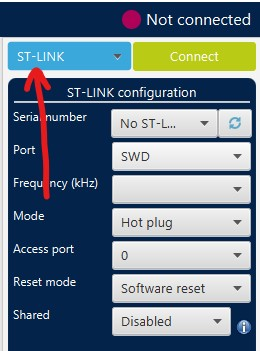
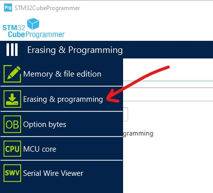
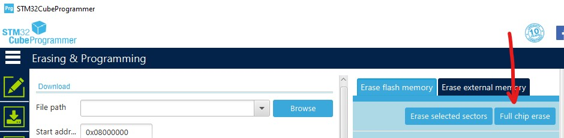
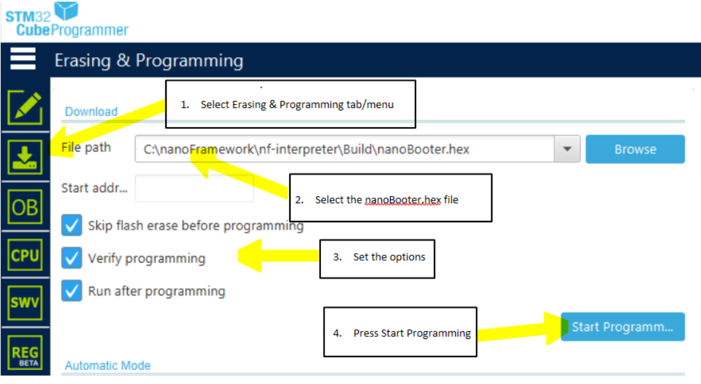
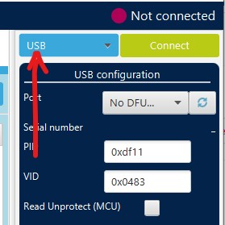

# How To Flash a target using STM32 Cube Programmer

This is a guide on how to manually flash the firmware using STM32CubeProgrammer utility.  This utility replaces the ST-Link utility and may be required for some Windows 10 machines.

You will need to use this utility to replace the boot loader on the STM32 chip.  Once replaced, you can do all further firmware maintentance using the nanoFramework Firmware Flash tool (nanoff.exe).

## Install the tool

1. Download the appropriate [STM32 Cube Programmer](https://www.st.com/en/development-tools/stm32cubeprog.html) from ST web site and install it in your development machine.

## Flash a JTAG connected board

There are two images to be flashed in the target, one for nanoBooter and another one for nanoCLR.

1. Download a ZIP file with the firmware for the board from our web site [here](https://github.com/nanoframework/nf-interpreter#firmware-for-reference-boards) by clicking on the appropriate badge. This will take you to our Cloudsmith repository that holds the packages with pre-build images for several target boards. After downloading it, unzip the package contents.

1. Connect the target board to your PC using an USB cable. Note that on most ST development boards there are two micro USB connectors. To follow this guide you'll want to use the one that's providing the JTAG connection through the ST-Link debugger. In doubt, check the PCB for the correct one or the board schematic.

1. Launch the STM32 Cube Programmer that you've just installed and connect to the ST board.

1. Select "USB" in the interface options.
    >

1. Navigate to the "Erasing and Programming" view.
    >

1. Perform a "full chip erase" to clear the flash.
    >

1. Load the `nanoBooter.hex` file from the package by clicking the "Browse" button. Make sure you tick the "Run after programming" and "Skip flash erase before programming" check boxes and hit "Start Program..." button. After the upload completes, the MCU is reset and the nanoBooter image runs. You can check the success of the operation watching for a slow blink pattern on the LED. Congratulations, you now have a board running nanoFramework's booter!
    >

1. Next, load the `nanoCLR.hex` file from the extracted package folder by clicking the "Browse" button. Make sure you tick the "Run after programming" and "Skip flash erase before programming" check boxes and hit "Start Program..." button. After the upload completes, the MCU is reset and the nanoCLR image will run. This time and if all goes as expected, there will be no LED blinking. You can check if the board is properly running .NET **nanoFramework** by looking into the Device Explorer window in VS. You may have to click the "Rescan nanoDevices" button (the magnifying glass icon).

## Flash a DFU connected board

1. Put your device in bootloader mode. This can be accomplished by pressing a certain combination of buttons. It depends on the particular hardware that you are using.

1. Launch the STM32 Cube Programmer that you've just installed and connect to the ST board.

1. Select "USB" in the interface options.
    >

1. Load the `nnnn.dfu` file by clicking the "Browse" button. Make sure you tick the "Run after programming" check box and hit "Start Program..." button. After the upload completes, the MCU is reset and the nanoCLR image runs.You can check if the board is properly running .NET **nanoFramework** by looking into the Device Explorer window in VS. You may have to click the "Rescan nanoDevices" button (the magnifying glass icon).
