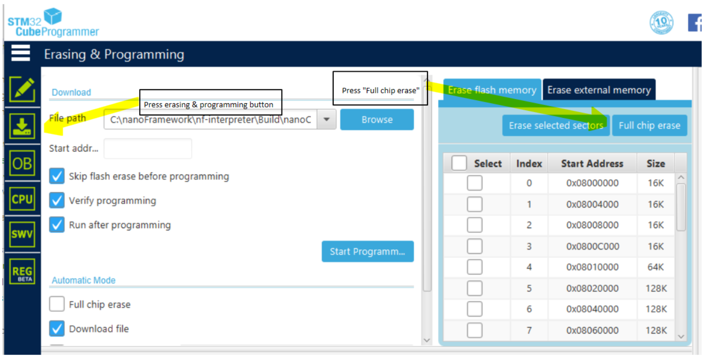

# How to flash a target using STM32CubeProgrammer utility
This is a guide on how to manually flash the firmware using STM32CubeProgrammer utility.  This utility replaces the ST-Link utility and may be required for some Windows 10 machines.

You will need to use this utility to replace the boot loader on the STM32 chip.  Once replaced, you can do all further firmware maintentance using the nanoFramework Firmware Flash tool (nanoff.exe).

## Introduction

There are two images to be flashed in the target, one for nanoBooter and another one for nanoCLR.

1. Download the appropriate [STM32CubeProgrammer Utility](https://www.st.com/en/development-tools/stm32cubeprog.html) from ST web site and install it on your development machine. 

1. Download a ZIP file with the firmware for the board from our web site [here](https://github.com/nanoframework/nf-interpreter#firmware-for-reference-boards) by clicking on the appropriate badge. This will take you to our Cloudsmith repository that holds the packages with pre-build images for several target boards. After downloading it, unzip the package contents.

1. Connect the target board to your PC using an USB cable. Note that on most ST deveopement boards there are two micro USB connectors. To follow this guide you'll want to use the one that's providing the JTAG connection through the ST-Link debugger. In doubt, check the PCB for the correct one or the board schematic. **Note:** the other USB port may be needed for the **Device Explorer** in Visual Studio see [Getting Started Guide for managed code (C#)](../getting-started-guides/getting-started-managed.md)

1. Launch the STM32CubeProgrammer Utility that you've just installed and connect to the ST board.

1. Perform a "full chip erase" to clear the flash. Select/press the `Erasing & Programming` button to switch to that tab, then press the `Full chip erase` button.
    >
1. Again, from the `Erasing & Programming` tab. Load the `nanoBooter.hex` file from the package. Make sure you tick the `Skip flash erase before programming`, `Verify programming`, and `Run after programming` check boxes and hit `Start Programming`. After the upload completes, the MCU is reset and the nanoBooter image runs. You can check the success of the operation watching for a slow blink pattern on the LED. Congratulations, you now have a board running nanoFramework's booter!
    >

1. Next, load the `nanoCLR.hex` file from the extracted package folder, use the same checkbox options, and hit the `Start Programming` button. After the upload completes, the MCU is reset and the nanoCLR image will run. This time and if all goes as expected, there will be no LED blinking. You can check if the board is properly running .NET **nanoFramework** by looking into the **Device Explorer** window in Visual Studio.