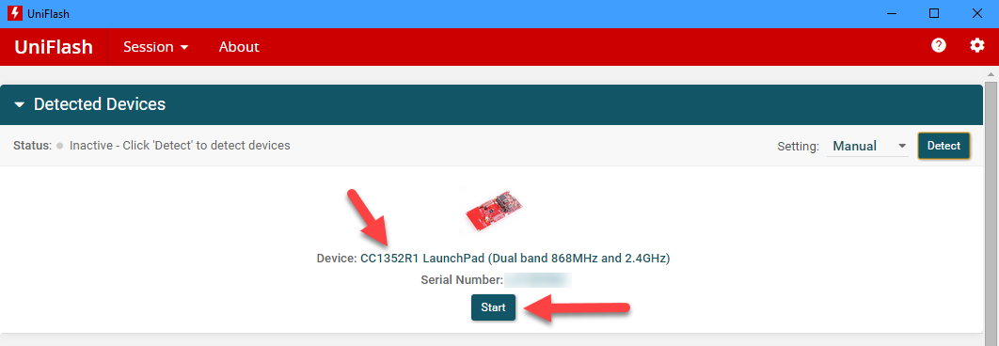

# Flash a nanoCLR image in TI CC13x2/CC6x2 boards

## How To guide

To flash nanoCLR image in TI CC13x2/CC6x2 boards [Uniflash](http://www.ti.com/tool/uniflash) tool from TI is required.

Assuming that Uniflash tool and the USB drivers are properly installed, follows the recommend procedure for a CC1352R1 LaunchPad board.

1. Download the image from .NET **nanoFramework** repository.
1. Connect the board using the USB cable.
1. Start Uniflash. The board should be detected and listed, unless the configuration is set to manual detection.

1. Click the **Start** button there.
1. Select the nanoCLR image file by clicking **Browse** and navigating to the folder/file where the `nanoCLR.bin` is located. (Make sure you do select the file with _bin_ extension).

1. The nanoCLR image will show in the flash list. By clicking on the **Load Image** button the flashing process starts.

1. After successfully burning the flash with the nanoCLR image, you can disconnect and reconnect the USB cable. The nanoDevice target will show in Visual Studio Device Explorer window as expected.

