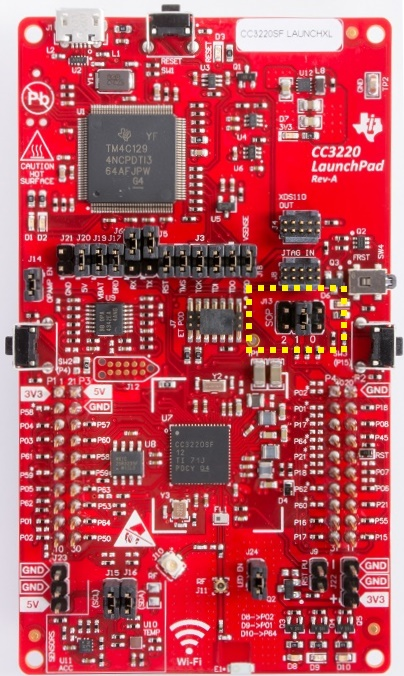
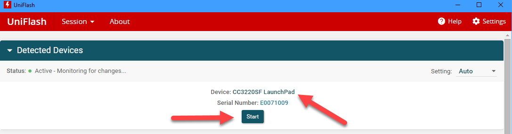
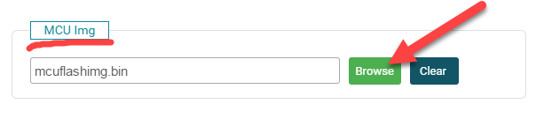
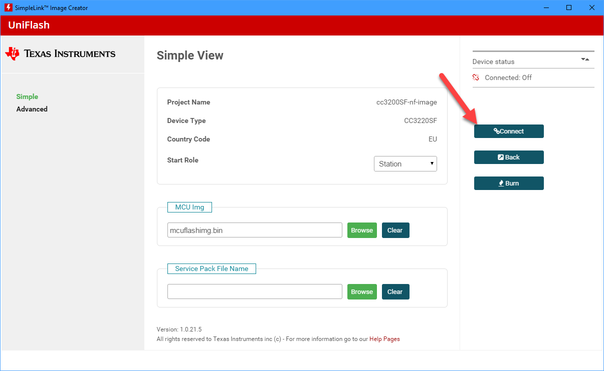
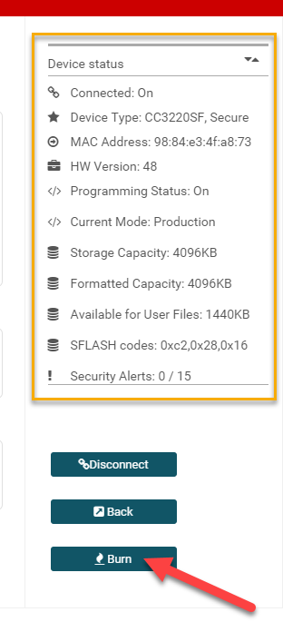

# Flash a nanoCLR image in a TI CC32xx board

## How To guide

To flash nanoCLR image in a TI board [Uniflash](http://www.ti.com/tool/uniflash) tool from TI is required.

Assuming that Uniflash tool and the USB drivers are properly installed, follows the recommend procedure for a CC3220SF-LAUNCHXL board.

1. Download the image from **nanoFramework** repository.
1. Place the J13 SPO jumper in position 1.

1. Connect the board using the USB cable.
1. Start Uniflash. The board should be detected and listed.

1. Click the **Start** button there and select the project corresponding to your board. This is assuming that you've created that project beforehand. If that's not the case, please follow the walk-through [here](#Prepare-a-Uniflash-project-for-a-CC32xx-board).
1. Select the nanoCLR image file by clicking **Browse** and navigating to the folder/file where the `nanoCLR.bin` is located. (Make sure you do select the file with _bin_ extension).

1. Click the **Connect** button.

1. After the connection with the target is successfully established the device status and capabilities will be listed at the top right corner.
1. Click the **Burn** button and the flashing process will start.

1. After successfully burning the flash with the nanoCLR image, you can disconnect and reconnect the USB cable. The nanoDevice target will show in Visual Studio Device Explorer window as expected.

## Prepare a Uniflash project for a CC32xx board

(TBD)