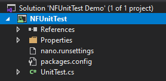
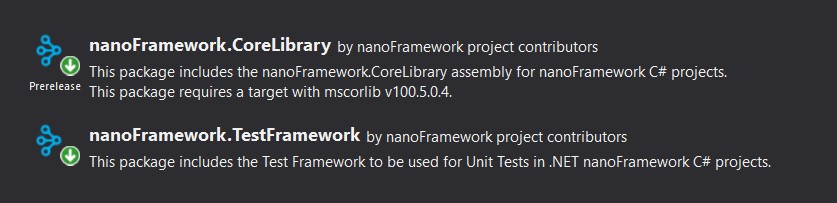
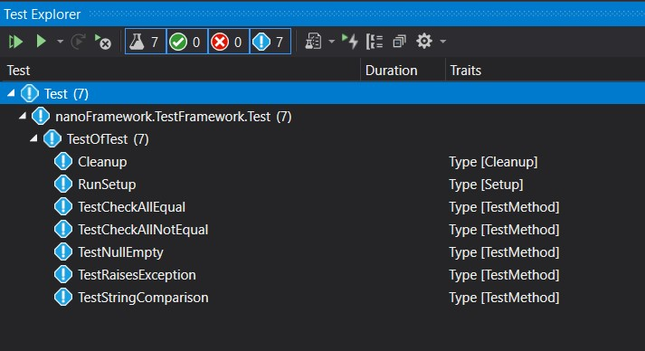
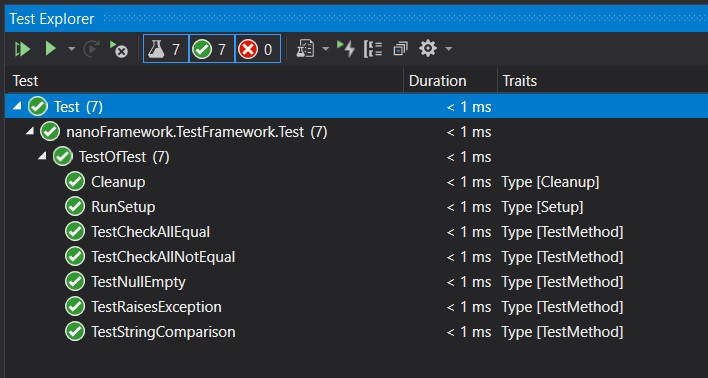
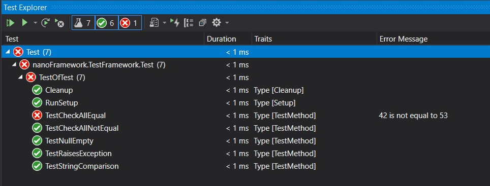
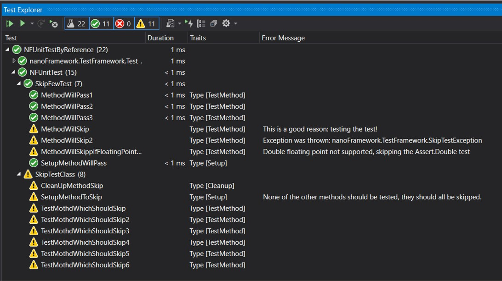
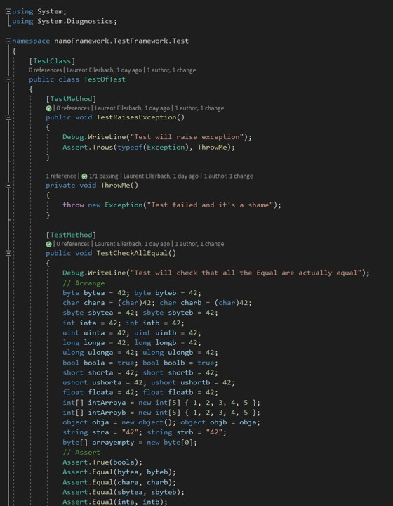
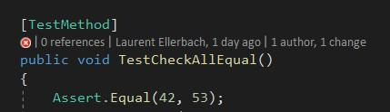
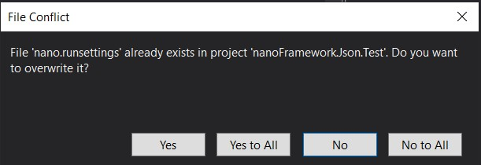

# Running Unit Tests on .NET **nanoFramework**

You first need to setup your .NET **nanoFramework** Unit Test project. For this, you have 2 options, either you create a `NFUnitTest` project from Visual Studio, either you add a the nanoFramework.TestFramework NuGet to your class library project.

## Setting up through Visual Studio project template

You can as well simply create a new Visual Studio NFUnitTest project that will already contains all the needed elements.



### Setting up Unit Test through NuGet

The .NET **nanoFramework** Unit Test platform is available thru a NuGet and comes with all the needed element. The only thing you need to do it to add it to your .NET **nanoFramework** project:



Make sure you have in the main directory of your sln file or in the same directory as your nfproj a `.runsettings` and the minium elements you need are:

```xml
<?xml version="1.0" encoding="utf-8"?>
<RunSettings>
   <!-- Configurations that affect the Test Framework -->
   <RunConfiguration>
       <MaxCpuCount>1</MaxCpuCount>
       <ResultsDirectory>.\TestResults</ResultsDirectory><!-- Path relative to solution directory -->
       <TestSessionTimeout>120000</TestSessionTimeout><!-- Milliseconds -->
       <TargetFrameworkVersion>Framework40</TargetFrameworkVersion>
   </RunConfiguration>
   <nanoFrameworkAdapter>
    <Logging>None</Logging>
    <IsRealHardware>False</IsRealHardware>
   </nanoFrameworkAdapter>
</RunSettings>
```

The most important part is the `<TargetFrameworkVersion>Framework40</TargetFrameworkVersion>` as this is what trigger the discovery of the tests.

## Discover the tests

Once you'll build your project, the tests will be discovered automatically:



This is automatic and you just need to build. If any issue, you can try the `Rebuild` option, it will force a rediscovery of the tests.

## Running the tests on a real hardware

You'll have to adjust the `.runsettings` file entry `IsRealHardware` to true:

```xml
<IsRealHardware>True</IsRealHardware>
```

Once you'll run the rests, they will be deployed into the device attached to your machine.

## Running the tests

Simply press the play button for all the tests or just the test you want to run. In case of success, you'll see something like this:



In case one of your test will fail, you'll see this:



Some tests may be skipped, they will appear like this:



## Test coverage and code highlighting

As you can expect in your code, you'll get the covered tests on the tests methods but as well on the methods that have been called:



In case of failure, you'll get the same:



## Running the tests in a pipeline

The tests can be run in a pipeline using `vstest.Console.exe`. The adapter to use is `nanoFramework.TestAdapter.dll`. You'll find all this into the NuGet package.

## Updating the NuGet

When you are updating the NuGet if you've done changes into your `.runsettings` file, you will be prompt to replace the file, depending on the choices you have done, you may want to save your choices and merge them into the new file. We do recommend to use the new file and adjust it.


